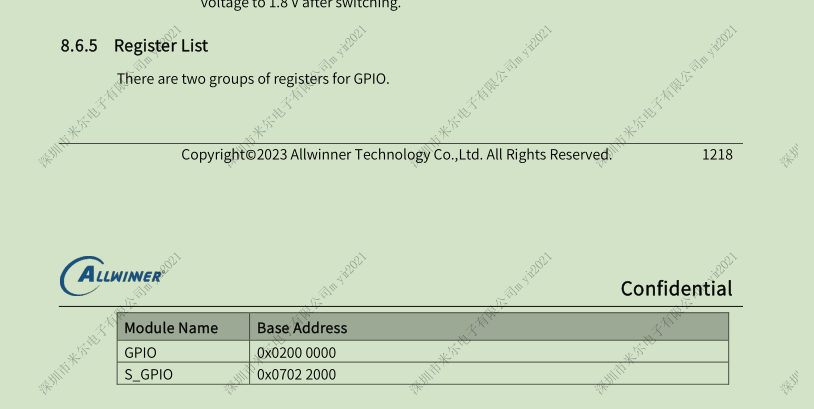
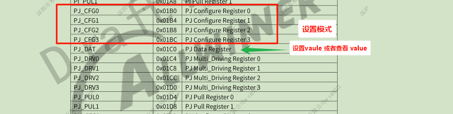
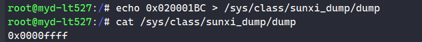
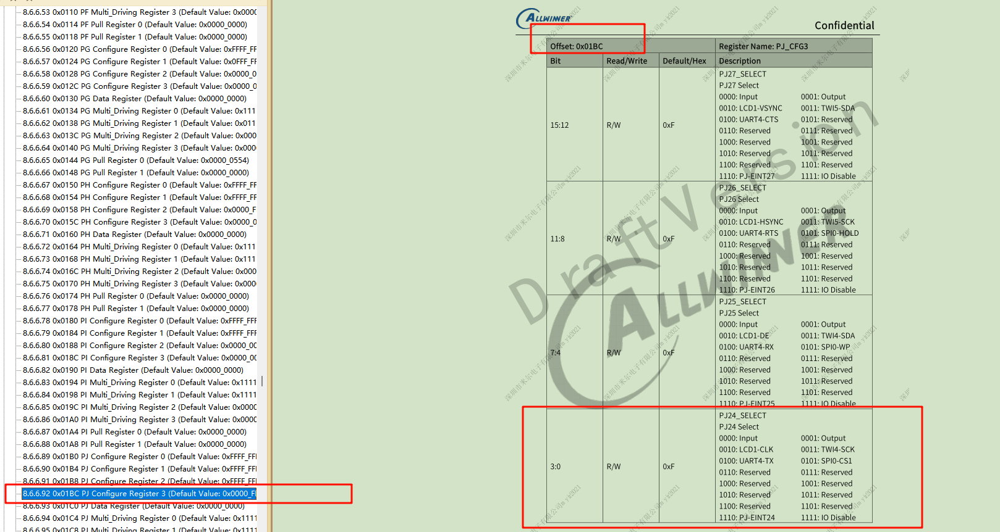
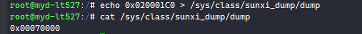
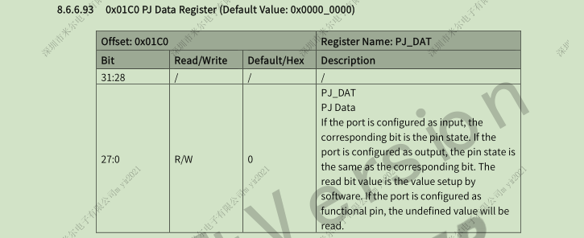
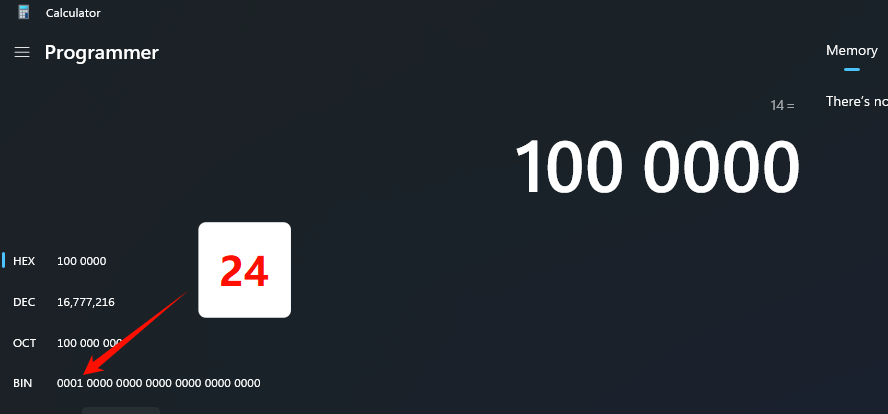

---
tags:
  - T527
---

## 以 PJ24 为例
### 找到 GPIO 的基地址


### 找到 PJ 这组 GPIO 的偏移地址


#### 查看 PJ 这组GPIO 的模式
```shell
echo 0x020001BC > /sys/class/sunxi_dump/dump
cat /sys/class/sunxi_dump/dump
```



### PJ24 设置输出模式： 
```shell
echo 0x020001BC 0x0000fff1 > /sys/class/sunxi_dump/write
```



#### 查看当前 PJ24 输出模式下的 GPIO 电平
```shell
echo 0x020001C0 > /sys/class/sunxi_dump/dump
cat /sys/class/sunxi_dump/dump
```



#### 设置 PJ24 的 value 值为 1：
```shell
echo 0x020001C0 0x01070000 > /sys/class/sunxi_dump/write
cat /sys/class/sunxi_dump/dump # 查看值
```





