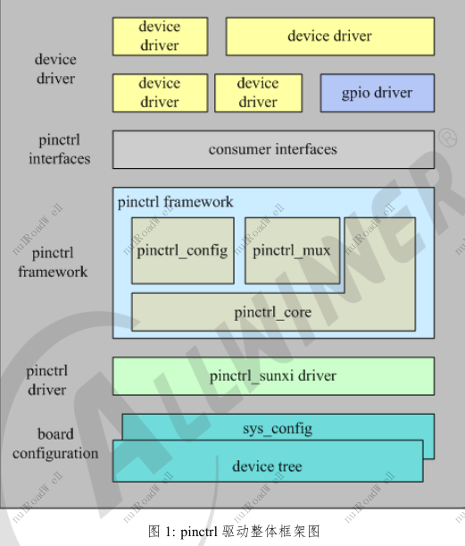
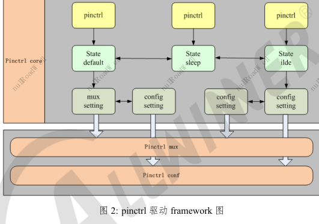

# 总体框架
#### 驱动模块可以分成 4 个部分：
1. Pinctrl api: pinctrl 提供给上层用户调用的接口
2. Pinctrl framework：Linux 提供的 pinctrl 驱动框架
3. Pinctrl sunxi driver：sunxi 平台需要实现的驱动
4. Board configuration：设备 pin 配置信息，格式 device tree source


## pinctrl framework
Pinctrl framework 主要处理 pinstate、pinmux 和 pinconfig 三个功能，pinstate 和 pinmux、pinconfig 映射关系如下图所示


### GPIO 设备树信息
```dts
can_int_gpios = <&pio PC 7 6 0xffffffff 0xffffffff 0>;
```
* <Port 端口组内序号> + <功能分配> + <内部电阻状态> + <驱动能力> + <输出电平状态>

![[assets/全志GPIO设备树信息.excalidraw|100%]]

使用上述方式配置gpio时，需要驱动调用以下接口解析dts的配置参数：
```c
int of_get_named_gpio_flags (struct device_node *np, const char *list_name, int index, enum of_gpio_flags *flags)
```
拿到 gpio 的配置信息后，保存在 flags 参数中，在根据需要调用相应的标准接口实现自己的功能

### pinctrl 使用配置示例
```c
//device tree对应配置
soc{
	pio: pinctrl@0300b000 {
		...
		uart0_pins_a: uart0@0 {
		allwinner,pins = "PH7", "PH8";
		allwinner,pname = "uart0_tx", "uart0_rx";
		allwinner,function = "uart0";
		allwinner,muxsel = <3>;
		allwinner,drive = <0x1>;
		allwinner,pull = <0x1>;
		};
		...
	}；
	
	...
	uart0: uart@05000000 {
		compatible = "allwinner,sun8i-uart";
		device_type = "uart0";
		reg = <0x0 0x05000000 0x0 0x400>;
		interrupts = <GIC_SPI 49 IRQ_TYPE_LEVEL_HIGH>;
		clocks = <&clk_uart0>;
		pinctrl-names = "default", "sleep";
		pinctrl-0 = <&uart0_pins_a>;
		pinctrl-1 = <&uart0_pins_b>;
		uart0_regulator = "vcc-io";
		uart0_port = <0>;
		uart0_type = <2>;
		status = "okay";
		};
		...
}
```

### 既配置通用 GPIO，也配置设备引脚
```c
//device_tree对应配置：
soc{
	pio: pinctrl@01c20800 {
		...
		vdevice_pins_a: vdevice@0 {
			allwinner,pins = "PC0", "PC1";
			allwinner,function = "vdevice";
			allwinner,muxsel = <5>;
			allwinner,drive = <1>;
			allwinner,pull = <1>;
		};
		...
		
		}；
		...
		vdevie: vdevie@0{
		...
		pinctrl-names = "default";
		pinctrl-0 = <&vdevice_pins_a>;
		test-gpios = <&pio PC 3 1 2 2 1>;
		...
	}
};
```
