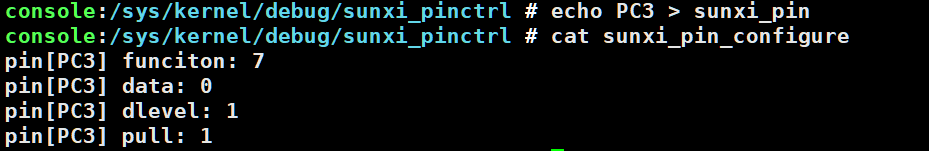

# pinctrl 调试方法
#### 利用 sunxi_dump 读写相应寄存器
~~~shell
cd /sys/class/sunxi_dump
# 查看一个寄存器
echo 0x0300b048 > dump; cat dump

# 写值到寄存器上
echo 0x0300b058 0xff > write; cat write

# 查看一片连续寄存器
echo 0x0300b000, 0x0300bfff > dump; cat dump

# 写一组寄存器的值
echo 0x0300b058 0xfff,0x0300b0a0 0xfff > write;cat write
~~~

#### 利用 sunxi_pinctrl 的 debug 节点

> [!info] debug 节点
> ~~~shell
mount  -t debugfs none /sys/kernel/debug
cd /sys/kernel/debug/sunxi_pinctrl
>~~~

1. 查看 pin 的配置
~~~shell
echo PC2 > sunxi_pin
cat sunxi_pin_configure
~~~

2. 修改 pin 属性
* 每个 pin 都有四种属性，如复用 (function)，数据 (data)，驱动能力 (dlevel)，上下拉 (pull)

> [!info] 修改 pin 属性
> ~~~shell
echo PC2 1 > pull;cat pull
cat sunxi_pin_configure # 查看修改情况
>~~~
>

> [!attention] 切换 PIN 的设备
> 在 sunxi 平台，目前多个 pinctrl 的设备，分别是 pio 和 r_pio 和 axpxxx-gpio，当操作 PL 之后的 pin 时，请通过以下命令切换 pin 的设备，否则操作失败

* 切换命令
~~~shell
echo pio > /sys/kernel/debug/sunxi_pinctrl/dev_name # 切换到 pio 设备
cat /sys/kernel/debug/sunxi_pinctrl/dev_name
echo r_pio > /sys/kernel/debug/sunxi_pinctrl/dev_name # 切换到 r_pio 设备
cat /sys/kernel/debug/sunxi_pinctrl/dev_name
~~~

#### 利用 pinctrl core 的 debug 节点

> [!help] Prerequisites
> ~~~shell
mount -t debugfs none /sys/kernel/debug
cd /sys/kernel/debug/pinctrl
>~~~
1. 查看 PIN 的管理设备
~~~shell
cat pinctrl-devices
~~~

2. 查看 PIN 的状态和对应的使用设备
~~~shell
cat pinctrl-handles
~~~

