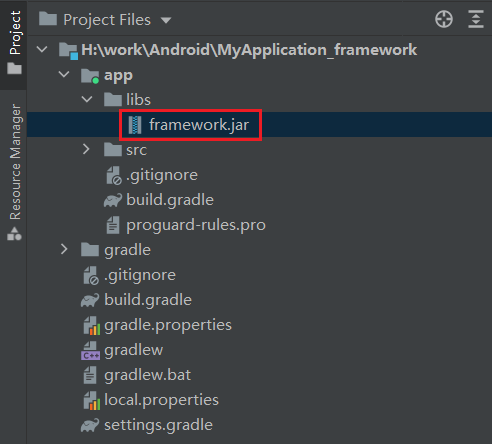
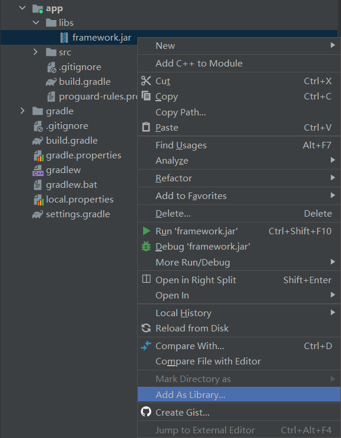
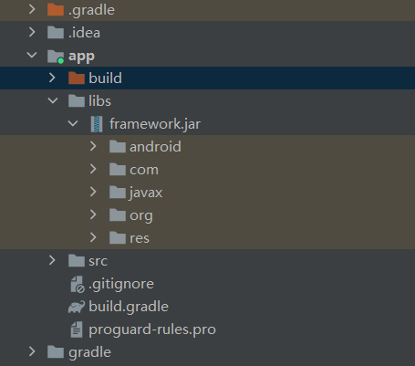

1. 将 `framework.jar` 文件添加至 `app\libs\` 目录

2. 右键 `framework.jar`，选择 *Add As Library*

3. 导入成功后，`framework.jar` 包下可以看到隐藏的接口列表


4. 导入包后，修改 `app/build.gradle` 提高 jar 包的优先级，修改示例如下
```kotlin:app/build.gradle
buildscript {
    repositories {
        google()
        mavenCentral()
    }

    dependencies {
        classpath "com.android.tools.build:gradle:7.0.4"

        // NOTE: Do not place your application dependencies here; they belong
        // in the individual module build.gradle files
    }

    gradle.projectsEvaluated {
        tasks.withType(JavaCompile){
            options.compilerArgs.add('-Xbootclasspath/p:app\\libs\\framework.jar')
        }
    }
}
```

5. 在 dependencies 下添加 compileOnly files (`libs\\framework.jar`)
```kotlin
dependencies {
    compileOnly files('libs\\framework.jar')
    implementation 'androidx.appcompat:appcompat:1.2.0'
    implementation 'com.google.android.material:material:1.3.0'
    implementation 'androidx.constraintlayout:constraintlayout:2.0.4'
    testImplementation 'junit:junit:4.+'
    androidTestImplementation 'androidx.test.ext:junit:1.1.2'
    androidTestImplementation 'androidx.test.espresso:espresso-core:3.3.0'
}
```
