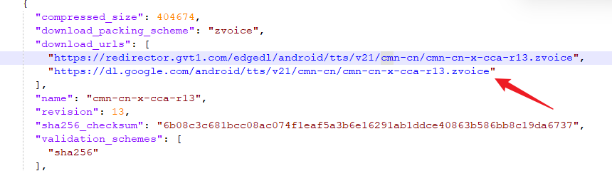

# Android 反编译
## INZ-APKTool
INZ-APKTool 可以做反编译及回编译

## Google TTS 谷歌语音添加中文语音包
1. 下载 INZ-APKTool：[Download INZ APKTool 2.3.0 / 2.4.0 Beta](https://www.softpedia.com/get/PORTABLE-SOFTWARE/Programming/INZ-APKTool.shtml)
2. 选择需要反编译的 apk、反编译路径，回编译路径
3. 打开 Googlespeech. apk\assets\superpacks_manifest. json 下载语音包
4. 下载中文语音包
# Link
- [Download INZ APKTool 2.3.0 / 2.4.0 Beta](https://www.softpedia.com/get/PORTABLE-SOFTWARE/Programming/INZ-APKTool.shtml)
- [chromium.googlesource.com](https://chromium.googlesource.com/chromiumos/platform/assets/+/refs/heads/firmware-fizz-10139.117.B/speech_synthesis/patts)

## dex 反编译到 Java
- [GitHub - skylot/jadx: Dex to Java decompiler](https://github.com/skylot/jadx)