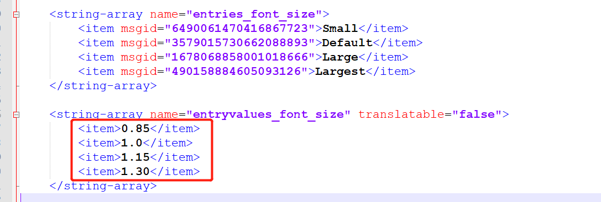

## Android 修改默认字体大小
```java:frameworks\base\packages\SettingsProvider\src\com\android\providers\settings\DatabaseHelper.jav
// frameworks\base\packages\SettingsProvider\src\com\android\providers\settings\DatabaseHelper.jav
private void loadSystemSettings(SQLiteDatabase db) {
...
loadStringSetting(stmt, Settings.System.FONT_SCALE,R.string.def_font_scale);//by Lyle,20201103
}
```

### 添加 xml 配置
- `frameworks\base\packages\SettingsProvider\res\values\defaults.xml`
```xml:frameworks\base\packages\SettingsProvider\res\values\defaults.xml
<string name="def_font_scale">1.15</string>
```

### 数值参考
- `packages\apps\Settings\res\values\arrays.xml`
