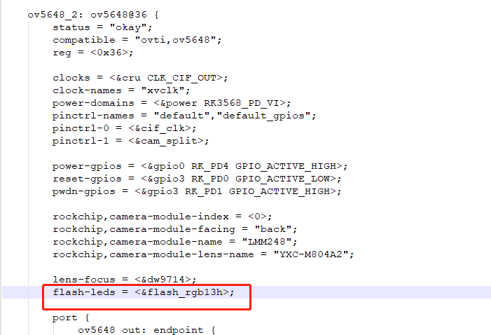

---
tags:
  - Android
---
## 摄像头添加闪光灯
```c
flash_rgb13h: flash-rgb13h {
		compatible = "led,rgb13h";
		label = "gpio-flash";
		led-max-microamp = <20000>;
		flash-max-microamp = <20000>;
		flash-max-timeout-us = <10000000>;
		enable-gpio = <&gpio2 RK_PB0 GPIO_ACTIVE_HIGH>;
		rockchip,camera-module-index = <0>;
		rockchip,camera-module-facing = "back";
	};
```



```Makefile
CONFIG_LEDS_RGB13H=y
```

- `hardware\rockchip\camera\etc\camera\camera3_profiles_rk3588.xml`
- 在 415 里面的 
```xml
<control.aeAvailableModes value="ON,OFF,ON_AUTO_FLASH,ON_ALWAYS_FLASH"/>
<flash.info.available value="TRUE"/>
```
