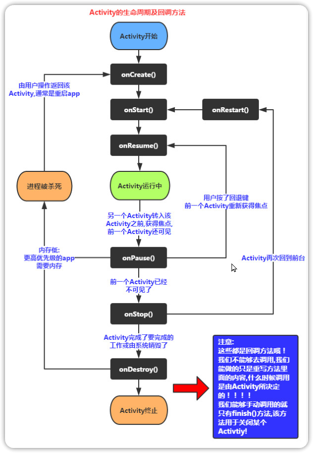

# Android 四大组件
## 2. 安卓四大组件

| 组件                            | 描述                                                                                                                                                                                                                                           |
| ------------------------------- | ---------------------------------------------------------------------------------------------------------------------------------------------------------------------------------------------------------------------------------------------- |
| Activity (活动)                 | 在应用中的一个 Activity 可以用来表示一个界面，意思可以理解为“活动”，即一个活动开始，代表 Activity 组件启动，活动结束，代表一个 Activity 的生命周期结束。一个 Android 应用必须通过 Activity 来运行和启动，Activity 的生命周期交给系统统一管理。 |
| Service (服务)                  | Service 它可以在后台执行长时间运行操作而没有用户界面的应用组件，不依赖任何用户界面，例如后台播放音乐，后台下载文件等。                                                                                                                         |
| Broadcast Receiver (广播接收器) | 一个用于接收广播信息，并做出对应处理的组件。比如我们常见的系统广播：通知时区改变、电量低、用户改变了语言选项等。                                                                                                                               |
| Content Provider (内容提供者)   | 作为应用程序之间唯一的共享数据的途径，Content Provider 主要的功能就是存储并检索数据以及向其他应用程序提供访问数据的接口。Android 内置的许多数据都是使用 Content Provider 形式，供开发者调用的（如视频，音频，图片，通讯录等）                  |

#### 启动广告流程 ：  
启动 Activity->广告 Activity->主页 Activity

## 3. Activity 生命周期

| 函数名称     | 描述                                                                                                                                     |
| ------------ | ---------------------------------------------------------------------------------------------------------------------------------------- |
| onCreat ()   | 一个 Activity 启动后第一个被调用的函数，常用来在此方法中进行 Activity 的一些初始化操作。例如创建 View，绑定数据，注册监听，加载参数等。  |
| onStart ()   | 当 Activity 显示在屏幕上时，此方法被调用但此时还无法进行与用户的交互操作。                                                               |
| onResume ()  | 这个方法在 onStart () 之后调用，也就是在 Activity 准备好与用户进行交互的时候调用，此时的 Activity 一定位于 Activity 栈顶，处于运行状态。 |
| onPause ()   | 这个方法是在系统准备去启动或者恢复另外一个 Activity 的时候调用，通常在这个方法中执行一些释放资源的方法，以及保存一些关键数据。           |
| onStop ()    | 这个方法是在 Activity 完全不可见的时候调用的。                                                                                           |
| onDestroy () | 这个方法在 Activity 销毁之前调用，之后 Activity 的状态为销毁状态。                                                                       |
| onRestart () | 当 Activity 从停止 stop 状态恢进入 start 状态时调用状态。                                                                                |

