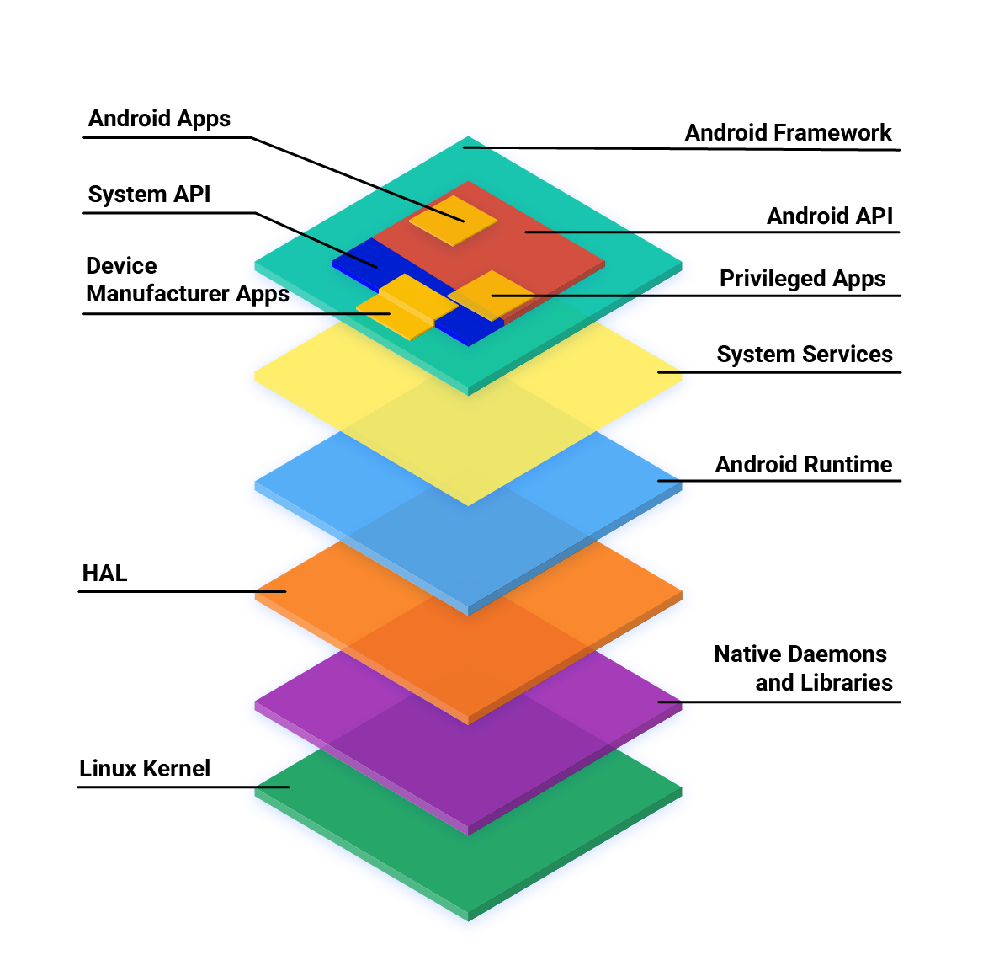
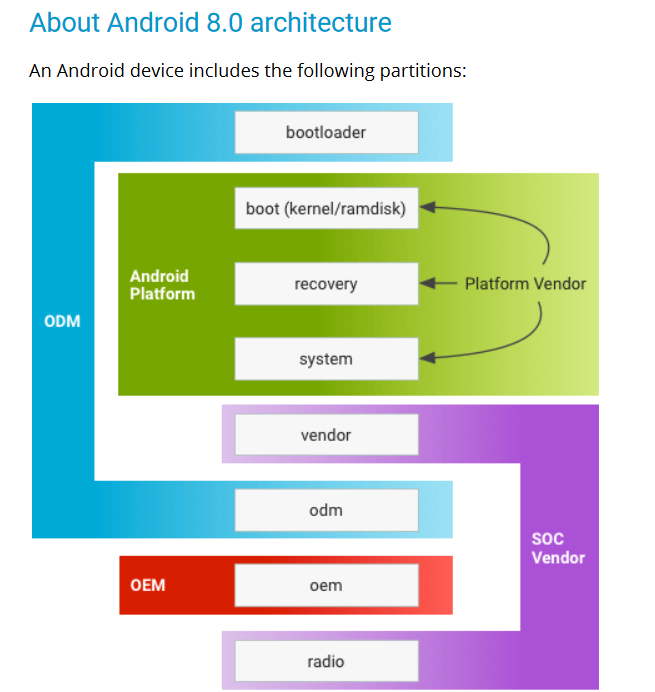

## 新 Android 架构

## Android 8 架构

- system.img. Contains mainly Android framework
- boot.img. (kernel/ramdisk) Contains Linux kernel + Android patches
- vendor.img. Contains SoC-specific code and configurations
- odm.img. Contains device-specific code and configurations
- oem.img. Contains OEM/carrier-related configurations and customizations
- bootloader. Brings up the kernel (vendor-proprietary)
- radio. Modem (proprietary)

vendor，odm，oem 分区链接到 system 分区下的对应目录

# Link

- [Android 操作系统核心主题](https://source.android.com/docs/core)
- [Android 架构](https://source.android.com/devices/architecture)