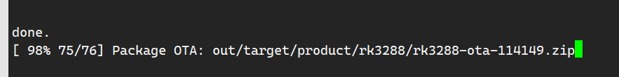
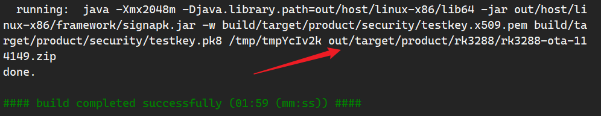
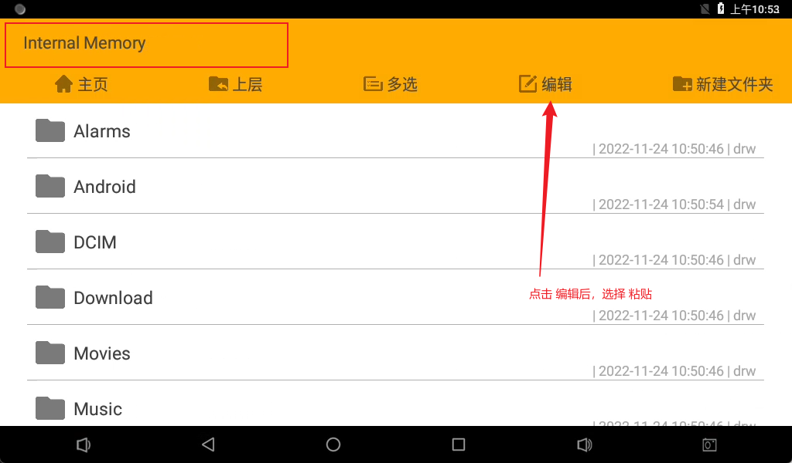

# Android OTA 编译
### build. sh 编译
```shell
./build.sh ota
```
- 如有报错， `vim build.sh` 查看代码

## 使用 make 命令
> [!attention] `make otapackage`
> 必须使用 `lunch` 导入环境变量

1. `make otapackage`
2. `./mkimage.sh ota`
3. 查看编译打印，将编译出来 zip 压塑包复制到 U 盘，重命名为 *update. zip*




> [!error] 通过 U 盘升级
> - U 盘的格式必须为 fat32, 否则 Android 自动检测不到 U 盘的 update. zip 升级包
> - 其他格式的 U 盘，可以将 update. zip 拷贝到 /mnt/sdcard/ 目录下
> - 文件管理器操作
> 

