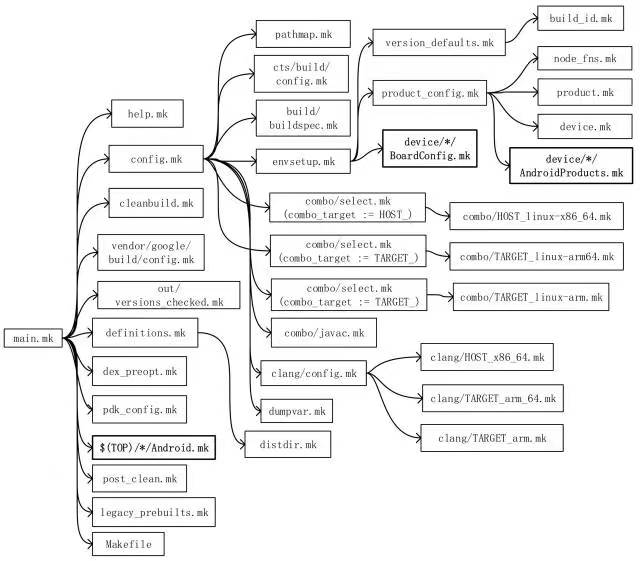
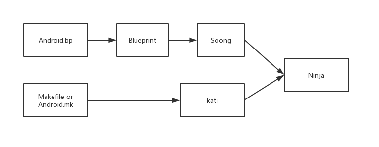

# 编译系统

* `build/core/main.mk` 是 Android Build 系统的主控文件
> [!info] `-include`
> 引入几个 make 文件。注意“-include”和“include”的区别是：前者包含的文件如果不存在不会报错，后者则会报错并停止编译
> ```Makefile
> include $(BUILD_SYSTEM)/help.mk
> -include vendor/google/build/config.mk
> ```

## Android.mk
Makefile编译系统的一部分，Android.mk是android编译环境下的一种特殊的“makefile”文件, 它是经过了android编译系统处理的。Android.mk中定义了一个模块的必要参数，使模块随着平台编译。通俗来讲就是告诉编译系统，以什么样的规则编译你的源代码，并生成对应的目标文件
## Ninja
Ninja是一个致力于速度的小型编译系统，如果把其他的编译系统看作高级语言，那么Ninja 目标就是汇编。使用Ninja 主要目的就是因为其编译速度快
## Soong  
Soong是谷歌用来替代此前的Makefile编译系统的替代品，负责解析Android.bp文件，并将之转换为Ninja文件
## Blueprint
Blueprint用来解析Android.bp文件翻译成Ninja语法文件
## kati
kati是谷歌专门为了Android而开发的一个小项目，基于Golang和C++。 目的是把Android中的Makefile，转换成Ninja文件
## Android.bp
Android.bp，是用来替换Android.mk的配置文件


# 源码编译
1. `build/envsetup.sh`脚本用于初始化环境，`make clobber` 用于清除缓存（需要在`source build/envsetup.sh`之后使用)
2. `lunch`用于选择编译目标
	1. 编译目标的格式为 BUILD-BUILDTYPE
		* BUILD表示编译出的镜像可以运行在什么环境
		* BUILDTYPE 指的是编译类型，有以下三种：
			1. **user**：用来正式发布到市场的版本，权限受限，如没有 root 权限，不能 dedug，adb默认处于停用状态
			2. **userdebug**：在user版本的基础上开放了 root 权限和 debug 权限，adb默认处于启用状态。一般用于调试真机
			3. **eng**：开发工程师的版本，拥有最大的权限(root等)，具有额外调试工具的开发配置。一般用于模拟器
			
> [!info] 没有设备
> 只想编译完后运行在模拟器查看，那么BUILD可以选择`aosp_x86`，BUILDTYPE选择eng

> [!info] 直接指定编译目标
> `lunch aosp_x86-eng`

# 生成镜像说明
* **system.img**：系统镜像，里面包含了Android系统主要的目录和文件，通过init.c进行解析并mount挂载到`/system`目录下
* **userdata.img**：用户镜像，是Android系统中存放用户数据的，通过init.c进行解析并mount挂载到`/data`目录下
* **ramdisk.img**：根文件系统镜像，包含一些启动Android系统的重要文件，比如init.rc
