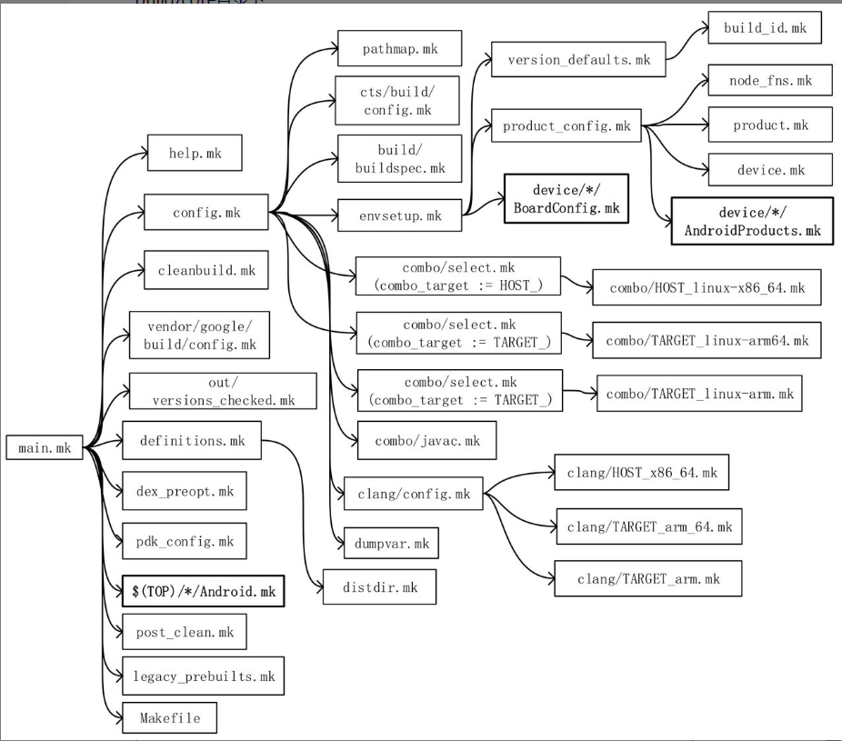

# Android 编译环境
## build 系统
Android 的 Build 系统可以分成 3 大块：
1. 第一块是位于 build/core 目录下的文件，这是 Android Build 系统的框架和核心
2. 第二块是位于 device 目录下的文件，存放的是具体产品的配置文件
3. 第三块是各模块的编译文件：Android. mk，位于模块的源文件目录下

> [!info] 编译 Android 系统
> 1. `. build/envsetup.sh`
> 2. `lunch`
> 3. `make`

- 主导作用的是 main. mk
- 专职配置脚本 config. mk，
- 定制设备：BoardConfig. mk AndroidProducts. mk
- 选取合适的 Java 编译器：Java. mk
- 环境变量定义：envsetup. mk
###  `envsetup.sh` 
* 建立 Android 的编译环境
* Lunch 命令如果没有参数，系统会打印出产品列表供选择。Launch 命令也可以有参数，参数的格式是 `<prodtct_name>-<build-variant>`
	* 参数前半部分的“product_name”必须是系统中已经定义的产品名称
	* 后半部分的“build_variant”必须是“eng”、“user”和“userdebug”三者之一

`vendorsetup.sh`
5. 