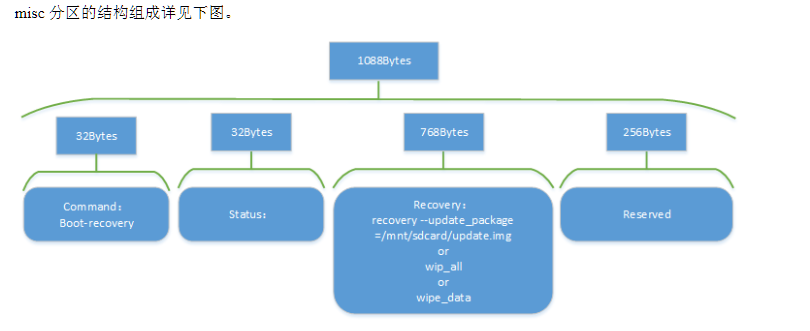

# 恢复出厂设置
* 我们把可以读写的配置文件保存在 userdata 分区，出厂固件会默认一些配置参数，用户使用一段时间后会生成或修改配置文件，有时用户需要清除这些数据，我们就需要恢复到出厂配置。直接运行 update 后面不加任何参数或者加 factory/reset 参数均可进入 recovery 后恢复出厂配

# misc 分区说明
* misc 其实是英文 miscellaneous 的前四个字母，杂项、混合体、大杂烩的意思
* misc 分区的概念来源于 Android 系统，Linux 系统中常用来作为系统升级时或者恢复出厂设置时使用

## misc 分区的读写：misc 分区在以下情况下会被读写
1. Uboot：设备加电启动时，首先启动 Uboot，在 Uboot 中会读取 misc 分区的内容。根据 misc 分区中 command 命令内容决定是进入正常系统还是 recovery 模式
2. Command 为 boot-recovery，则进入 recovery 模式
3. Command 为空，则进入正常系统
4. Recovery：在设备进入 recovery 模式中，可以读取 misc 分区中 recovery 部分的内容，从而执行不同的动作，或升级分区固件，或擦除用户分区数据，或其他操作等等
	