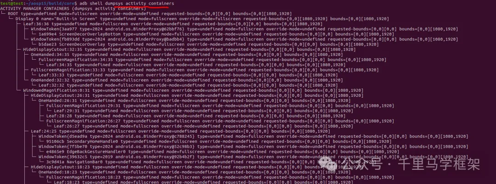

---
tags:
  - Android/command
---
## 基础查询命令

列出所有可用服务

```
adb shell dumpsys -l      # 显示所有支持dump的系统服务
adb shell service list    # 另一种服务列表查看方式
```

查看命令帮助文档

```
adb shell dumpsys [服务名] -h
```

注意这个命令不一定所有服务都有。

## 核心常用命令汇总

```shell
# --activity汇总信息
adb shell dumpsys activity

# --当前显示activity相关信息
dumpsys activity activities 

# --当前task和activity
am stack list 

# --当前窗口层级结构树
dumpsys activity containers 

# --window相关信息
dumpsys window windows 

# --sf相关信息
dumpsys SurfaceFlinger 

# --input信息
dumpsys input 

# --实时展示输入事件情况
getevent -lrt

# -- 显示应用权限/版本/签名/路径/组件
dumpsys package [package] 

# --展示系统屏幕
dumpsys display  

# --查看指定包内存占用
dumpsys meminfo [package]

# --展示电源息屏是哪个
dumpsys power 
```

## AMS和WMS相关的命令

**1、AMS的信息总命令：**

```
adb shell dumpsys activity
```

这个命令内容太多，一般在想要展示所有信息时候使用，但是因为输出内容太多，一般会用他的子命令，更有目标性

**2、展示当前Activity上到下的具体情况命令**

```
dumpsys activity activities
am stack list
```

这个命令会展示当前系统activity上到下的具体情况，哪个activity最顶层，哪个activity属于Resume，Focus状态

```shell
adb shell dumpsys activity activities
ACTIVITY MANAGER ACTIVITIES (dumpsys activity activities)
Display #0 (activities from top to bottom):
  * Task{4bc6e2d #1 type=home isResizeable=true minWidth=-1 minHeight=-1 U=0 visible=true visibleRequested=false mode=fullscreen translucent=false sz=1}
    * Task{1cff125 #53 type=home I=com.android.launcher3/.uioverrides.QuickstepLauncher isResizeable=true minWidth=-1 minHeight=-1 U=0 rootTaskId=1 visible=true visibleRequested=false mode=fullscreen translucent=false sz=1}
      mLastPausedActivity: ActivityRecord{f9bc11c u0 com.android.launcher3/.uioverrides.QuickstepLauncher t53}
      mLastNonFullscreenBounds=Rect(225, 457 - 856, 1537)
      isSleeping=true
      * Hist  #0: ActivityRecord{f9bc11c u0 com.android.launcher3/.uioverrides.QuickstepLauncher t53}
        packageName=com.android.launcher3 processName=com.android.launcher3
        launchedFromUid=0 launchedFromPackage=null launchedFromFeature=null userId=0
        app=ProcessRecord{f2946bb 2433:com.android.launcher3/u0a140}
        Intent { act=android.intent.action.MAIN cat=[android.intent.category.HOME] flg=0x10000100 cmp=com.android.launcher3/.uioverrides.QuickstepLauncher (has extras) }
        rootOfTask=true task=Task{1cff125 #53 type=home I=com.android.launcher3/.uioverrides.QuickstepLauncher isResizeable=true minWidth=-1 minHeight=-1}
        taskAffinity=null
        mActivityComponent=com.android.launcher3/.uioverrides.QuickstepLauncher
        baseDir=/system/system_ext/priv-app/TrebuchetQuickStep/TrebuchetQuickStep.apk
        dataDir=/data/user/0/com.android.launcher3
        stateNotNeeded=true componentSpecified=true mActivityType=home
        compat={420dpi} theme=0x7f13000f
        mLastReportedConfigurations:
          mGlobalConfig={1.0 ?mcc0mnc [en_US] ldltr sw411dp w411dp h731dp 420dpi nrml long port night finger -keyb/v/h -nav/h winConfig={ mBounds=Rect(0, 0 - 1080, 1920) mAppBounds=Rect(0, 0 - 1080, 1920) mMaxBounds=Rect(0, 0 - 1080, 1920) mDisplayRotation=ROTATION_0 mWindowingMode=fullscreen mActivityType=undefined mAlwaysOnTop=undefined mRotation=ROTATION_0} as.4 s.39 fontWeightAdjustment=0}
          mOverrideConfig={1.0 ?mcc0mnc [en_US] ldltr sw411dp w411dp h731dp 420dpi nrml long port night finger -keyb/v/h -nav/h winConfig={ mBounds=Rect(0, 0 - 1080, 1920) mAppBounds=Rect(0, 0 - 1080, 1920) mMaxBounds=Rect(0, 0 - 1080, 1920) mDisplayRotation=ROTATION_0 mWindowingMode=fullscreen mActivityType=home mAlwaysOnTop=undefined mRotation=ROTATION_0} as.4 s.3 fontWeightAdjustment=0}
        mLastReportedActivityWindowInfo=ActivityWindowInfo{isEmbedded=false, taskBounds=Rect(0, 0 - 1080, 1920), taskFragmentBounds=Rect(0, 0 - 1080, 1920)}
        CurrentConfiguration={1.0 ?mcc0mnc [en_US] ldltr sw411dp w411dp h731dp 420dpi nrml long port night finger -keyb/v/h -nav/h winConfig={ mBounds=Rect(0, 0 - 1080, 1920) mAppBounds=Rect(0, 0 - 1080, 1920) mMaxBounds=Rect(0, 0 - 1080, 1920) mDisplayRotation=ROTATION_0 mWindowingMode=fullscreen mActivityType=home mAlwaysOnTop=undefined mRotation=ROTATION_0} as.4 s.3 fontWeightAdjustment=0}
        RequestedOverrideConfiguration={0.0 ?mcc0mnc ?localeList ?layoutDir ?swdp ?wdp ?hdp ?density ?lsize ?long ?ldr ?wideColorGamut ?orien ?uimode ?night ?touch ?keyb/?/? ?nav/? winConfig={ mBounds=Rect(0, 0 - 0, 0) mAppBounds=null mMaxBounds=Rect(0, 0 - 0, 0) mDisplayRotation=undefined mWindowingMode=undefined mActivityType=home mAlwaysOnTop=undefined mRotation=undefined} ?fontWeightAdjustment}
        taskDescription: label="null" icon=null iconResource=/0 iconFilename=null primaryColor=ff171d1e
          backgroundColor=ff1b2122 statusBarColor=0 navigationBarColor=0
         backgroundColorFloating=ff171d1e
        launchFailed=false launchCount=0 lastLaunchTime=-57m57s152ms
        mHaveState=true mIcicle=Bundle[mParcelledData.dataSize=5696]
        state=STOPPED delayedResume=false finishing=false
        keysPaused=false inHistory=true idle=true
        occludesParent=true noDisplay=false immersive=false launchMode=2
        mActivityType=home
        mImeInsetsFrozenUntilStartInput=true
        windows=[Window{8a0ad4f u0 com.android.launcher3/com.android.launcher3.uioverrides.QuickstepLauncher}]
        windowType=2
        mOccludesParent=true
        overrideOrientation=SCREEN_ORIENTATION_NOSENSOR
        requestedOrientation=SCREEN_ORIENTATION_NOSENSOR
        mVisibleRequested=false mVisible=false mClientVisible=false reportedDrawn=false reportedVisible=false
        mAppStopped=true
        mNumInterestingWindows=1 mNumDrawnWindows=1 allDrawn=true lastAllDrawn=false)
        nowVisible=false lastVisibleTime=-5m0s938ms
        connections={ConnectionRecord{e7866fe u0 com.android.launcher3/com.android.quickstep.TouchInteractionService:@a1172b9 flags=0x0}}
        resizeMode=RESIZE_MODE_RESIZEABLE
        mLastReportedMultiWindowMode=false mLastReportedPictureInPictureMode=false
        supportsSizeChanges=SIZE_CHANGES_UNSUPPORTED_METADATA
        configChanges=0xdf3
        neverSandboxDisplayApis=false
        alwaysSandboxDisplayApis=false
        isTransparentPolicyRunning=false
        areBoundsLetterboxed=false
        isLetterboxRunning=false

  * Task{17b93de #2 type=undefined isResizeable=true minWidth=-1 minHeight=-1 U=0 visible=false visibleRequested=false mode=fullscreen translucent=true sz=2}
    mCreatedByOrganizer=true
    * Task{25142db #4 type=undefined isResizeable=true minWidth=-1 minHeight=-1 U=0 rootTaskId=2 visible=false visibleRequested=false mode=multi-window translucent=true sz=0}
      mBounds=Rect(0, 1920 - 1080, 2880)
      mCreatedByOrganizer=true
      isSleeping=true
    * Task{9290fea #3 type=undefined isResizeable=true minWidth=-1 minHeight=-1 U=0 rootTaskId=2 visible=false visibleRequested=false mode=multi-window translucent=true sz=0}
      mCreatedByOrganizer=true
      isSleeping=true

  Resumed activities in task display areas (from top to bottom):
    Resumed: ActivityRecord{f9bc11c u0 com.android.launcher3/.uioverrides.QuickstepLauncher t53}
```

**3、展示系统窗口层级结构树**

```shell
dumpsys activity containers
```

 **4、展示系统窗口window的详细信息**

```
dumpsys window windows
```

一般用来查看当前手机上哪些window属于显示状态，窗口相关属性，大小类型等信息。 命令一般也会和Activity或者SurfaceFlinger结合起来一起查看，用于定位显示相关疑难问题


## SurfaceFlinger相关

```
dumpsys SurfaceFlinger
```

属于非常高频命令，主要用来展示当前设备上展示的画面，图层信息，一般用于调试，定位一些显示异常等疑难问题，属于做系统窗口和显示开发必须会的命令 输出如下： 内容较多，这里只截出当前手机显示的Layer详细情况

```
Display 0 (active) HWC layers:
---------------------------------------------------------------------------------------------------------------------------------------------------------------
 Layer name
           Z |  Window Type |  Comp Type |  Transform |   Disp Frame (LTRB) |          Source Crop (LTRB) |     Frame Rate (Explicit) (Seamlessness) [Focused]
---------------------------------------------------------------------------------------------------------------------------------------------------------------
 Wallpaper BBQ wrapper#69
           1 |            0 |     DEVICE |          0 |    0    0 1080 1920 |   49.0   87.0 1031.0 1833.0 |                                              [ ]
---------------------------------------------------------------------------------------------------------------------------------------------------------------
 com.android.launcher3/com.android.launcher3.uioverrides.QuickstepLauncher#107
           3 |            1 |     DEVICE |          0 |    0    0 1080 1920 |    0.0    0.0 1080.0 1920.0 |              Cat::High           Default    [*]
---------------------------------------------------------------------------------------------------------------------------------------------------------------
 StatusBar#88
           4 |         2000 |     DEVICE |          0 |    0    0 1080   74 |    0.0    0.0 1080.0   74.0 |        Cat::NoPreference           Default    [ ]
---------------------------------------------------------------------------------------------------------------------------------------------------------------
 NavigationBar0#84
           5 |         2019 |     DEVICE |          0 |    0 1794 1080 1920 |    0.0    0.0 1080.0  126.0 |        Cat::NoPreference           Default    [ ]
---------------------------------------------------------------------------------------------------------------------------------------------------------------
```

#### 触摸输入input的命令

命令1： 一般查看事件派发等信息，比如派发哪些窗口等，一般用于调试一些触摸无响应问题

```
dumpsys input
```


命令2： 实时查看手机输入相关信息

```
getevent -lrt
```

#### PKMS包管理相关

```
dumpsys package [package]      # 显示应用权限/版本/签名/路径
```

比如看看launcher信息

```shell
adb shell dumpsys package com.android.launcher3
Activity Resolver Table:
  Non-Data Actions:
      android.intent.action.MAIN:
        9bf54f9 com.android.launcher3/.uioverrides.QuickstepLauncher filter 3f13c3e
          Action: "android.intent.action.MAIN"
          Action: "android.intent.action.SHOW_WORK_APPS"
          Category: "android.intent.category.HOME"
          Category: "android.intent.category.DEFAULT"
          Category: "android.intent.category.MONKEY"
          Category: "android.intent.category.LAUNCHER_APP"
        41561bb com.android.launcher3/.secondarydisplay.SecondaryDisplayLauncher filter 283c6d8
          Action: "android.intent.action.MAIN"
          Category: "android.intent.category.SECONDARY_HOME"
          Category: "android.intent.category.DEFAULT"
      android.intent.action.PICK:
        e18d43 com.android.launcher3/.WidgetPickerActivity filter de5bfc0
          Action: "android.intent.action.PICK"
          Category: "android.intent.category.DEFAULT"
      android.content.pm.action.CONFIRM_PIN_APPWIDGET:
        405ba9f com.android.launcher3/.dragndrop.AddItemActivity filter b4717ec
          Action: "android.content.pm.action.CONFIRM_PIN_APPWIDGET"
          Action: "android.content.pm.action.CONFIRM_PIN_SHORTCUT"
      android.intent.action.APPLICATION_PREFERENCES:
        31747b5 com.android.launcher3/.settings.SettingsActivity filter 3c0de4a
          Action: "android.intent.action.APPLICATION_PREFERENCES"
          Category: "android.intent.category.DEFAULT"
      android.intent.action.SHOW_WORK_APPS:
        9bf54f9 com.android.launcher3/.uioverrides.QuickstepLauncher filter 3f13c3e
          Action: "android.intent.action.MAIN"
          Action: "android.intent.action.SHOW_WORK_APPS"
          Category: "android.intent.category.HOME"
          Category: "android.intent.category.DEFAULT"
          Category: "android.intent.category.MONKEY"
          Category: "android.intent.category.LAUNCHER_APP"
      com.android.quickstep.action.GESTURE_SANDBOX:
        170bda7 com.android.launcher3/com.android.quickstep.interaction.GestureSandboxActivity filter cf3d254
          Action: "com.android.quickstep.action.GESTURE_SANDBOX"
          Category: "android.intent.category.DEFAULT"
      com.android.quickstep.action.GESTURE_ONBOARDING_ALL_SET:
        ede55fd com.android.launcher3/com.android.quickstep.interaction.AllSetActivity filter 18be2f2
          Action: "com.android.quickstep.action.GESTURE_ONBOARDING_ALL_SET"
          Category: "android.intent.category.DEFAULT"
      android.content.pm.action.CONFIRM_PIN_SHORTCUT:
        405ba9f com.android.launcher3/.dragndrop.AddItemActivity filter b4717ec
          Action: "android.content.pm.action.CONFIRM_PIN_APPWIDGET"
          Action: "android.content.pm.action.CONFIRM_PIN_SHORTCUT"

Receiver Resolver Table:
  Non-Data Actions:
      androidx.profileinstaller.action.SAVE_PROFILE:
        cd5b86d com.android.launcher3/androidx.profileinstaller.ProfileInstallReceiver filter ac898f0
          Action: "androidx.profileinstaller.action.SAVE_PROFILE"
      android.content.pm.action.SESSION_COMMITTED:
        bc1aa31 com.android.launcher3/.SessionCommitReceiver filter 6369516
          Action: "android.content.pm.action.SESSION_COMMITTED"
      androidx.profileinstaller.action.INSTALL_PROFILE:
        cd5b86d com.android.launcher3/androidx.profileinstaller.ProfileInstallReceiver filter 67eeca2
          Action: "androidx.profileinstaller.action.INSTALL_PROFILE"
      androidx.profileinstaller.action.SKIP_FILE:
        cd5b86d com.android.launcher3/androidx.profileinstaller.ProfileInstallReceiver filter 7704d33
          Action: "androidx.profileinstaller.action.SKIP_FILE"
      androidx.profileinstaller.action.BENCHMARK_OPERATION:
        cd5b86d com.android.launcher3/androidx.profileinstaller.ProfileInstallReceiver filter fa26e69
          Action: "androidx.profileinstaller.action.BENCHMARK_OPERATION"
      android.appwidget.action.APPWIDGET_HOST_RESTORED:
        bae5e97 com.android.launcher3/.AppWidgetsRestoredReceiver filter 9da7884
          Action: "android.appwidget.action.APPWIDGET_HOST_RESTORED"

Service Resolver Table:
  Non-Data Actions:
      android.intent.action.QUICKSTEP_SERVICE:
        736541c com.android.launcher3/com.android.quickstep.TouchInteractionService filter 96a8825 permission android.permission.STATUS_BAR_SERVICE
          Action: "android.intent.action.QUICKSTEP_SERVICE"
      android.service.notification.NotificationListenerService:
        9756dfa com.android.launcher3/.notification.NotificationListener filter 7de2fab permission android.permission.BIND_NOTIFICATION_LISTENER_SERVICE
          Action: "android.service.notification.NotificationListenerService"
```

这个命令的使用频率也是非常高，主要用于看看以下几个信息： 1、某个apk是否安装，apk的安装路径 2、apk的签名信息 3、apk所有的组件信息 4、apk的权限情况

## display相关

```
adb shell dumpsys display
```

输出如下：

```shell
adb shell dumpsys display
DISPLAY MANAGER (dumpsys display)
  mSafeMode=false
  mPendingTraversal=false
  mViewports=[DisplayViewport{type=INTERNAL, valid=true, isActive=false, displayId=0, uniqueId='local:0', physicalPort=0, orientation=0, logicalFrame=Rect(0, 0 - 1080, 1920), physicalFrame=Rect(0, 0 - 1080, 1920), deviceWidth=1080, deviceHeight=1920}]
  mDefaultDisplayDefaultColorMode=0
  mWifiDisplayScanRequestCount=0
  mStableDisplaySize=Point(1080, 1920)
  mMinimumBrightnessCurve=[(0.0, 0.0), (2000.0, 50.0), (4000.0, 90.0)]

  mHdrConversionMode=HdrConversionMode{ConversionMode=HDR_CONVERSION_SYSTEM, PreferredHdrOutputType=HDR_TYPE_INVALID}

Display States: size=1
---------------------
  Display Id=0
  Display State=OFF
  Display Brightness=-1.0
  Display SdrBrightness=-1.0

Display Adapters: size=4
------------------------
  LocalDisplayAdapter
  VirtualDisplayAdapter
  OverlayDisplayAdapter
    mCurrentOverlaySetting=
    mOverlays: size=0
  WifiDisplayAdapter
    mCurrentStatus=WifiDisplayStatus{featureState=1, scanState=0, activeDisplayState=0, activeDisplay=null, displays=[], sessionInfo=WifiDisplaySessionInfo:
        Client/Owner: Client
        GroupId: 
        Passphrase: 
        SessionId: 0
        IP Address: }
    mFeatureState=1
    mScanState=0
    mActiveDisplayState=0
    mActiveDisplay=null
    mDisplays=[]
    mAvailableDisplays=[]
    mRememberedDisplays=[]
    mPendingStatusChangeBroadcast=false
    mSupportsProtectedBuffers=false
    mDisplayController:
      mWifiDisplayOnSetting=false
      mWifiP2pEnabled=false
      mWfdEnabled=false
      mWfdEnabling=false
      mNetworkInfo=null
      mScanRequested=false
      mDiscoverPeersInProgress=false
      mDesiredDevice=null
      mConnectingDisplay=null
      mDisconnectingDisplay=null
      mCancelingDisplay=null
      mConnectedDevice=null
      mConnectionRetriesLeft=0
      mRemoteDisplay=null
      mRemoteDisplayInterface=null
      mRemoteDisplayConnected=false
      mAdvertisedDisplay=null
      mAdvertisedDisplaySurface=null
      mAdvertisedDisplayWidth=0
      mAdvertisedDisplayHeight=0
      mAdvertisedDisplayFlags=0
      mAvailableWifiDisplayPeers: size=0

Display Devices: size=1
-----------------------
  DisplayDeviceInfo{"Built-in Screen": uniqueId="local:0", 1080 x 1920, modeId 1, renderFrameRate 60.000004, defaultModeId 1, userPreferredModeId -1, supportedModes [{id=1, width=1080, height=1920, fps=60.000004, vsync=60.000004, synthetic=false, alternativeRefreshRates=[], supportedHdrTypes=[]}], colorMode 0, supportedColorModes [0], hdrCapabilities HdrCapabilities{mSupportedHdrTypes=[], mMaxLuminance=500.0, mMaxAverageLuminance=500.0, mMinLuminance=0.0}, isForceSdr false, allmSupported false, gameContentTypeSupported false, density 420, 428.625 x 427.789 dpi, appVsyncOff 1000000, presDeadline 16666666, touch INTERNAL, rotation 0, type INTERNAL, address {port=0}, deviceProductInfo null, state OFF, committedState OFF, frameRateOverride , brightnessMinimum 0.0, brightnessMaximum 1.0, brightnessDefault 0.5, hdrSdrRatio NaN, FLAG_ALLOWED_TO_BE_DEFAULT_DISPLAY, FLAG_ROTATES_WITH_CONTENT, FLAG_SECURE, FLAG_SUPPORTS_PROTECTED_BUFFERS, FLAG_TRUSTED, installOrientation 0, displayShape DisplayShape{ spec=1673867177 displayWidth=1080 displayHeight=1920 physicalPixelDisplaySizeRatio=1.0 rotation=0 offsetX=0 offsetY=0 scale=1.0}}
    mAdapter=LocalDisplayAdapter
```

主要用来展示系统中有几个display，每个display的详细属性等，具体已经在投屏专题中有详细讲解

#### 内存分析

```
dumpsys meminfo [package]      # 查看指定包内存占用
```

这个命令一般用于经常分析某个app的内容情况和变化，调试内存泄露等参考对比用

#### 电源管理相关

```
dumpsys power
```

## 注意和使用技巧：

使用dumpsys过程中需要注意一下几点
1. 部分命令输出内容会随AOSP版本迭代发生变化，建议结合-h参数验证最新用法

2. 一些输出dumpsys输出内容过多，需要考虑输入到txt文本中 adb shell dumpsys window > window\_dump. txt 然后在window\_dump. txt进行查看

3. dumpsys输出的东西一般都是某个服务的相关信息，这些信息都是可以在源码中直接找到，所以很多时候可以考察是否对一个模块是否掌握，或者学习就可以通过dumpsys来进行验证学习，所以学习一些模块的快速入门方式可以看dumpsys对应的dump方法：


## Link
  [mp.weixin.qq.com/s/VL0MlSuthsAj7yi40zs6og](https://mp.weixin.qq.com/s/VL0MlSuthsAj7yi40zs6og)

  

  

  

  
