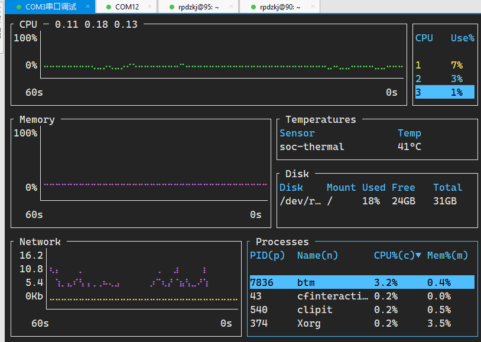

# CPU 温度查看
### bottom
1. 安装：`cargo install -f bottom`
2. 
5. 链接：
	1. [How to install the bottom crate // Lib.rs](https://lib.rs/install/bottom)
	2. [GitHub - ClementTsang/bottom: Yet another cross-platform graphical process/system monitor.](https://github.com/ClementTsang/bottom#installation)