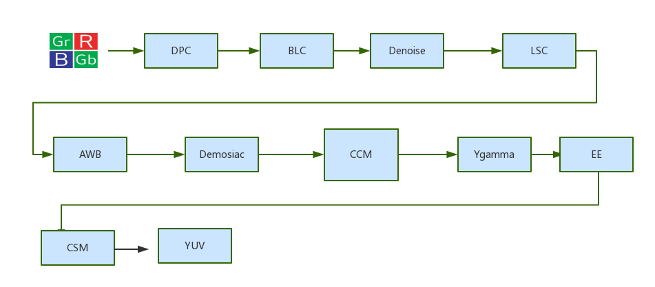

# Camera 数据处理流程

-   RAW 域：是指从 DPC 一直到 demosaic 阶段（此流程图）
-   DPC: 坏点矫正 (bed pixel corr), 坏点由于芯片制造工艺等问题产生的，坏点是指亮度或者色彩与周围其他像素的点有非常大的区别，常用检测方法是在全黑环境下看亮点和彩点和在盖白板的情况下看黑点和彩点，ISP 端一般通过在亮度域上取其他周围像素点均值来消除坏点
-   BLC: 黑电平矫正 (Black level corr)，黑电平是指图像数据为 0 时对应的信号电平，进行黑电平矫正的目的；一是由于 sensor 本身会存在暗电流，导致在没有光照进来的条件下 pixel 也有电压输出，不过这部分一般在 sensor 端就已经处理掉了，还有一个原因是因为 sensor 进行模数转换时精度不够，以 8bit 为例，每个 pixel 有效范围是 0-255，sensor 可能无法将接近于 0 的信息转化出来，由于人眼特性（对暗处细节比较敏感，）所以 sensor 厂商一般在转换时会加一个固定的偏移量使像素输出在 5（非固定值）—255 之间，然后传输在 ISP 端再做一个减法，将 5（非固定值）变为 0
-   Denosice: 降噪. 噪声在图像上常表现为一引起较强视觉效果的孤立像素点或像素块。一般在暗态下噪声表现尤为明显。影响人的主观视觉感受及对目标的观测，所以进行降噪，但是降噪一般伴随着细节的损失
-   LSC: 镜头亮度矫正（lens shading corr）由于镜头光学系统原因（CRA），sensor 中心光轴附件的 pixle 感光量比四周多，所以导致呈现出来的画面会中心亮四周暗（同时由于边缘入射角大，会造成相邻像素间串扰，严重时会导致角落偏色）。所以进行 lsc 的主要目的是为了让画面四周亮度与中心亮度一直，简单理解就是用过增加四周像素的 gain 值，来达到亮度一致
-   AWB：自动白平衡（auto white balance），白平衡顾名思义就是让白色在任何色温下 camera 都能把它还原成白，由于色温的影响，一张白纸在低色温下会偏黄，高色温下会偏蓝，白平衡的目的就是白色物体在任何色问下都是 R=G=B 呈现出白色，比较常用的 AWB 算法有灰度世界，完美反射法等
-   Demosica；颜色插值。SENSOR 每个 pixel 只感知一种颜色分量（如流程图一开始所示），由于人眼对绿色比较敏感所以 G 的分量是 R 与 B 的两倍，所形成的图像称之为 Bayer 图，所以要通过颜色插值使每个 pixel 上同时包含 RGB 三个分量
-   CCM : 色彩校正（color corr matrix），AWB 已经将白色校准了，CCM 就是用来校准白色除白色以外其他颜色的准确度的，用一个 3X3 的 CCM 矩阵来校准, 其中每一列系数 r1+g1+b1 等于一个恒定值 1。Ccm 矫正最终结果可以通过拍摄 24 色卡图片然后用 imatest 分析来做分析参考
-   Ygamma ；由于最早期的显示器端，亮度与电流之间响应不线性的，而是以曲线形式（曲线称之为 gamma 曲线），camera 为了配合显示器显示出正确的亮度所以有了摄像头的 gamma 曲线与显示器 gamma 曲线成反比（不是绝对的），后来随着显示器的工艺发展，显示器亮度与电流之间已经可以做成显性关系了，但是人们发现由于 gamma 曲线的存在，摄像头暗部才能信息更好保留显示，更符合人眼视觉感受，我们可以通过调整 gamma 曲线来调整摄像头的亮度，对比度，动态范围等等的效果
-   EE：锐化，当物体锐化值过低时会出现边缘模糊，图像给人感觉不清晰，锐化过高就会导致图像出现锯齿白边等现象
-   CSM：色彩空间转化（color space matrix），RGB 图像通过一个转转举止向 SRGB 等色彩空间转化的过程
