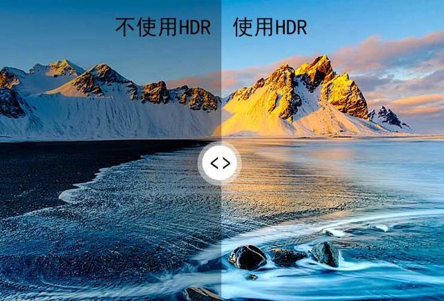

# HDR 基础
## 什么是 HDR？
- HDR 全称是 High-Dynamic Range，即高动态范围图像技术。这项技术最早应用于摄影，在拍照过程中开启 HDR，可以让原先的暗场景变得更明亮更通透
- 简而言之，就是把几张不同曝光的照片合并到一起
### HDR 能带来什么？
拿电脑显示器举个例子。传统显示器所能展现的亮度范围极为有限，与人眼所能感知的范围相差甚远。其原因是传统显示器在画面明亮处的亮度提不上去，暗处暗不下来。这导致了人眼最终所感知到的画面层次感较差，大量细节丢失
