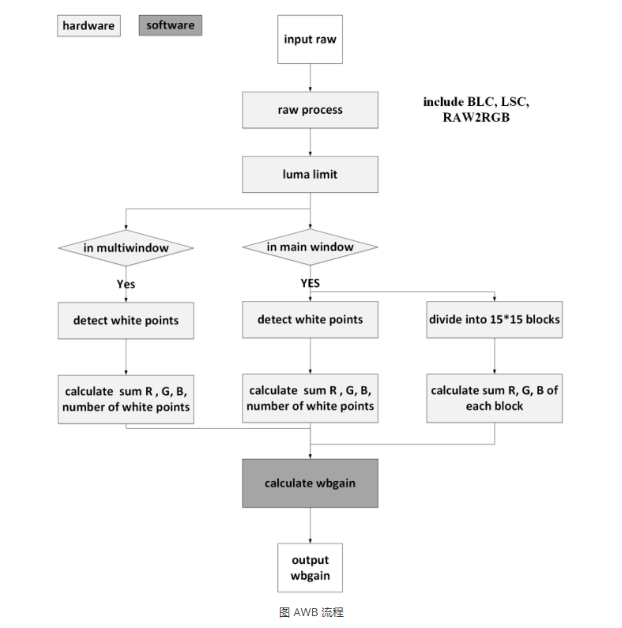

# ISP20
ISP20 相关的颜色调整模块有
- 自动白平衡（auto white balance, AWB)
- 颜色校正（colorcorrection, CC)
- 3 维查找表（three dimension look up table, 3dlut)

## AWB 自动白平衡
- 自动白平衡算法能自动的计算 WB gain (R G B 通道的白平衡增益)，并将其与 RGB 通道分别相乘后，使受环境光影响的白色还原成纯白色，保证在各个光线条件下，相机成像色彩跟物体真实的色彩保持一致。
