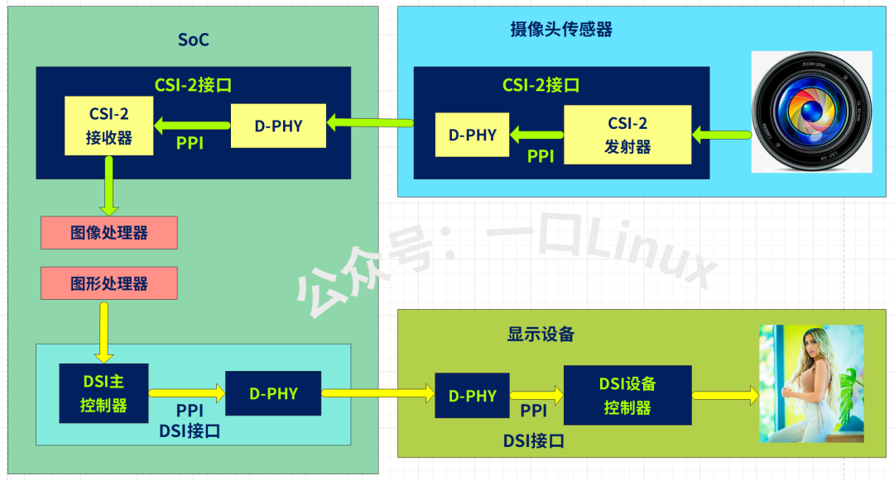
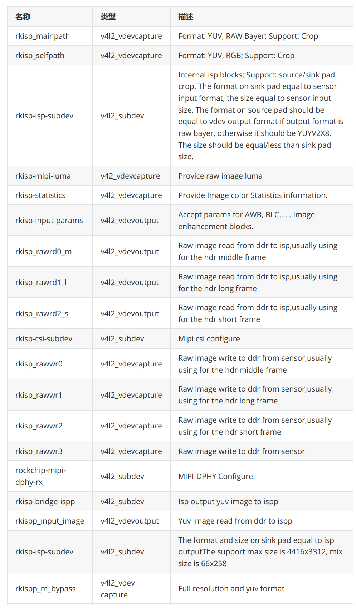

# Linux Camera 架构
## 设备节点 
- `/dev/video<N>`：video 设备主要用于图像操作（结构体struct video_device变量）
- `/dev/v4l-subdev<N>` ：v4l-subdev 设备主要对应 sensor 等具体从设备（struct  v4l2_subdev 变量）
	- 内部的isp和csi、csi-dphy也都需要注册为subdev
- **mainpath**：Format：YUV，RAW Bayer; Support: Crop, 不支持 RGB 格式
- **selfpath**：Format: YUV, RGB; Support :Crop
### Link 
- [7.17. Rockchip Image Signal Processor (rkisp1) — The Linux Kernel documentation](https://damonitor.github.io/doc/html/next/admin-guide/media/rkisp1.html)
## 架构图

- 摄像头输入显示流程

---
## 模块功能
