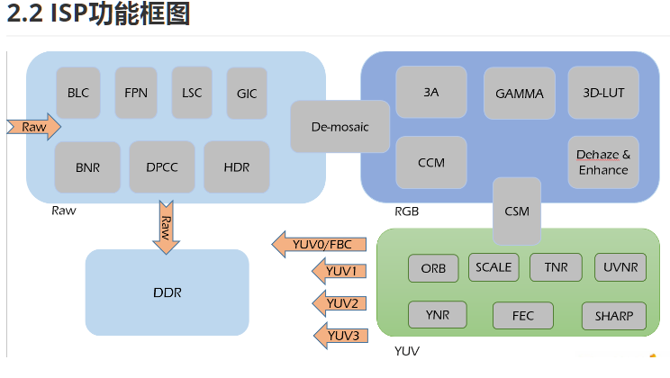

# ISP
* *ISP(Image Signal Processor)*，即图像信号处理器，用于处理图像信号传感器输出的图像信号
* 主要作用是对前端图像传感器输出的信号做后期处理，主要功能有线性纠正、噪声去除、坏点去除、内插、白平衡、自动曝光控制等，依赖于ISP才能在不同的光学条件下都能较好的还原现场细节

# 饱和度
颜色的饱和度是指色彩的纯度，某色彩的纯度越高，则其表现的就越鲜明；纯度越低，表现的则比较黯淡。RGB 三原色的饱和度越高，则可显示的色彩范围就越广泛

