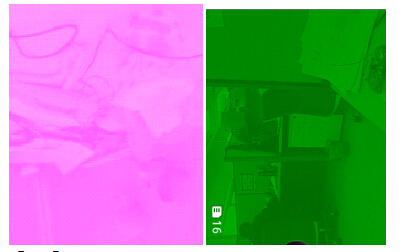
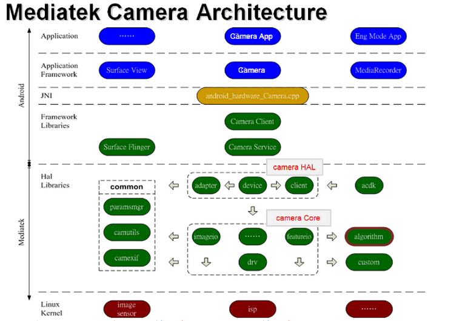
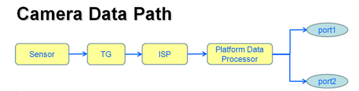

# Image Sensor 类型
* **YUV Sensor** 输出的 Data 格式为 YUV，图像的效果处理使用 Sensor 内部的 ISP，BB 端接收 YUV 格式的 data 后只进行格式的转换，效果方面不进行处理，由于 Sensor 内部的 ISP 处理能力有限，且 YUV Sensor 的数据量比较大（YUV422 的格式 1 个 pixel2 个 byte），一般 Size 都比较小，常见的 YUV sensor 都是 5M 以下

* **Raw Sensor** 输出的 Data 格式为 Raw，图像的效果处理使用 BB 端的 ISP，BB 端接收 Raw data 后进行一系列的图像处理（OB，Shading，AWB，Gamma，EE，ANR 等），效果方面由 BB 端控制，需要针对不同的模组进行效果调试，Raw sensor 是目前的主流，数据量比 YUV Sensor 小（RAW10 格式的 sensor 1 个 pixel 10 个 bit）使用平台 ISP 处理，能支持较大的 size

* 简单说来，Camera 的接口分为并行和串行两种方式

### 三路电压
camera 包含的三路电压为
	1. 模拟电压（VCAMA）
	2. 数字电压（VCAMD）
	3. IO 口电压（VCAMIO）

###  I2C 信号
Sensor 端通过 I2C 来通信（读写寄存器），包括 SCL（I2C Clock） SDA（I2C Data）信号

### mipi 几条 lane
mipi data 是成对的差分信号，MIPI_RDN 和 MIPI_RDP，有几对这样的 pin 脚，则说明是几条 lane，同一颗 sensor 由于 register setting 不同，输出的信号有可能是 2 lane 或者 4lane 等

### parallel 高低八位
Parallel 接口一般 Data 有 10 根 pin，分别叫做 Data0~Data9，Parallel sensor 输出的 data 信号是 8 根 pin 时，这八根 pin 接到的是 Data0~Data7 还是 Data2~Data9，需要配置正确，叫做接到高八位或者低八位，接错了可能产生如下现象

### Data Format
* Sensor 输出的数据格式，对于 YUV Sensor 来说，Data Fomat 一般有 YUYV，YVYU，UYVY 等，配置不对可能会导致颜色和亮度错掉
* 对于 Raw Sensor 来说，Data Format 就是 First Pixel 的颜色，分为 R，Gr，Gb，B，配置不对会导致颜色错误

### MCLK
提供给 Sensor 的外部 clock

### PCLK
Parallel 接口的 Sensor 输出的 clock，该 clock 变化一次，data 更新一次

###  mipi 信号
mipi 信号包括 mipi clock 和 mipi data，该信号是高速信号，用来传输 mipi 数据包

---
# 软件框架

