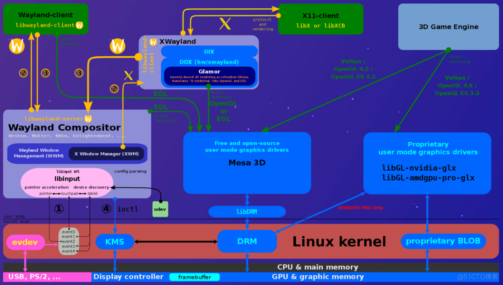
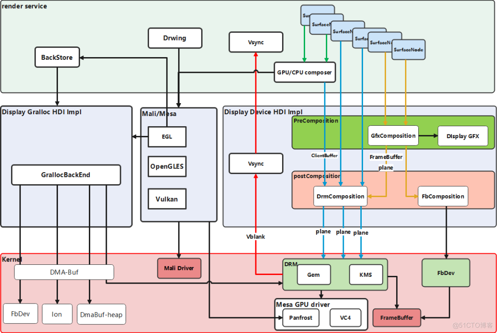
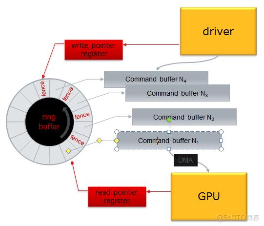

---
tags:
  - GPU
---
## 开源图形驱动架构介绍
整个驱动的架构可以分为2D和3D两个部分，2D部分的比较老的框架是基于X11，而比较新的框架是基于Wayland

3D的部分驱动通过mesa，将OpenGLES或者Vulkan的API以及shader转化为硬件的ISA。而2D的DDX驱动通过glamor也可以走到mesa层，这样避免了2D和3D分岔的驱动路线（过去曾经是分岔的，2D走DDX）

整体的驱动是UMS+KMS结构，UMS负责用户层驱动的解析，而KMS用来做显示和硬件渲染，通过libdrm和DRM来形成UMS到KMS的传递

## 开源图形驱动在OpenHarmony
显示框架支持Display_Gralloc、Display_Gfx和Device HDI的3类南向接口，其中，Display_Gralloc负责内存分配；Display_Gfx负责图形硬件2D绘制，可以用于离线合成；Device HDI负责显示设备特性管理，包括屏幕显示，在线及离线硬件合成，硬件Vsync，显示设备色彩管理等

### Fence
Fence能够让GPU和CPU协调工作，提高图像显示的速度。通过Fence机制产生的GPU的事件，能够保证用户态程序下发的渲染命令被顺序执行，从而保证上层应用程序渲染相关数据的一致性
