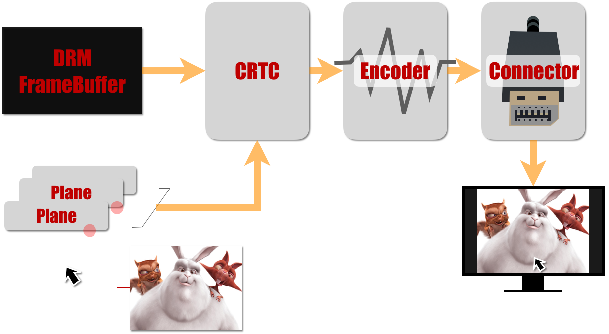
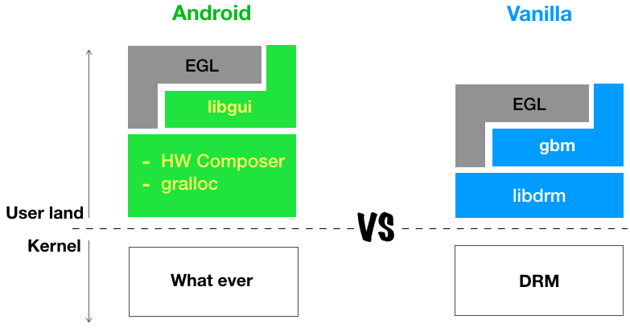
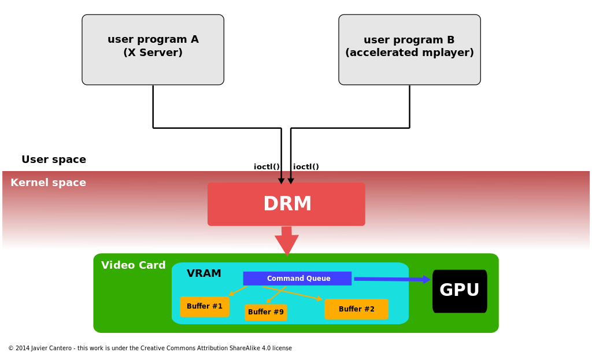
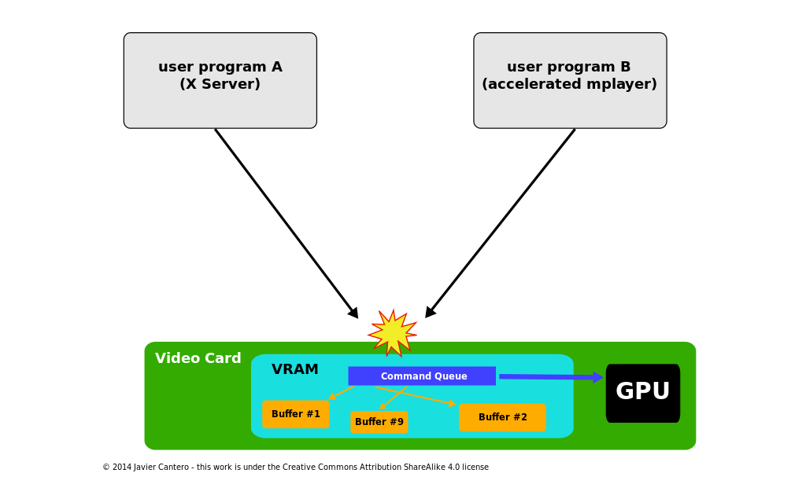
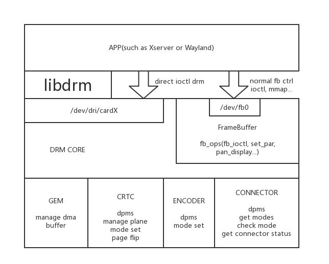
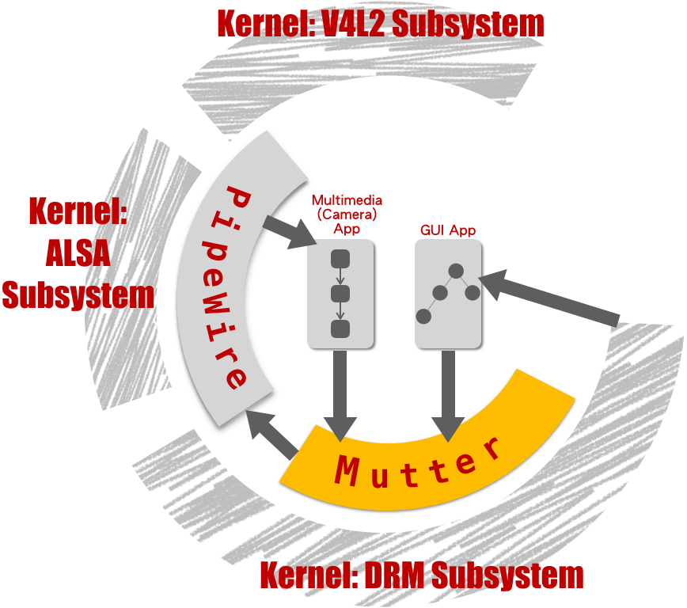

# DRM
- DRM 子系统主要提供一下功能
	- 操作 Frame Buffer / Plane 接口
	- Buffer 管理
	- 模式设定（分辨率、色深、刷新率等）
	
* DRM 功能上相当于 HW Composer + gralloc，只不过 “接口” 是 Linux Kernel 导出的，而不是 HAL。换句话说，HW Composer 和 gralloc 可以映射到 DRM 实现。事实上，一些平台的 Android BSP 正是这样做的。下图对比了两者

* 其中 Compositor 负责将合成后的帧，写入 Frame Buffer

* DRM 框架操作可以分成两类行为：Graphics Execution Manager (GEM)、Kernel Mode-Setting (KMS)
> [!info] GEM 与 KMS
> * GEM 主要是对 FrameBuffer 的管理，如显存的申请释放 (Framebuffer managing) ，显存共享机制 (Memory sharing objects)，及显存同步机制 (Memory synchronization)
> * KMS 主要是完成显卡配置 (Display mode setting)
* DRM 全称是 Direct Rendering Manager，管理进行显示输出的, buffer 分配, 帧缓冲
* 有 drm

* 没有 drm

### DRM 包含以下四项
* **KMS**(Kernel Mode Setting)：Change resolution and depth
* **DRI** (Direct Rendering Infrastructure)：Interfaces to access hardware directly
* **GEM** (Graphics Execution Manager)：Buffer management
* **DRM** Driver in kernel side：Access hardware
![[DRM代码调用.excalidraw]]
### DRM KMS Franework
* **Framebuffer**
	 Memory information such as width, height,depth, bpp, pixel format, and so on
	 
* [CRTC](CRTC.md)
![[DRM流程图.excalidraw]]
* CRTC 可以理解为 Display Controller
* CRTC 的常用行为如下：  
    -   DPMS (Display Power Manage System) 电源状态管理 (crtc_funcs->dpms)
    -   将 Framebuffer 转换成标准的 LCDC Timing ，其实就是一帧图像刷新的过程（crtc_funs->mode_set）
    -   帧切换，即在 VBlank 消影期间，切换 Framebuffer（crtc_funcs->page_flip）
    -   [Gamma](http://www.eizo.com.cn/global/library/basics/lcd_display_gamma/) 校正值调整（crtc_funcs->gamma_set）
* Mode information
	resolution, depth, polarity, porch, refresh rate,and so on
* Information of the buffer region displayed
* Change current framebuffer to new one

* [Encoders](Encoders.md)
	* Encoder 就是指具体接口驱动 eDP / HDMI
	* Encoder 的常用行为如下：
		* DPMS (Display Power Manage System) 电源状态管理 (encoder_funcs->dpms)
		* 将 VOP 输出的 lcdc Timing 打包转化为对应接口时序 HDMI TMDS / … (encoder_funcs->mode_set)
	* Take the digital bit-stream from the CRTC
	* Convert to the appropriate analog levels(for transmission across the connector to the monitor)
	### Implement
	* 提供控制 hardware overlays 的 setup、enable、disable 回调函数
	* 控制显示的电源
	* HDMI 控制

* [Connectors](Connectors.md)
* Connector 指的是具体外接的屏幕 Monitor / Panel
* Connector 的常用行为如下：
	* 获取上报热拔插 Hotplug 状态
	* 读取并解析屏 (Panel) 的 EDID 信息
	Provide the appropriate physical plugs such as HDMI, DVI-D, VGA, S-Video, and so on
	### Implement
	* 控制输出设备的时序(timing)
	* 控制输出设备的电源(power)
	* 控制输出设备的连接 (connection)

> [!example] HDMI Monitor 显示的过程为例
> 1. 首先 HDMI 驱动检测到电视 Plugin 信号，读出电视的 EDID 信号，获取电视的分辨率信息 (DRM Connector)
> 2. Userspace 将需要显示的数据填充在 framebuffer 里面，然后通过 libdrm 接口通知 VOP 设备开始显示
> 3. 接着 VOP 驱动将 framebuffer 里面的数据转换成标准的 LCDC Timing 时序 (DRM CRTC)
> 4. 同时 HDMI 驱动将 HDMI 硬件模块的 LCDC 时序配置与 VOP 输出时序一致，准备将输入的 LCDC Timing 转化为电视识别的 HDMI TMDS 信号 (DRM Encoder)

* [GEM(Graphics Execution Manager)](GEM(Graphics%20Execution%20Manager).md)
	### Physically continuous allocation
	Physically continuous allocation：**CMA**: Continuous Memory Allocator

## Linux 图形栈一览

---
# references
- [DRM driver for Samsung Exynos SoC(branch name: samsung-drm)]<http://git.infradead.org/users/kmpark/linux-2.6-samsung>
- <http://lwn.net/Articles/450178/>
- DRM plane feature<http://lists.freedesktop.org/archives/dri-devel/2011-June/011855.html>
- DRM function<https://landley.net/kdocs/htmldocs/drm.html>
- <https://en.wikipedia.org/wiki/Direct_Rendering_Manager>
