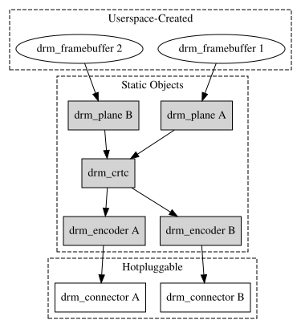

# KMS 

> [!info] KMS
> KMS 全称是 `Kernel Mode Setting`，这里的 mode 是指显示控制器的 mode

KMS 将整个显示控制器的显示 pipeline 抽象成以下几个部分
-   plane
-   crtc
-   encoder
-   connector
# DRM pipeline

> [!info] GEM 与 KMS
> * GEM 主要是对 FrameBuffer 的管理，如显存的申请释放 (Framebuffer managing) ，显存共享机制 (Memory sharing objects)，及显存同步机制 (Memory synchronization)
> * KMS 主要是完成显卡配置 (Display mode setting)

# Links & References
* https://01.org/linuxgraphics/gfx-docs/drm/gpu/drm-kms.html
<iframe 
    height = 400
    width = 100%
    src="https://01.org/linuxgraphics/gfx-docs/drm/gpu/drm-kms.html">
</iframe>
