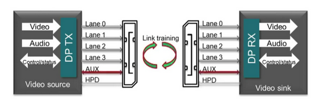

# DP 显示接口

## 物理链路
1. Main lane link： 利用查分信号通过双绞线传输数据
2. AUX：辅助接口
	1. 双向、半双工差分接口
	2. 数据速率为 1Mbits
	3. 使用 VESA、EDID 和 VESA MCCS 标准为主链路传送管理和器件控制数据
3. HPD：热插拔检测
	1. 检测设备插拔：请求使用辅助接口读取 DPCD 寄存器；启动拉电流发送器
	2. 传输中断信号

重定时器可使用时钟恢复电路来恢复衰减的输入信号
### DP main link signaling characteristic
#### 支持 $7$ 种速率传输
- RBR：1.62 Gbps per lane
- HBR: 2.7 Gbps per lane
- HBR2: 5.4Gbps per lane
- HBR3: 8.1Gbps per lane
- UHBR10: 10Gbps per lane
- UHBR13.5: 13.5Gbps per lane
- UHBR20: 20Gbps per lane
#### 可能 lanes 配置
- 1 lane
- 2 lanes
- 4 lanes
- 数据传输速率与 lane 配置通过 AUX 进行配置设定

- DisplayPort 连接器在主链路可以有 1、2、或 4 路差分资料对（巷道），每巷道可以在自定时器执行于 162、270、或 540MHz 的基础上其原始比特率为 1.62、2.7 或者 5.4 Gbit/s。资料为 8b/10b 编码，即每 8 位的消息被编入 10 比特符号中。因此，解码后每通道的有效资料传输速率是 1.296、2.16、4.32 Gbit/s（或者说是总量的 80％）

- DisplayPort可用于同时传输音频和视频，这两项中每一项都可以在没有另外一项的基础上单独传输。视频信号路径中每个颜色通道可以有6到16位，音频路径可以有多达8通道24位192 kHz的非压缩的PCM音频