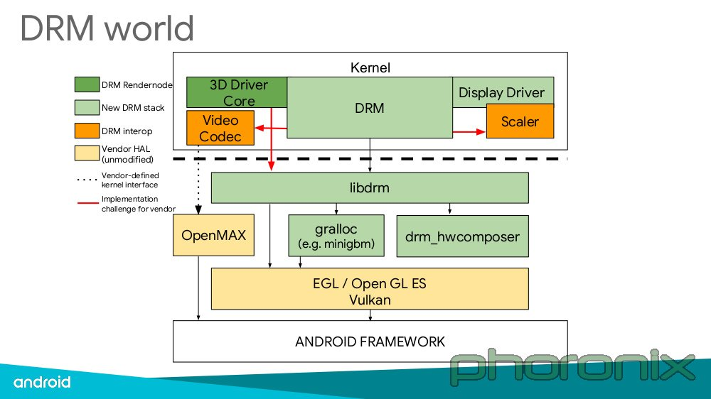
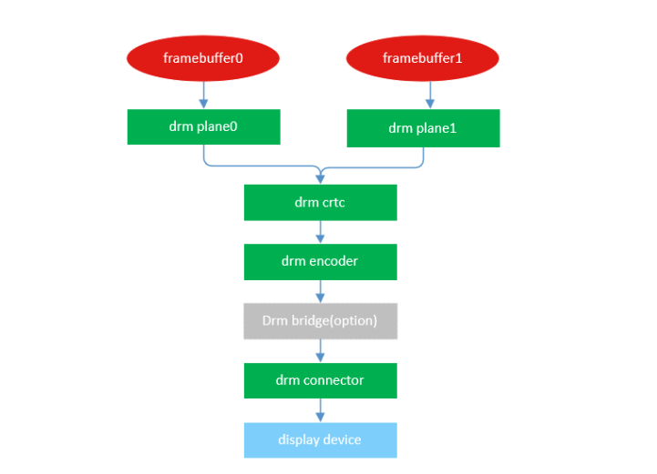
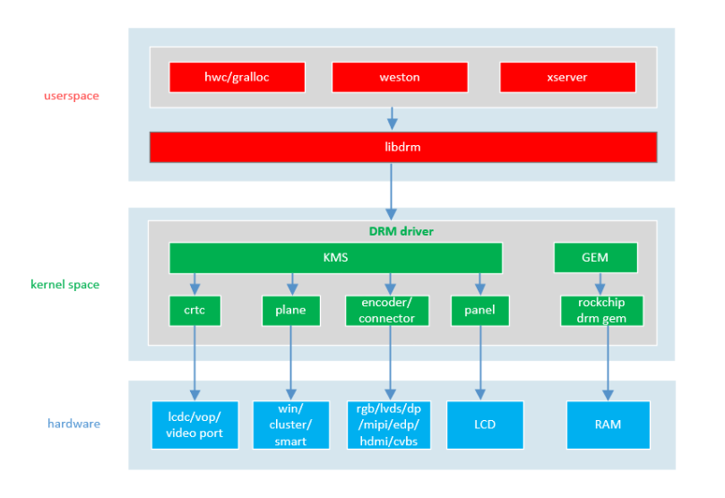

---
tags:
  - DRM
---
# DRM框架

> [!info] DRM
> Direct Rendering Manager

## KMS
![[images/The DRM-KMS subsystem from a newbie’s point of view.png]]

| 元素        | 作用                                                                                       |
| ----------- | ------------------------------------------------------------------------------------------ |
| **CRTC**    | 对显示buffer进行扫描，并产生时序信号的硬件模块，通常指Display Controller |
| **ENCODER** | 负责将CRTC输出的timing时序转换成外部设备所需要的信号的模块，如HDMI转换器或*DSI Controller* |
| **CONNECTOR**            | 连接物理显示设备的连接器，如HDMI、DisplayPort、DSI总线，通常和Encoder驱动绑定在一起  |
| **PLANE** |硬件图层，有的Display硬件支持多层合成显示，但所有的Display Controller至少要有1个plane |
| **FB** |Framebuffer，单个图层的显示内容，唯一一个和硬件无关的基本元素 |
| **VBLANK** |软件和硬件的同步机制，RGB时序中的垂直消影区，软件通常使用硬件VSYNC来实现 |
| **property** |任何你想设置的参数，都可以做成property，是DRM驱动中最灵活、最方便的Mode setting机制 |

---
# Link & Reference
* https://manpages.ubuntu.com/manpages/impish/man7/drm-kms.7.html
<iframe 
    height = 400
    width = 100%
    src="https://manpages.ubuntu.com/manpages/impish/man7/drm-kms.7.html">
</iframe>
