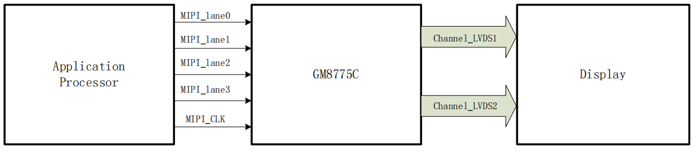

# GM8775C
GM8775C 型 DSI 转双通道 LVDS 发送器产品主要实现将 MIPI DSI 转单/双通道 LVDS 功能，MIPI 支持 1/2/3/4 通道可选，每通道最高支持 1Gbps 速率，最大支持 4Gbps 速率。LVDS 时钟频率高达 154MHz，最大支持视频格式为 FULL HD（1920 x 1200）。系统应用图如下：

## 参数计算
### 时钟计算
$$
\mbox{clock-frequency} = (hactive + hfront + hsync + hback)\times (vactive + vsync  + vback) \times fps
$$
### Lane 速率计算
$$
\mbox{lane-rate} = \frac{\frac{\mbox{clock-frequency} \times 1000 \times bpp} {lanes}}{0.9}
$$

# Link
- [mipi_dsi 接口转 lvds显示(GM8775C）](https://blog.csdn.net/qq_48709036/article/details/124296103)