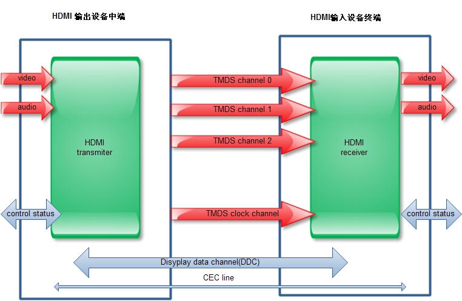

# HDMI

### HDMI 传输原理
- HDMI 采用 TMDS (TimeMinimized Differential Signal) 最小化传输差分信号传输技术 , TMDS 是一种微分信号机制, 采用的是差分传动方式 , 是一种利用 2 个引脚间电压差来传送信号的技术
- HDMI把视频信号分为R、G、B、H、V五种信号用TMDS技术编码
- TMDS:这三个通道传输R、G、B三原色,HV编码在B信号通道里面传输,R、G的多余位置用来传输音频信号
- DDC :即显示数据通道,用来向视频接收装置发送配置信息和数据格式信息
- E-EDID(增强扩展显示识别数据)的信息
- CEC:即消费电子控制通道,通过这条通道可以控制视听设备的工作

### HDMI 数据容量
1. 1.0版本规定为25MHz-165MHz之间,也就是说一个TMDS通道每秒最多能传输165MHz×10bit=1.65Gbit的数据,3个TMDS通道一秒就可以传输1.65×3=4.95Gbit的数据,再加上控制数据,用标准方法表示就是4.96Gbps的带宽
2.  在1.3版本规格中,TMDS连接带宽从原来最高165MHz提升到340MHz,数据传输率也从4.96Gbps提升到了10.2Gbps

### HDMI 数据传输
HDMI 输入的源编码格式包括视频像素数据 (8 位)、控制数据 (2 位) 和数据包 (4 位)。其中数据包中包含有音频数据和辅助信息数据。数据传输过程可以分成三个部分: 视频数据传输期、岛屿数据传输期和控制数据传输期
视频数据传输期: HDMI 数据线上传送视频像素信号, 视频信号经过编码, 生成 3 路 (即 3 个 TMDS 数据信息通道, 每路 8 位) 共 24 位的视频数据流, 输入到 HDMI 发射器中。24 位像素的视频信号通过 TMDS 通道传输, 将每通道 8 位的信号编码转换为 10 位, 在每个 10 位像素时钟周期传送一个最小化的信号序列, 视频信号被调制为 TMDS 数据信号传送出去, 最后到接受器中接收

### HDMI 音频功能
- 传统的数字音频信号的传输主要依靠两种途径:同轴电缆和光纤传输
- 同轴电缆传输数字音频信号是一种非常成熟且高质量的方式。这种接口标准对设备端的硬件要求较低,但是在传输高频信号时,容易发生比较大的衰减,影响到最终音质
-  HDMI技术则综合了以上两者的优点:物理层采用成熟的电缆连接。HDMI理论上可以实现最高20米的无损耗数字音频信号传播,那些对距离有要求的用户也能较好接受

# Link
[android HDMI (一)：HDMI基础篇](https://blog.csdn.net/xubin341719/article/details/7713450?spm=a2c6h.12873639.article-detail.6.3a4b65bdP9QYVg)