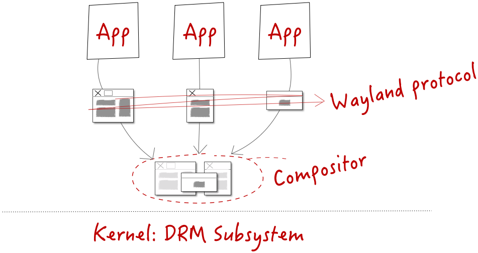

# weston
- Weston 是 Wayland 合成器的参考实现，同时也是一个开箱即用的多用途桌面环境。
- Weston 还提供了一个可复用的  libweston 库，允许其他项目基于 Weston 核心构建自己的全功能环境。
- App 将画好的 surface，通过 Wayland 协议提交给 Compositor。Compositor 将来自各个应用的 surface (s) 合成为一帧，通过 DRM 接口最终画在 Frame Buffer

---
## Link
1. [LWN：Linux图形栈简介，第二部分](https://blog.csdn.net/Linux_Everything/article/details/135687697?spm=1001.2101.3001.6650.3&utm_medium=distribute.wap_relevant.none-task-blog-2%7Edefault%7ECTRLIST%7ERate-3-135687697-blog-135663341.237%5Ev3%5Ewap_relevant_t0_download&depth_1-utm_source=distribute.wap_relevant.none-task-blog-2%7Edefault%7ECTRLIST%7ERate-3-135687697-blog-135663341.237%5Ev3%5Ewap_relevant_t0_download)
2. [RockChip buildroot Weston配置](assets/Rockchip_Developer_Guide_Buildroot_Weston_CN.pdf)
3. [GitHub - wayland-project/weston: Reference compositor for Wayland (mirror)](https://github.com/wayland-project/weston)