---
tags:
  - Display
link: https://www.cnblogs.com/shangdawei/p/4760933.html
---
# 显示屏原理
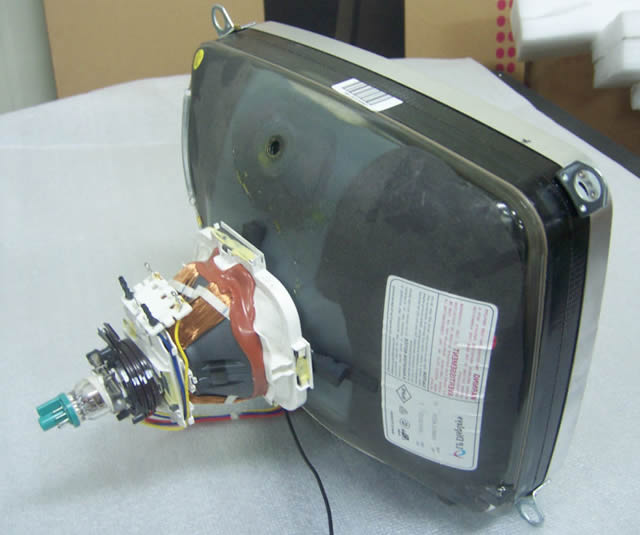

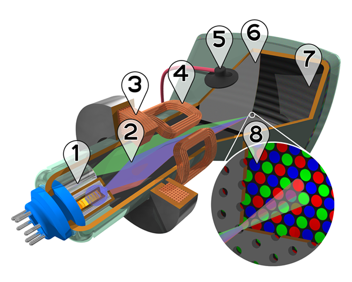

彩色阴极射线管的剖面图:

1. 电子 QIANG Three Electron guns (for red, green, and blue phosphor dots)  
2. 电子束 Electron beams  
3. 聚焦线圈 Focusing coils  
4. 偏向线圈 Deflection coils  
5. 阳极接点 Anode connection  
6. Mask for separating beams for red, green, and blue part of displayed image  
7. 荧光粉层 Phosphor layer with red, green, and blue zones  
8. Close-up of the phosphor-coated inner side of the screen

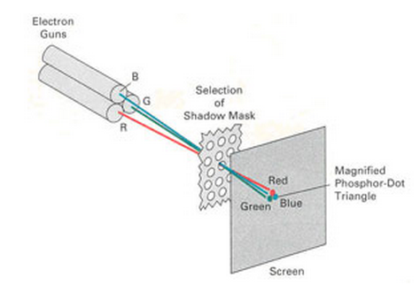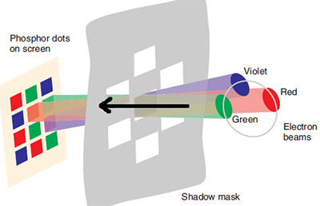

## 阴极射线管

**阴极射线管**（**Cathode ray tube**，缩写：**CRT**，又称“显像管”、布劳恩管）是一种用于显示系统的物理仪器，

曾广泛应用于示波器、电视机和显示器上。它是利用阴极电子qiang发射电子，在阳极高压的作用下，射向萤光屏，使萤光粉发光，

同时电子束在偏转磁场的作用下，作上下左右的移动来达到扫描的目的。

早期的阴极射线管仅能显示光线的强弱，展现黑白画面。

而彩色阴极射线管具有红、绿色和蓝色三支电子QIANG，三支电子QIANG同时发射电子打在屏幕玻璃上磷化物上来显示颜色。

由于它笨重、耗电且较占空间，2000年代起几乎被轻巧、省电且省空间的液晶显示器取代。

阴极射线管的市场剩下极重视色彩表现及低温环境下等特殊用途。

最早的阴极射线管是由英国人威廉·克鲁克斯首创，可以发出射线，这种阴极射线管被称为克鲁克斯管。

德国人卡尔·费迪南德·布劳恩在阴极射线管上涂布萤光物质，

此种阴极射线显像管被称为布劳恩管，在德国、日本等地，仍广泛使用布劳恩管这一称呼。

## 显像管的种类

1.  磁场偏向型：以磁场令电子束产生偏向，产生磁场的偏向线圈附加在阴极射线管颈部外侧。  
    电视机使用此种方式的显像管。
2.  电场偏向型：以电场令电子束产生偏向，产生电场的偏向极板内建在阴极射线管内部。  
    示波器使用此种方式的显像管，以利应付不同的扫描频率，但此方式需要较长的管身。
3.  威廉士管：具有记忆保持功能的特殊阴极射线管。

CRT显示器的视频带宽可以看做每秒钟所扫描的像素点数的总和，一般采用MHz（兆赫兹）为单位。

众所周知，CRT显示器是靠电子束激发屏幕内表面的荧光粉来显示图像的，

由于荧光粉被点亮后很快会熄灭，所以电子QIANG必须循环地不断激发这些点。

屏幕分辨率越高，需要扫描的点数就越多，对电子QIANG扫描频率的要求就更高，视频带宽也因此需要提高。

一般来说，CRT显示器工作频率范围在电路设计时就已经固定了，主要取决于高频放大部分元件的特性，

由于高频电路的设计相对困难，因此成本也较高，同时还会产生一定的辐射。

对于CRT显示器而言，高频处理能力越好，视频带宽所能达到的频率越高，图像稳定性也越好。

CRT显示器对视频带宽的要求，除了分辨率外，还和它的场频有密切的关系。

场频是指CRT显示器屏幕每秒钟刷新的次数，又称为垂直扫描频率。

当场频过低时，人眼会感觉到屏幕有明显的闪烁，图像稳定性差，容易造成眼睛疲劳。

一般来讲，CRT显示器屏幕的场频要达到75Hz以上人眼才不易出现闪烁感，但长时间注视必然会让眼睛感到很累。

此外，视频带宽不仅对显示器寿命和故障率有影响，还对显示器品质有重要影响。

如果显示器实际带宽不足以支持用户设定的分辨率和场频，则会使显示的清晰度受到影响，从而影响显示效果。

显示器对带宽的要求可以用分辨率与场频来计算：带宽要求等于“水平分辨率×垂直分辨率×场频”。
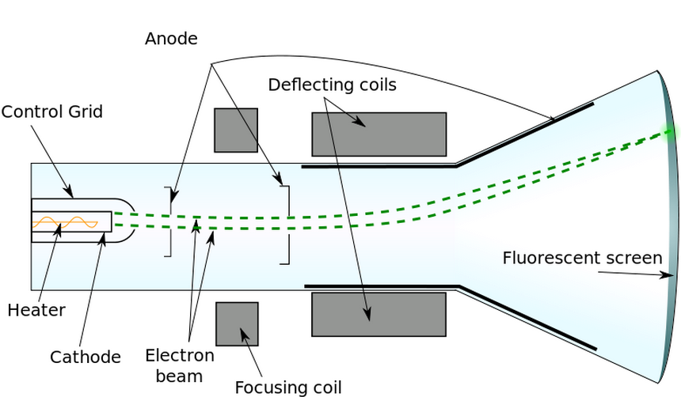

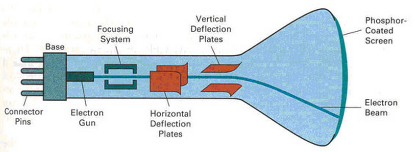

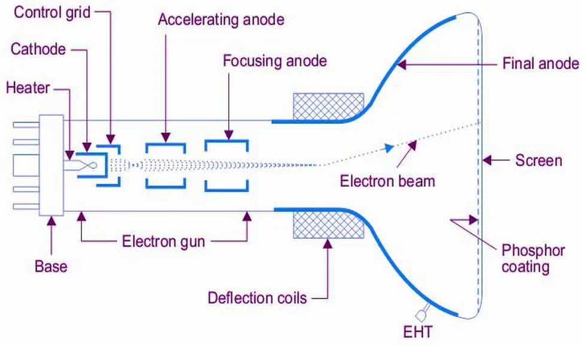

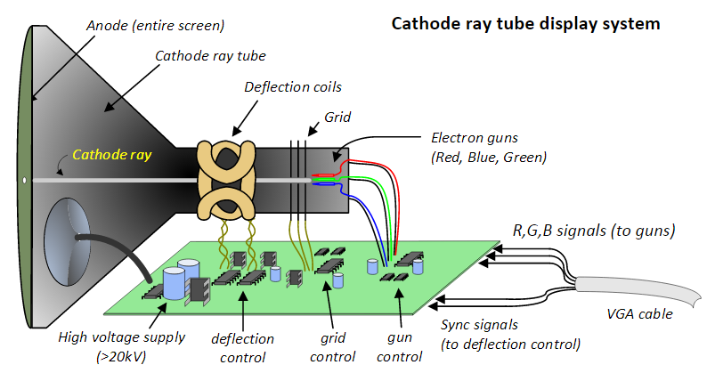
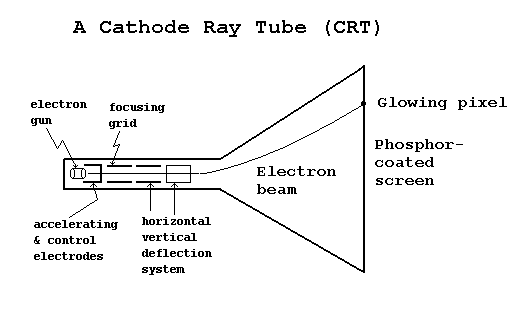

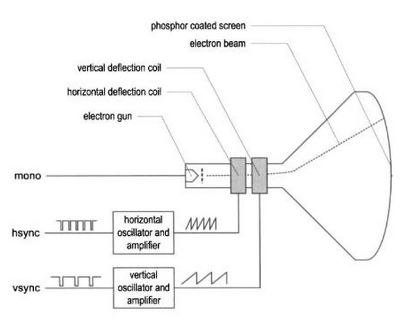

CRT显示器(学名为“阴极射线显像管”)是就是这样一种装置，它主要由电子QIANG(Electron gun)、

偏转线圈(Deflection coils)、荫罩(Shadow mask)、荧光粉层(phosphor)和玻璃外壳五部分组成。

其中我们印象最深的肯定是玻璃外壳，也可以叫做荧光屏，因为它的内表面可以显示丰富的色彩图像和清晰的文字。

CRT显示器是怎样将三原色原理用在其中。当然，并不是直接将这三原色画在荧光屏上，而是用电子束来进行控制和表现的。

简单的理解，CRT显示终端的工作原理就是当显像管内部的电子QIANG阴极发出的电子束，经强度控制、聚焦和加速后变成细小的电子流，

再经过偏转线圈的作用向正确目标偏离，穿越荫罩的小孔或栅栏，轰击到荧光屏上的荧光粉。这时荧光粉被启动，就发出光线来。

R、G、B三色荧光点被按不同比例强度的电子流点亮，就会产生各种色彩。

电子QIANG（Electron gun）的工作原理是由灯丝加热阴极，阴极发射电子，然后在加速极电场的作用下，

经聚焦极聚成很细的电子束，在阳极高压作用下，获得巨大的能量，以极高的速度去轰击荧光粉层。

这些电子束轰击的目标就是荧光屏上的三原色。为此，电子QIANG发射的电子束不是一束，而是三束，

它们分别受计算机显卡R、 G、 B三个基色视频信号电压的控制，去轰击各自的荧光粉单元。

受到高速电子束的激发，这些荧光粉单元分别发出强弱不同的红、绿、蓝三种光。

从而混合产生不同色彩的像素，大量的不同色彩的像素可以组成一张漂亮的画面，

而不断变换的画面就成为可动的图像。很显然，像素越多，图像越清晰、细腻，也就更逼真。

偏转线圈（Deflection coils)的作用就是帮助电子QIANG发射的三支电子束，以非常非常快的速度对所有的像素进行扫描激发。

就可以使显像管内的电子束以一定的顺序，周期性地轰击每个像素，使每个像素都发光；

而且只要这个周期足够短，也就是说对某个像素而言电子束的轰击频率足够高，

我们就会看到一幅完整的图像。有了扫描，就可以形成画面。

荫罩（Shadow mask）的作用是保证三支电子束在扫描的过程中，准确击中每一个像素。

荫罩是厚度约为0.15mm的薄金属障板，它上面有很多小孔或细槽，它们和同一组的荧光粉单元即像素相对应。

三支电子束经过小孔或细槽后只能击中同一像素中的对应荧光粉单元，

因此能够保证彩色的纯正和正确的会聚，所以我们才可以看到清晰的图像。

最后，场扫描的速度来决定画面的连续感，场扫描越快，形成的单一图像越多，画面就越流畅。

而每秒钟可以进行多少次场扫描通常是衡量画面质量的标准，

我们通常用帧频或场频（单位为Hz，赫兹）来表示，帧频越大，图像越有连续感。

### 1、电子QIANG是如何工作的

这首先有赖于荧光粉层，在荧光屏上涂满了按一定方式紧密排列的红、绿、蓝三种颜色的荧光粉点或荧光粉条，

称为荧光粉单元，相邻的红、绿、蓝荧光粉单元各一个为一组，学名称之为像素。

每个像素中都拥有红、绿、蓝(R、G、B)三原色，根据我们刚才所说的三原色理论，这就有了形成千变万化色彩的基础。

然而，怎样把这三原色混合成丰富的色彩。

我们通过电子QIANG(Electron gun)来解决这个问题，没错，电子QIANG就好像手QIANG一样，可以发射，不过发射的不是子弹，而是非常高速的电子束。

其工作原理是由灯丝加热阴极，阴极发射电子，然后在加速极电场的作用下，经聚焦极聚成很细的电子束，

在阳极高压作用下，获得巨大的能量，以极高的速度去轰击荧光粉层。

这些电子束轰击的目标就是荧光屏上的三原色。为此，电子QIANG发射的电子束不是一束，而是三束，

它们分别受电脑显卡R、 G、 B三个基色视频信号电压的控制，去轰击各自的荧光粉单元。

受到高速电子束的激发，这些荧光粉单元分别发出强弱不同的红、绿、蓝三种光。

根据空间混色法(将三个基色光同时照射同一表面相邻很近的三个点上进行混色的方法)产生丰富的色彩，

这种方法利用人们眼睛在超过一定距离后分辨力不高的特性，产生与直接混色法相同的效果。

用这种方法可以产生不同色彩的像素，而大量的不同色彩的像素可以组成一张漂亮的画面，而不断变换的画面就成为可动的图像。

很显然，像素越多，图像越清晰、细腻，也就更逼真。可是，怎样用电子QIANG来同时激发这数以万计的像素发光并形成画面。

### 2、画面是如何形成的

科学家们想到了一个很聪明的办法，其原理是利用了人们眼睛的视觉残留特性和荧光粉的余辉作用，

这就是我们即使只有一支电子QIANG，只要我们的三支电子束可以足够快地向所有排列整齐的像素进行激发，

我们还是可以看到一幅完整的图像的。大家不要怀疑，我们现在的CRT显示器中的电子QIANG能发射这三支电子束，

然后以非常非常快的速度对所有的像素进行扫描激发。要形成非常高速的扫描动作，我们还需要偏转线圈(Deflection coils)的帮助，

通过它，我们可以使显像管内的电子束以一定的顺序，周期性地轰击每个像素，使每个像素都发光，而且只要这个周期足够短，

也就是说对某个像素而言电子束的轰击频率足够高，我们就会看到一幅完整的图像。

我们把这种电子束有规律的周期性运动叫扫描运动。

### 3、显示器的扫描方式 

理解了三原色，聪明的你一定会想到，可以用这样一个原理来制作彩色显示器呀。

没错，我们今天的色彩丰富的CRT显示器正是由这个三原色原理制造出来的。

刚才提到，三原色的选择在原则上是任意的，但是通过实验研究发现，

人们的眼睛对红、绿、蓝三种颜色反应最灵敏，而且它们的配色范围比较广，

用这三种颜色可以随意配出自然界中的大部分颜色，

因此在CRT显示器中，选用红、绿、蓝三种颜色作为三原色，

还分别用R、G、B三个字母来表示。

现在问题来了，怎样可以把这三原色的光表现出来呢，我们需要一个机电装置来完成这一表现过程。

没错，因为有大量排列整齐的像素需要激发，必然要求有规律的电子QIANG扫描运动才显得高效，通常实现扫描的方式很多，

如直线式扫描，圆形扫描，螺旋扫描等等。其中，直线式扫描又可分为逐行扫描和隔行扫描两种，

相信大家都经常听到，事实上，在CRT显示系统中两种都有采用。

逐行扫描是电子束在屏幕上一行紧接一行从左到右的扫描方式，是比较先进的一种方式。

而隔行扫描中，一张图像的扫描不是在一个场周期中完成的，而是由两个场周期完成的。  
在前一个场周期扫描所有奇数行，称为奇数场扫描，在后一个场周期扫描所有偶数行，称为偶数场扫描。

无论是逐行扫描还是隔行扫描，为了完成对整个屏幕的扫描，扫描线并不是完全水平的，  
而是稍微倾斜的，为此电子束既要作水平方向的运动，又要作垂直方向的运动。

前者形成一行的扫描，称为行扫描，后者形成一幅画面的扫描，称为场扫描。 

有了扫描，就可以形成画面，然而在扫描的过程中，怎样可以保证三支电子束准确击中每一个像素。  
这就要借助于荫罩(Shadow mask)，它的位置大概在荧光屏后面(从荧光屏正面看)约10mm处，  
厚度约为0.15mm的薄金属障板，它上面有很多小孔或细槽，它们和同一组的荧光粉单元即像素相对应。

三支电子束经过小孔或细槽后只能击中同一像素中的对应荧光粉单元，因此能够保证彩色的纯正和正确的会聚，  
所以我们才可以看到清晰的图像。至于画面的连续感，则是由场扫描的速度来决定的，场扫描越快，  
形成的单一图像越多，画面就越流畅。

而每秒钟可以进行多少次场扫描通常是衡量画面质量的标准，我们通常用帧频或场频(单位为Hz，赫兹)来表示，

帧频越大，图像越有连续感。我们知道，24Hz场频是保证对图像活动内容的连续感觉，48Hz场频是保证图像显示没有闪烁的感觉，

这两个条件同时满足，才能显示效果良好的图像。

其实，这就跟动画片的形成原理是相似的，一张张的图片快速闪过人的眼睛，就形成连续的画面，就变成动画。

### 什么叫光栅扫描

光栅扫描显示器显示图形时，电子束依照固定的扫描线和规定的扫描顺序进行扫描。

电子束先从荧光屏左上角开始，向右扫一条水平线，然后迅速地回扫到左边偏下一点的位置，

再扫第二条水平线，照此固定的路径及顺序扫下去，直到最后一条水平线，即完成了整个屏幕的扫描。

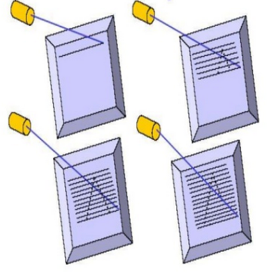
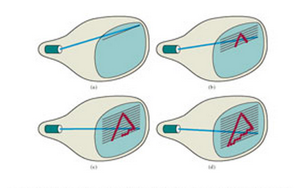

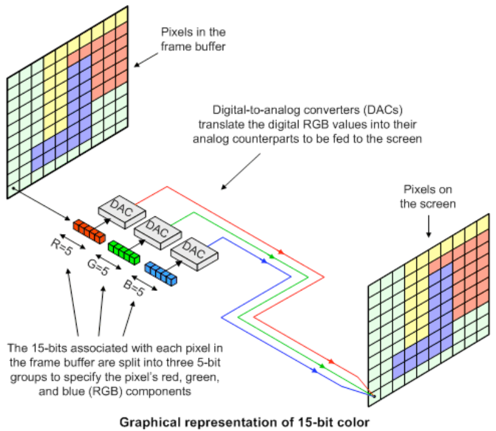

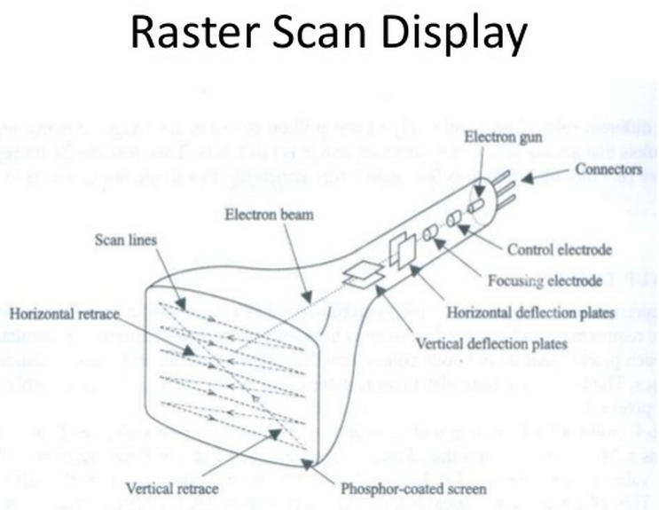

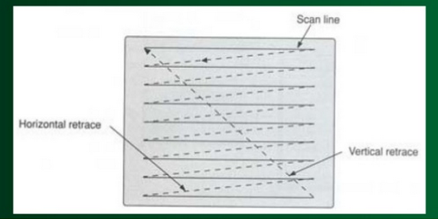

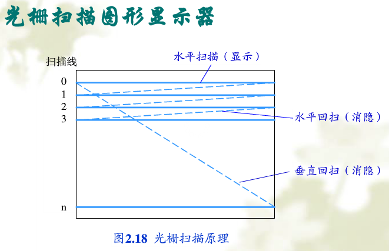

## Displaying a picture

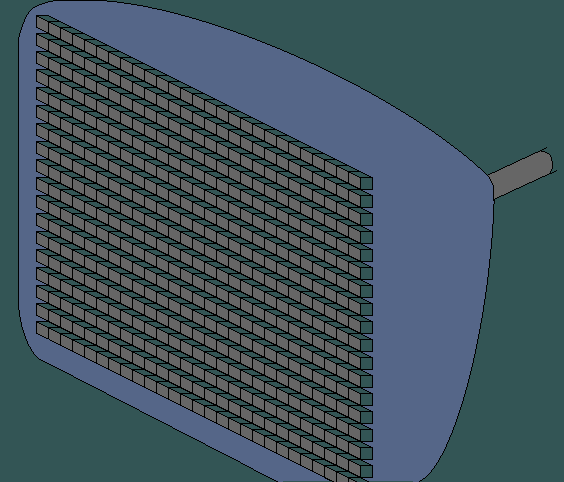

**H-SYNC & V-SYNC Pulse Signals**

Try and view the H-SYNC and V-SYNC signals like Custom "COUNTERS"

that are constantly running and counting up to their MAXIMUM declared value,

resetting to zero and then counting up once again.

Every time the H-SYNC counter resets to zero, the V-SYNC counter is only incremented by 1.

The animated GIF Image shown below shows how the H-SYNC & V-SYNC signals are used together to create the Screen Refresh Cycle.

When you look at these signals like (X & Y) counters, they essentially count through each Pixels on the screen

from the Top Left corner all the way down in sequence to the Bottom Right corner.

This process repeats 60 times per second, due to the fact that we are using a 60Hz refresh rate.

The H-SYNC and V-SYNC signal patterns that we send to the VGA monitor,

when working together, they create the Zig-Zag scanning effect as shown below.

Now, depending on the Frequency, Pulse Width and Duty Cycle of these signal patterns...

we can create different resolution settings for the monitor to display.

So we have a specific H-SYNC and V-SYNC signal Pattern for creating the Zig-Zag scanning cycle of a 640 X 480 screen resolution,

and we also have another H-SYNC and V-SYNC signal Pattern for a 1600 X 1200 screen resolution, and many more.

The Image above is actually showing what's called Interlaced Frames.

You don't really need to worry about that right now, as we are not using this particular format.

The animated image is mainly being used to show you the basic concept of a screen "Refresh Cycle".

Now the fact that we are using a resolution setting of (640 x 480) this means that we have 640 Pixels

that run from the left side of our screen to the Right Side.

This also means that we have 480 Pixels that run from the Top of the screen to the Bottom.

In other words, what we have here is a 640 X 480 Pixel Matrix.

You can consider the Top Left corner of the Screen as the starting point for your H-SYNC and V-SYNC counters starting at Zero.

The H-SYNC Counter then proceeds to increment through all 640 pixels on the first horizontal row from Left to Right.

Once it reaches the end of the Row, it then resets to the beginning.

However this time, it also moves down by one pixel to the next Row and increments the V-SYNC counter by 1.

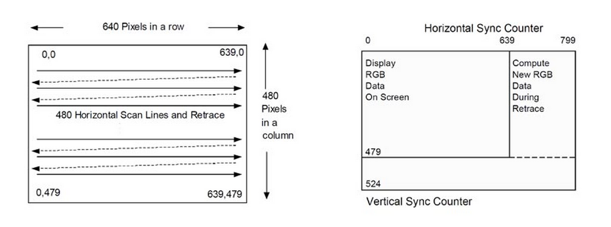

This process is repeated until the V-SYNC counter counts to 479, which brings it to the last Row at the Bottom of the screen.

Then, when the H-SYNC counter reaches the last pixel on the Bottom Right corner of the Screen (639),

both the H-SYNC and V-SYNC counters are reset to Zero.

This brings us back to the Top Left corner pixel and the entire counting Process starts all over again.

A single pass over the entire screen is called a "Screen Refresh Cycle" and this is repeated 60 times per second

to refresh the screen and update each pixel for a particular color... and in turn, this produces an Image on the screen.

Review the Animated GIF image above to get a better understanding of this "Screen Refresh" process in action.

A CRT television displays an image by scanning a beam of electrons

across the screen in a pattern of horizontal lines known as a raster.

At the end of each line the beam returns to the start of the next line;

at the end of the last line it returns to the top of the screen.

As it passes each point the intensity of the beam is varied,

varying the brightness (technically, luminance) of that point.

A color television system is identical except that an additional signal

known aschrominance controls the color of the spot.

Raster scanning is shown in a slightly simplified form below.

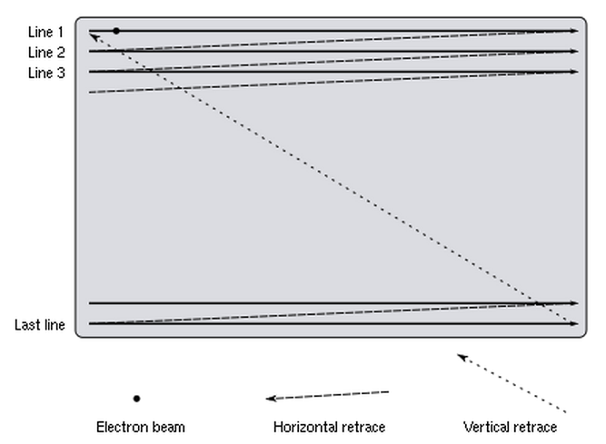

When analog television was developed, no affordable technology for storing any video signals existed;

the luminance signal has to be generated and transmitted at exactly the point in time at which is displayed on the CRT.

It is therefore essential to keep the raster scanning in the camera (or other device for producing the signal)

in exact synchronization with the scanning in the television.

The physics of the CRT require that a finite time interval is allowed

for the spot to move back to the start of the next line **(horizontal retrace)**

or the start of the screen **(vertical retrace).**

The timing of the luminance signal must allow for this.

Raster scanning has to be performed sufficiently quickly that persistence of vision allows the eye

to view a stable image, and such that moving images can be displayed without appearing jerky.

The maximum frame rate achievable depends on the bandwidth of the electronics and transmission system,

and the number of lines in the image. In practice, a rate of 50 or 60 hertz is a satisfactory compromise,

with interlacing used to double the apparent number of lines.

### Picture and Synchronisation

The video carrier is demodulated to give a composite video signal;

this contains luminance (brightness), chrominance (color) and synchronisation signals;

this is identical to the video signal format used by analog video devices such as VCRs or CCTV cameras.

Note that the RF signal modulation is inverted compared to the conventional AM:

the minimum video signal level corresponds to maximum carrier amplitude, and vice versa.

The carrier is never shut off altogether; this is to ensure that intercarrier sound demodulation can still occur.

Each line of the displayed image is transmitted using a signal as shown below.

The same basic format (with minor differences mainly related to timing and the encoding of color)

is used for PAL, NTSC and SECAM television systems.

A monochrome signal is identical to a color one, with the exception that the elements shown in color in the diagram

(the color burst, and the chrominance signal) are not present.

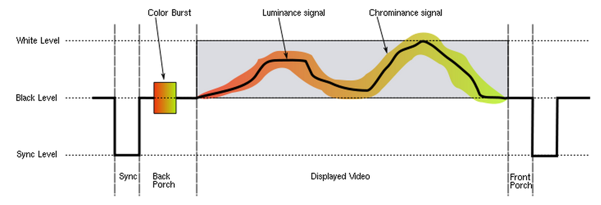

### Synchronisation

Synchronisation is transmitted via negative-going pulses;

in a composite video signal these are approximately 0.3V below the "black level".

**The horizontal sync signal is a single short pulse which indicates the start of every line.**

Two timing intervals are defined -  
**the** **front porch** between the end of displayed video and the start of the sync pulse, and**the** **back porch** after the sync pulse and before displayed video.

These and the sync pulse itself are called **the** **horizontal blanking (or retrace) interval** and represent the time that the electron beam in the CRT is returning to the start of the next display line.

**The vertical sync signal is a series of much longer pulses, indicating the start of a new field.**  
The sync pulses occupy the whole of line interval of a number of lines at the beginning and end of a scan;  
no picture information is transmitted during vertical retrace.

The pulse sequence is designed to allow horizontal sync to continue during vertical retrace;  
it also indicates whether each field represents even or odd lines in interlaced systems  
(depending on whether it begins at the start of a horizontal line, or mid-way through).

In the TV receiver, a sync separator circuit detects the sync voltage levels and sorts the pulses into horizontal and vertical sync.  
These are fed to horizontal and vertical timebase circuits which generate sawtooth current waveforms,  
which are each reset by the appropriate sync pulse.

These waveforms are fed to the horizontal and vertical scan coils wrapped around the CRT tube.  
These produce a magnetic field proportional to the changing current,  
and this deflects the electron beam, scanning it across the tube surface.

The lack of precision timing components available in early television receivers meant  
that the timebase circuits occasionally needed manual adjustment.  
The adjustment took the form of horizontal hold and vertical hold controls, usually on the rear of the set.

Loss of horizontal synchronisation usually resulted in an unwatchable picture;  
loss of vertical synchronisation would produce an image rolling up or down the screen.

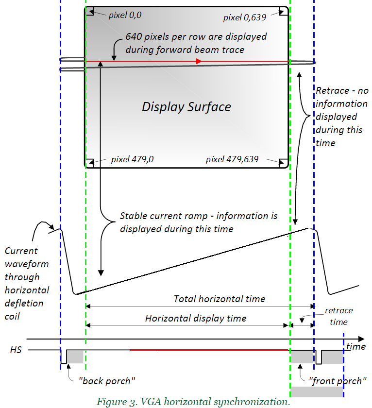

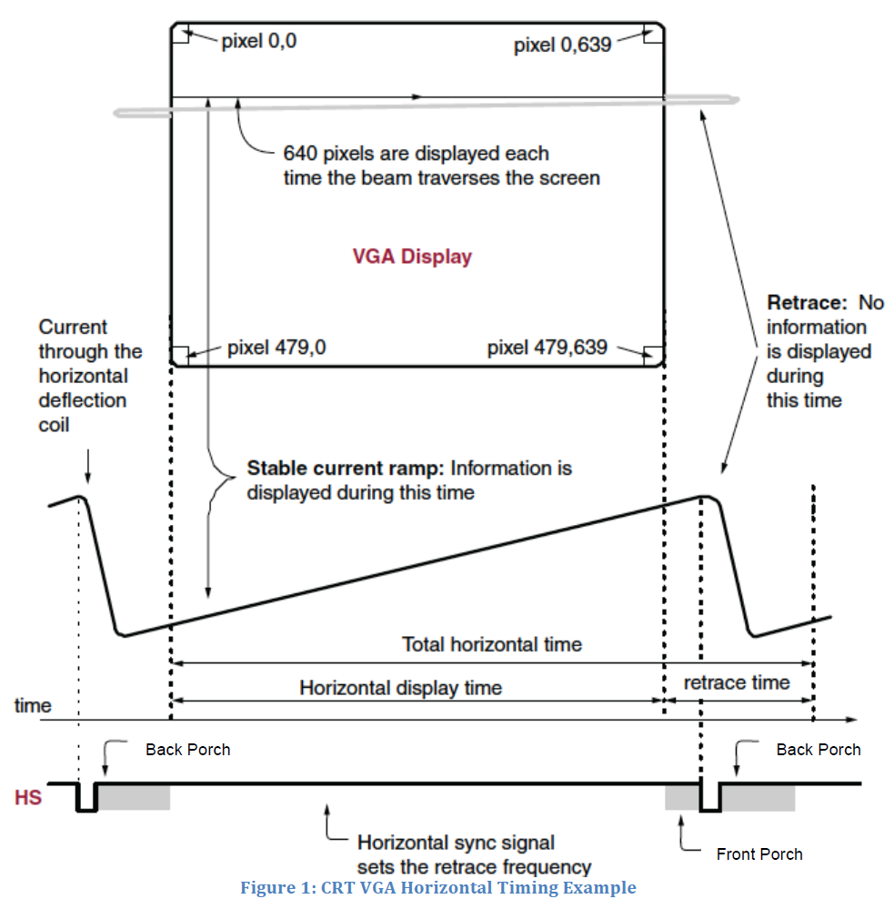

The timing for all this depends on the monitor refresh rate.

For a monitor with 60Hz refresh in 640x480 mode and a 25MHz pixel clock, you can use the timings in Figure 2.

The timings in this figure define the display time (the time when the pixel is one of the 640 visible pixels in a line),

pulse width (hSync or vSync), and the front porch and back porch timings.

These times (in μs or ms) can also be measured in terms of the number of ticks of the 25MHz pixel clock,

or in terms of the number of horizontal lines.

That is, the vertical timing can be measured in terms of how many hSync pulses have been seen.

The bottom line is that both the horizontal and vertical timing for the vgaControl are just counters.

You may have to enable things or reset things or change things when the counters get to a certain value,

but basically they’re just counters.

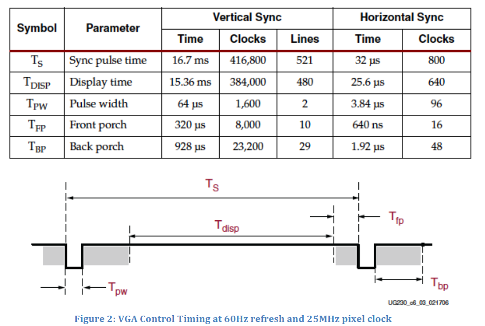

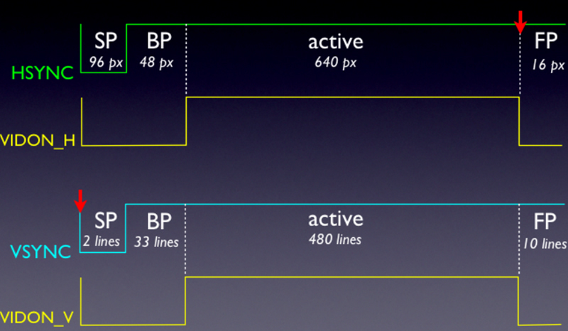

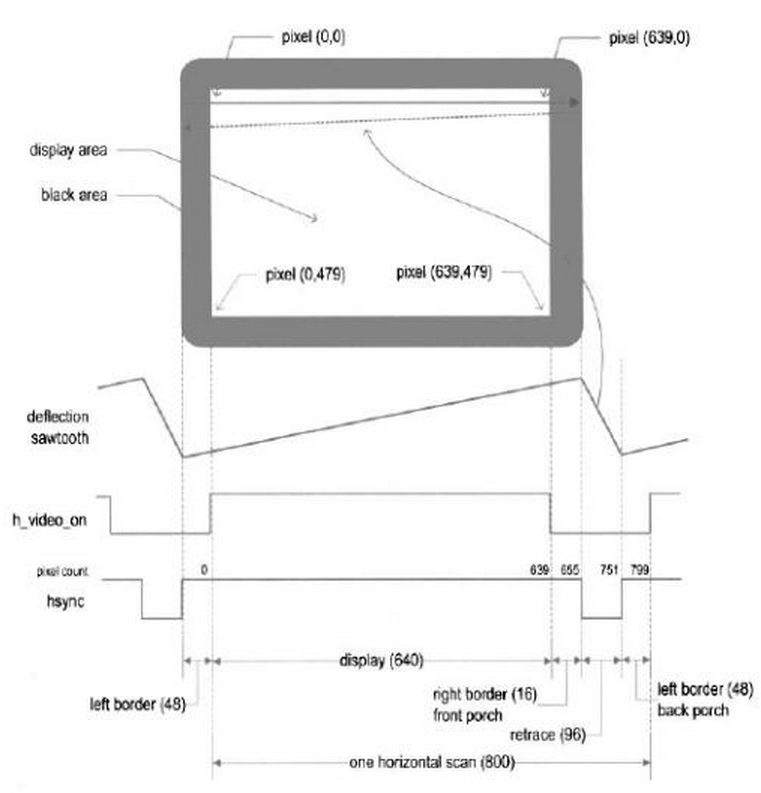

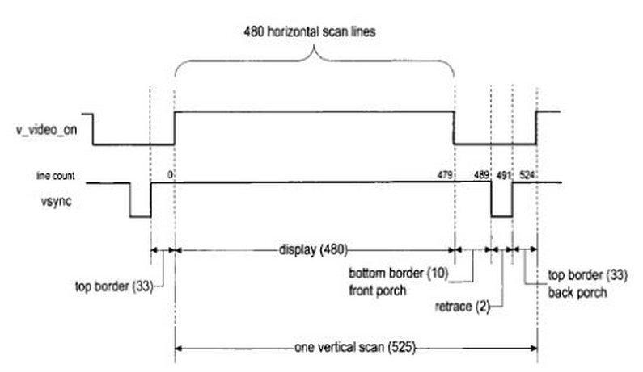

从上图我们可以看到整个时序图可以分为4段：

1，显示阶段，也就是video\_on使能的阶段。这个时候controlller要将RGB数据送给显示器，而且是每一个pixel\_clk送出一个pixel的RGB数据。

2，折回（retrace），也就是电子QIANG扫完一行之后回到最初扫描的位置用的时间。

3，前沿（front porch），之所以称为前沿，是因为它在retrace的前面吧。对应于显示右边黑掉的部分。

4，后沿（back porch），对于与显示左边黑掉的部分。

Information is only displayed when the beam is moving in the “forward” direction (left to right and top to bottom),

and not during the time the beam is reset back to the left or top edge of the display.

Much of the potential display time is therefore lost in “blanking” periods

when the beam is reset and stabilized to begin a new horizontal or vertical display pass.

The size of the beams, the frequency at which the beam can be traced across the display,

and the frequency at which the electron beam can be modulated determine the display resolution.

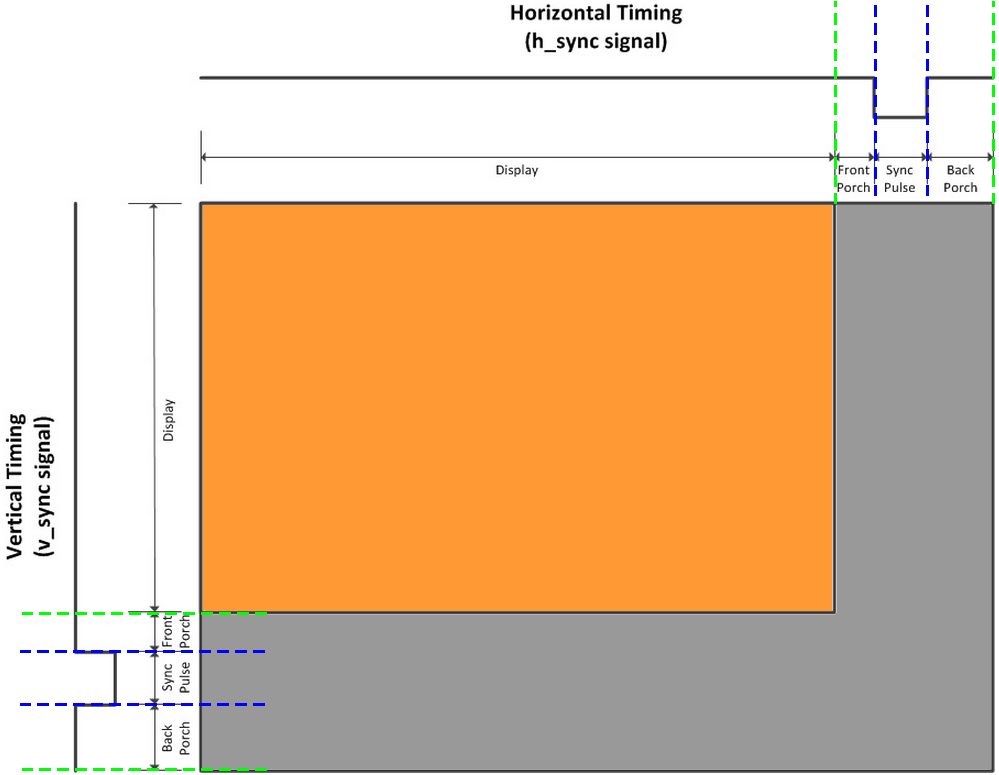

## VGA Timing Specification

Modern VGA displays can accommodate different resolutions,

and a VGA controller circuit dictates the resolution by producing timing signals to control the raster patterns.

The controller must produce synchronizing pulses at 3.3V (or 5V)

to set the frequency at which current flows through the deflection coils,

and it must ensure that video data is applied to the electron guns at the correct time.

Raster video displays define a number of “rows” that corresponds

to the number of horizontal passes the cathode makes over the display area,

and a number of “columns” that corresponds to an area on each row that is assigned to one “picture element”, or pixel.

Typical displays use from 240 to 1200 rows and from 320 to 1600 columns.

The overall size of a display and the number of rows and columns determines the size of each pixel.

Video data typically comes from a video refresh memory; with one or more bytes assigned to each pixel location

(the Nexys4 uses 12-bits per pixel, Nexys 2, Nexys 3 and Basys2 uses 8-bits).

The controller must index into video memory as the beams move across the display,

and retrieve and apply video data to the display at precisely the time the electron beam is moving across a given pixel.

A VGA controller circuit must generate the HS and VS timings signals

and coordinate the delivery of video data based on the pixel clock.

The pixel clock defines the time available to display one pixel of information.

The VS signal defines the “refresh” frequency of the display, or the frequency at which all information on the display is redrawn.

The minimum refresh frequency is a function of the display's phosphor and electron beam intensity,

with practical refresh frequencies falling in the 50Hz to 120Hz range.

The number of lines to be displayed at a given refresh frequency defines the horizontal “retrace” frequency.

显示有两个主要时间脉冲--垂直同步脉冲和水平同步脉冲，分别用于控制帧显示与行显示。

垂直同步脉冲有三部分组织:

1）垂直同步脉冲开始时序-Vertical back porch（VBP）表示垂直同步脉冲开始到一帧的有效像素数据开始前的一段时序，也表示有效像素数据开始时不显示的行数。  
2）垂直同步脉冲帧时序-Vertical active line（VACTL）表示一帧的有效像素数据开始前到一帧结束的时序，也表示有效像素数据行数。  
2）垂直同步脉冲结束时序-Vertical front porch（VFP）表示一帧的有效像素数据开始结束后到下一帧同步脉冲开始前的时序，也表示有效像素数据结束后不显示的行数。

水平同步脉冲有三部分组织:

1）水平同步脉冲开始时序-Horizontal back porch（HBP）表示水平同步脉冲开始到一行的有效像素数据开始前的一段时序，也表示有效像素数据开始时不显示的像素个数。  
2）水平同步脉冲行时序-Horizontal active line（HACTL）表示一行的有效像素数据开始前到一行结束的时序，也表示有效像素数据像素个数。  
2）水平同步脉冲结束时序-Horizontal front porch（HFP）表示一行的有效像素数据开始结束后到下一行同步脉冲开始前的时序，也表示有效像素数据结束后不显示的像素个数。

**linux内核中的lcd参数**

VBPD(vertical back porch)：表示在一帧图像开始时，垂直同步信号以后的无效的行数，对应驱动中的upper\_margin；  
VFBD(vertical front  porch)：表示在一帧图像结束后，垂直同步信号以前的无效的行数，对应驱动中的lower\_margin；  
VSPW(vertical sync pulse  width)：表示垂直同步脉 冲的宽度，用行数计算，对应驱动中的vsync\_len；

  
HBPD(horizontal back porch)：表示从水平同步信号开始到一行的有效数据开始之间的VCLK的个数，对应驱动中的left\_margin；  
HFPD(horizontal front  porth)：表示一行的有效数据结束到下一个水平同步信号开始之间的VCLK的个数，对应驱动中的right\_margin；  
HSPW(horizontal sync  pulse width)：表示水平同步信号的宽度，用VCLK计算，对应驱动中的hsync\_len；

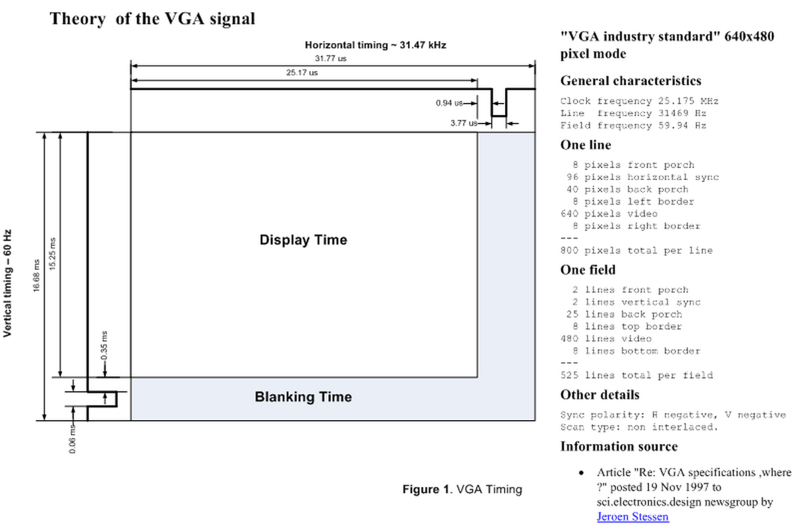

A VGA driver isn't actually as complicated as you think.

All it really does is maintain counters for the X and Y positions.

Based on these counters, it knows when to send synchronization pulses to the display

and when to actually display pixels. Here is a timing diagram of the process (not to scale):

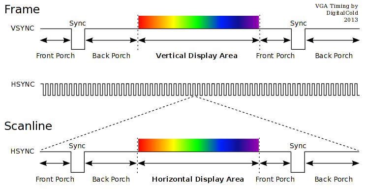

Here are the corresponding 640x480@60Hz VGA timing tables from tinyvga.com:

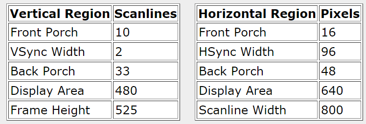

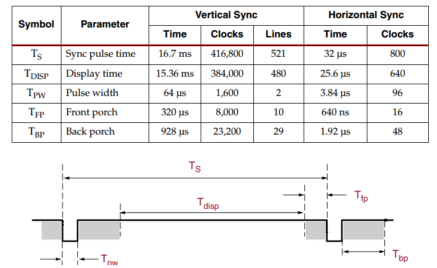

Each of the intervals shown have different timings depending on the resolution and refresh rate you decide to display at.

In the demo's case, it uses a modest 640x480 pixel display running at 60 Hz.

The timing for this mode all revolves around a special clock value, specifically 25.175 MHz.

This particular clock frequency allows each pulse to represent exactly one pixel.

From now on I will refer to this as the **pixel clock**.

In my implementation, I actually use a 25 MHz clock instead (easier to synthesize based off of internal oscillator).

Vertical timing is measured in scanlines and horizontal timing in pixels.

In the vertical front porch, there are 10 scanlines or 8000 pixels.

The usage of "pixels" is contextually dependent when talking about VGA.

VGA is all about timing, so when talking about pixels not in the display area, we are really referring to a unit of time.

Knowing the total horizontal and vertical lengths, the refresh rate is defined as:

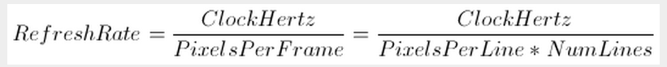

We can easily calculate the VGA driver's refresh rate:

(25,000,000)/(800\*525) ~= 60Hz.

This is pretty close to 60 Hz, even though the 640x480@60Hz specification states

a 25.175 MHz clock, my test monitor doesn't seem to mind.

### 显示器扫描方式分为逐行扫描和隔行扫描：

逐行扫描是扫描从屏幕左上角一点开始，从左像右逐点扫描，每扫描完一行,电子束回到屏幕的左边下一行的起始位置，

在这期间，CRT对电子束进行消隐，每行结束时，用行同步信号进行同步；

当扫描完所有的行，形成一帧，用场同步信号进行场同步，并使扫描回到屏幕左上方，同时进行场消隐,开始下一帧。

隔行扫描是指电子束扫描时每隔一行扫一线，完成一屏后在返回来扫描剩下的线，隔行扫描的显示器闪烁的厉害，会让使用者的眼睛疲劳。 

完成一行扫描的时间称为水平扫描时间，其倒数称为行频率；

完成一帧（整屏）扫描的时间称为垂直扫描时间，其倒数称为场频率，

即刷新一屏的频率，常见的有60Hz，75Hz等等。

标准的VGA显示的场频60Hz,行频31.5KHz。

行场消隐信号:是针对老式显像管的成像扫描电路而言的。

电子QIANG所发出的电子束从屏幕的左上角开始向右扫描，一行扫完需将电子束从右边移回到左边以便扫描第二行。

在移动期间就必须有一个信号加到电路上，使得电子束不能发出。

不然这个回扫线会破坏屏幕图像的。

这个阻止回扫线产生的信号就叫作消隐信号,

场信号的消隐也是一个道理。

显示带宽:带宽指的显示器可以处理的频率范围。

如果是60Hz刷新频率的VGA,其带宽达640x480x60=18.4MHz,

70Hz的刷新频率1024x768分辨率的SVGA,其带宽达1024x768x70=55.1MHz。

时钟频率：以640x480@59.94Hz(60Hz)为例，每场对应525个行周期(525=10+2+480+33),其中480为显示行。

每场有场同步信号,该脉冲宽度为2个行周期的负脉冲，

每显示行包括800点时钟,其中640点为有效显示区,

每一行有一个行同步信号，该脉冲宽度为96个点时钟。

由此可知：行频为525\*59.94=31469Hz,需要点时钟频率：525\*800\*59.94约25MHz.

一、VGA时序分析：

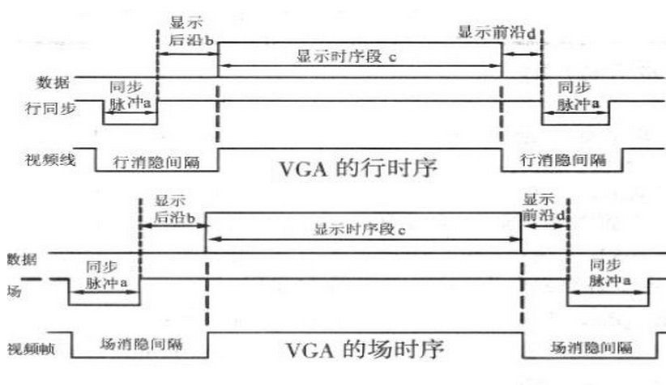

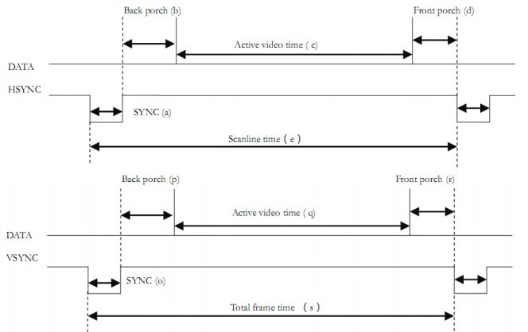

VESA中定义行时序和场时序都需要同步脉冲

（Sync a）、显示后沿（Back porch b）、显示时序段（Display interval c）和显示前沿（Front porch d）四部分。

VGA工业标准显示模式要求：行同步，场同步都为负极性，即同步脉冲要求是负脉冲。

由VGA的行时序可知：

每没一行都有一个负极性行同步脉冲（Sync a），是数据行的结束标志，同时也是下一行的开始标志。

在同步脉冲之后为显示后沿（Back porch b），在显示时序段（Display interval c）显示器为亮的过程，

RGB数据驱动一行上的每一个像素点，从而显示一行。

在一行的最后为显示前沿（Front porch d）。

在显示时间段（Display interval c）之外没有图像投射到屏幕是插入消隐信号。

同步脉冲(Sync a)、显示后沿（Back porch b）和显示前沿（Front porch d）都是在行消隐间隔内

(Horizontal Blanking Interval)，当消隐有效时，RGB信号无效，屏幕不显示数据。

VGA的场时序与行时序基本一样，每一帧的负极性脉冲（Sync a）是一帧的结束标志，

同时也是下一帧的开始标志。而显示数据是一帧的所有行数据。

下面以800x600@60Hz分辨率为例子详细讲解VGA时序:

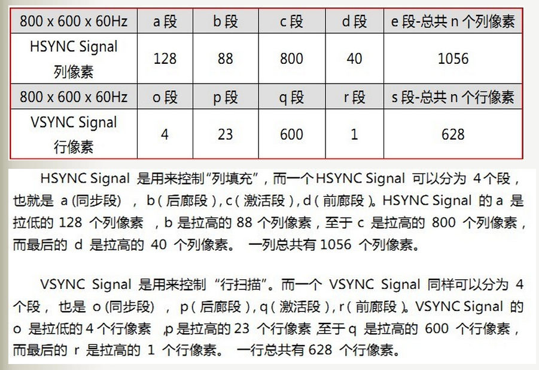

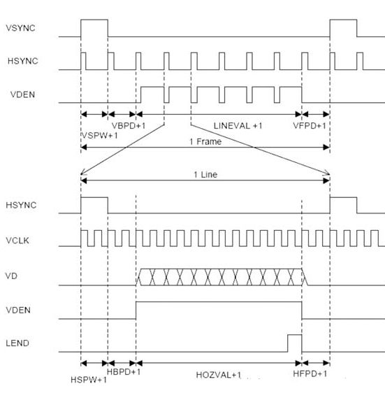

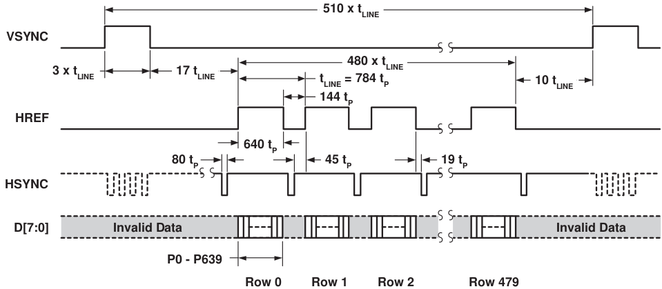

## GENERATING VGA (video graphics array)

The first VGA display was introduced with the IBM PS/2 line of computers in 1987.

One thing most people associate with this form of display is the 15-pin D-subminiature VGA connector

you tend to find on the back of a tower computer or the side of your notebook computer.

The original VGA standard supported a resolution of only 640×480

(which means 640 pixels in the horizontal plane and 480 lines in the vertical plane).

Over the years, however, the standard has evolved to support a wide variety of resolutions,

all the way up to widescreen resolutions as high as 1920×1080.

The act of driving a VGA is surprisingly simple, being based on the use of two counters as follows:

-   Pixel counter:  
    Counts at the required clock frequency (40MHz in this example) the number of pixels in a line, this is used to generate the horizontal timing.
-   Line counter:  
    Also known as the Frame Counter, this repeats at the refresh rate of the desired VESA specification  
    for 60Hz, 75Hz, 85Hz, and so on. This also identifies when the counter is within a valid region for outputting display data.  
    The line counter is incremented each time the pixel counter reaches its terminal count.
    
    These counters are used to generate two synchronization (sync) markers —  
    the “V\_Sync” (vertical sync) and “H\_Sync” (horizontal sync) signals.  
    In conjunction with the RGB (red, green, and blue) analog signals ,  
    “V\_Sync” and “H\_Sync” form the basic signals required to display video on a monitor.
    

Actually, this may be a good time to take a step back to remind ourselves as to  
the origin of terms like “V\_Sync” and “H\_Sync.”

The main thing to remember is that, at the time the original VGA standard was introduced,  
the predominant form of computer display was based on the cathode ray tube (CRT),  
in which an electron beam is used to “write” on a phosphorescent screen.

There are several ways in which an electron beam can be manipulated to create images on a CRT screen,  
but by far the most common technique is the raster scan.

Using this approach, the electron beam commences in the upper-left corner of the screen  
and is guided across the screen to the right.

The path the beam follows as it crosses the screen is referred to as a line.  
When the beam reaches the right-hand side of the screen it undergoes a process known as horizontal flyback,  
in which its intensity is reduced and it is caused to “fly back” across the screen.  
While the beam is flying back it is also pulled a little way down the screen as shown in the following illustration:

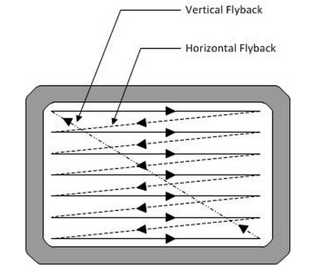

  
The beam is now used to form a second line, then a third, and so on until it reaches the bottom of the screen.

The number of lines affects the resolution of the resulting picture (that is, the amount of detail that can be displayed).

When the beam reaches the bottom right-hand corner of the screen it undergoes vertical flyback,

in which its intensity is reduced, it “flies back” up the screen to return to its original position

in the upper left-hand corner, and the whole process starts again.

The “V\_Sync” and “H\_Sync” signals are used to synchronize all of these activities.

Thus, returning to our pixel and line counters, the values on these counters

can be decoded so as to generate the required waveforms on the “V\_Sync” and “H\_Sync”

outputs from an FPGA (that is, on the FPGA’s pins that are being used to drive the display’s “V\_Sync” and “H\_Sync” signals).

Meanwhile, generating the RGB signals will require the FPGA to drive three digital-to-analog convertors (DACs), one for each signal.

As the design engineer, you must ensure that the latency through the DACs is accounted for to ensure

that their outputs are correctly aligned with respect to the “V\_Sync” and “H\_Sync” signals.

The line and pixel counters both have portions of their count sequences

when no data is being output to the display.

In the case of an 800×600 resolution display refreshing at 60Hz,

for example, the vertical (line) counter will actually count 628 lines

while the horizontal (pixel) counter will count 1,056 pixels.

Why should this be so?

Well, returning to our raster scan, it takes a certain amount of time for the electron beam

to undergo its horizontal and vertical flyback activities.

One way to think about these times is that we have an actual display area that we see,

and that this actual display area “lives” in a larger (virtual) display space that contains a border zone that we don’t see:

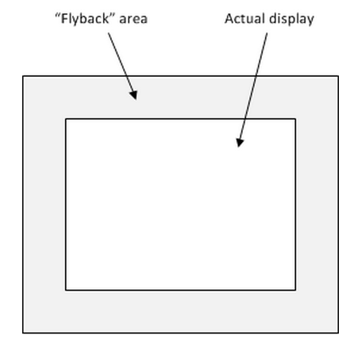

Of course, in the case of today’s flat-screen, liquid crystal displays (LCDs) and similar technologies,

we don’t actually need to worry about things like horizontal and vertical flyback times.

At least, we wouldn’t have to worry if it were not for the fact that we don’t actually know

what type of screen our FPGA is driving.

Thus, anything driving a VGA output generates the timing signals required to drive CRT display,

and other forms of display simply make allowances for any of the historical peculiarities associated with these VGA signals.

But we digress… Each of our counters has a collection of associated timing parameters.

Vertical timings are referenced in terms of lines, while horizontal timings are referenced in terms of pixels.

The following table lists timing values for several popular resolutions.

| Format | Pixel Clock  
(MHz) | Horizontal (in Pixels) | Vertical (in Lines) |
| --- | --- | --- | --- |
| Active  
Video | Front  
Porch | Sync  
Pulse | Back  
Porch | Active  
Video | Front  
Porch | Sync  
Pulse | Back  
Porch |
| 640x480, 60Hz | 25.175 | 640 | 16 | 96 | 48 | 480 | 11 | 2 | 31 |
| 640x480, 72Hz | 31.500 | 640 | 24 | 40 | 128 | 480 | 9 | 3 | 28 |
| 640x480, 75Hz | 31.500 | 640 | 16 | 96 | 48 | 480 | 11 | 2 | 32 |
| 640x480, 85Hz | 36.000 | 640 | 32 | 48 | 112 | 480 | 1 | 3 | 25 |
| 800x600, 56Hz | 38.100 | 800 | 32 | 128 | 128 | 600 | 1 | 4 | 14 |
| 800x600, 60Hz | 40.000 | 800 | 40 | 128 | 88 | 600 | 1 | 4 | 23 |
| 800x600, 72Hz | 50.000 | 800 | 56 | 120 | 64 | 600 | 37 | 6 | 23 |
| 800x600, 75Hz | 49.500 | 800 | 16 | 80 | 160 | 600 | 1 | 2 | 21 |
| 800x600, 85Hz | 56.250 | 800 | 32 | 64 | 152 | 600 | 1 | 3 | 27 |
| 1024x768, 60Hz | 65.000 | 1024 | 24 | 136 | 160 | 768 | 3 | 6 | 29 |
| 1024x768, 70Hz | 75.000 | 1024 | 24 | 136 | 144 | 768 | 3 | 6 | 29 |
| 1024x768, 75Hz | 78.750 | 1024 | 16 | 96 | 176 | 768 | 1 | 3 | 28 |
| 1024x768, 85Hz | 94.500 | 1024 | 48 | 96 | 208 | 768 | 1 | 3 | 36 |
| _Source: Rick Ballantyne, Xilinx Inc._ |

 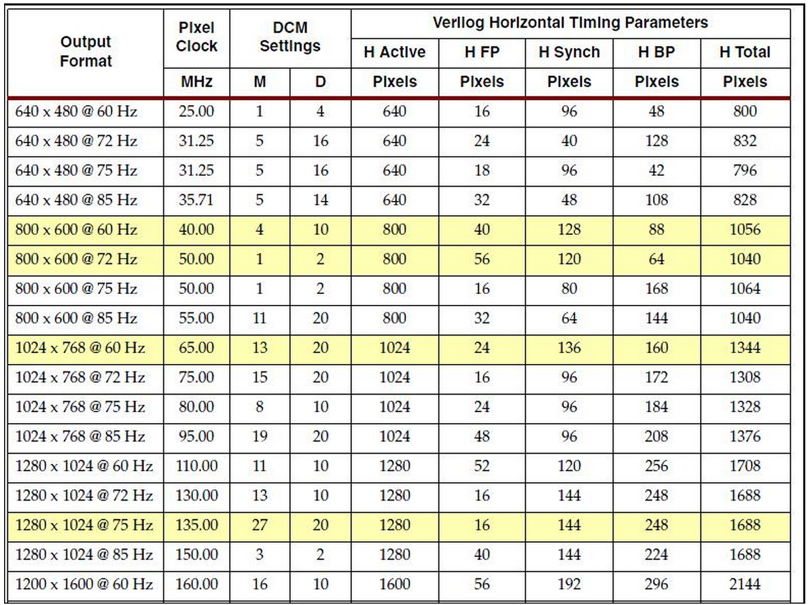

## [Principles of VGA Video](http://www.xess.com/blog/vga-the-rest-of-the-story/)

There are three signals -- red, green, and blue (RGB) -- that send color information to a VGA monitor. 

Signal levels between 0 (completely dark) and 0.7 V (maximum brightness) control the intensity of each color component,

which combine to make the final color of a pixel on the monitor screen.

Each analog color input can be set to one of 32 levels by five digital outputs using a simple five-bit digital-to-analog converter (DAC) as shown below.  

Replicating the DAC for each analog input gives us a palette of 32 x 32 x 32 = 32768 different colors selectable through fifteen digital control lines.

For many applications we only need two colors:

black and white.

This is done by applying the same level to each of the RGB inputs.

This simplifies the DAC circuitry to a single resistor driven by a single output.

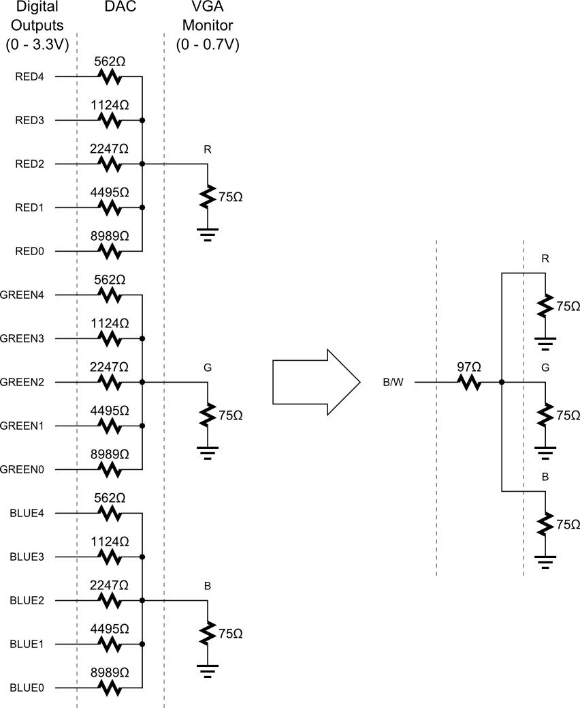

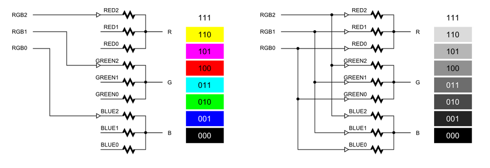

An image (or frame) on a monitor screen is composed of _h_ lines each containing _w_ pixels. 

VGA frame size is expressed as _w_ x _h_ with typical sizes of 640 x 480, 800 x 600, 1024 x 768 and 1280 x 1024.

In order to send a frame of pixels to the monitor, two sync signals are required:

a horizontal sync to indicate the start and stop of each line of pixels going from left to right on the screen,

and a vertical sync that marks the top and bottom lines so they stack up to form an image. 

The timing for the VGA sync signals is shown in below.

Negative pulses on the horizontal sync signal mark the start and end of a line and ensure that the monitor displays the pixels

between the left and right edges of the visible screen area. 

The pixels are sent on the RGB signal lines within a 25.17 μs window. 

After this, a _front porch_ interval of 0.94 μs is inserted before the horizontal sync signal goes low for 3.77 μs. 

After a _back porch_ interval of 1.89 μs, the next line of pixels begins. 

Therefore, a single line of pixels occupies 25.17 μs of a 31.77 μs interval. 

The red, green and blue signals are blanked during the 6.6 μs interval comprised of the front porch, sync pulse and back porch.

In a similar fashion, negative pulses on the vertical sync signal mark the start and end of a frame of video lines

and ensure that the monitor displays the lines between the top and bottom edges of the visible monitor screen. 

The lines are displayed within a 15.25 ms window. 

After this, a front porch interval of 0.45 ms is inserted before the vertical sync signal goes low for 64 μs. 

After a back porch interval of 1.02 ms, the next frame begins. 

Therefore, a single frame of pixels occupies 15.25 ms of a 16.784 ms interval. 

The RGB signals are blanked during the 1.534 ms interval comprised of the front porch, sync pulse and back porch.

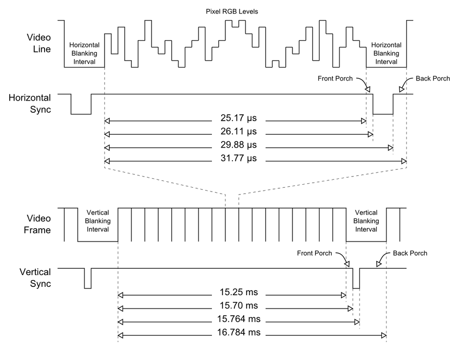

The pixel clock rate needs to be adjusted to achieve Vsync rates and Hsync rates that are acceptable for your multisync monitor.

Since 40Hz is not a common Vsync rate, try 30, 50 or 60 or higher.

640\*480 \* 40Hz = 12.3MHz so it seems pixels are pushed out at 1/2 of 25MHz clock rate

The NTSC timing for V Sync , front porch (480~494) , Hsync, back porch(495~525) as follows using 25MHz 

Hsync can be varied as long with before after periods as long as sum is same.

Some monitors have a 10% tolerance depending design.

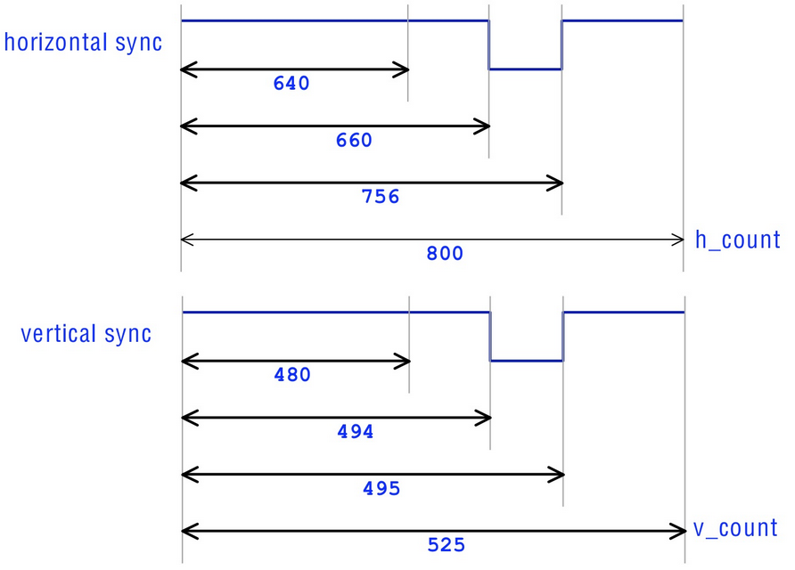

### LCD bus timing parameters

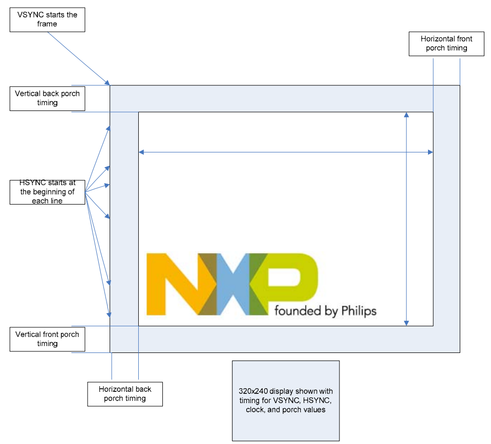

### Frame and line timing parameters

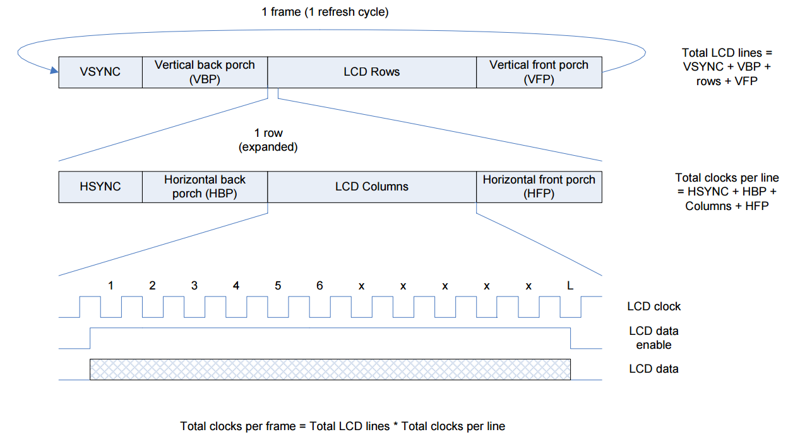

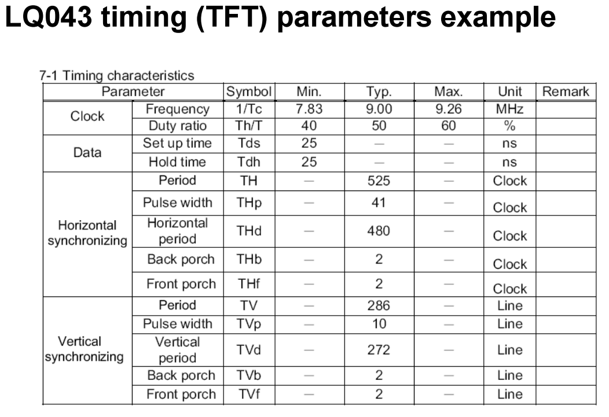

### [How VGA Monitors Work](http://www.eecg.toronto.edu/~jayar/ece241_05F/vga_new/)

The VGA monitor can be thought of as a grid of pixels (picture elements which can be individually set to a specific colour).

It contains 480 rows of 640 horizontal pixels. Most monitors, including VGA, use a serial scheme to set the colour of each pixel.

This means that the VGA controller sends the colour information for each pixel one at a time,

rather than being able to set all of the colours at once in a parallel scheme.

This colour information for each pixel is provided by a RGB (Red, Green, Blue) triplet.

Three analog signals are used to represent relative amounts of red, green, and blue that compose the colour.

However, the UP2 board produces digital signals.

Thus, the controller is only able to provide full intensity or turn off for each of the RGB components.

The VGA monitor does not save any of the pixels written to it so the pixels

must be continuously written to the monitor for the image to remain stable.

The protocol for the transmission is shown below.

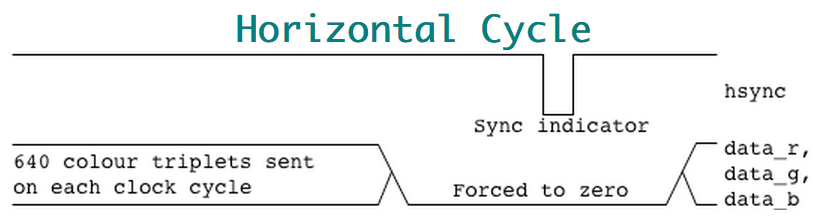

The horizontal cycle is part of the VGA standard and defines a method for setting the colours of all the pixels in a particular row.

The colour values for the 640 pixels are sent out on each of the first 640 clock cyles.

The colour values are then forced to zero (black), while the hsync signal is asserted low

to tell the monitor to move to the next horizontal row of pixels.

The exact timing between these signals is defined in the VHDL source code for the VGA controller.

The VGA controller only allows your requests to write pixels while the colour signals are forced to zero.

At all other times, it is reading from memory and it cannot write to the memory at the same time.

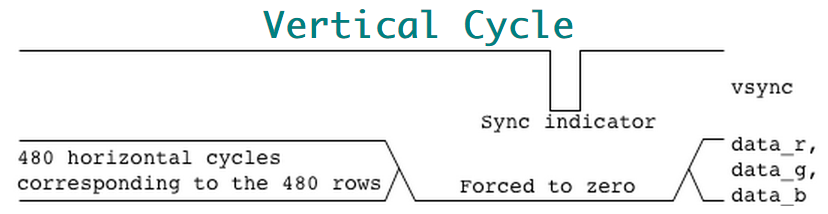

The vertical cycle allows the monitor to synchronize which rows are being written by the horizontal cycles.

480 horizontal cycles are produced during the first stage of the vertical cycle.

In the next stage, the colour values are again forced to zero (black), while the vsync signal is asserted.

The vsync signal tells the monitor to go back to the (0,0) pixel.

The data that follows starts with the first horizontal row of pixels.

**LCD TFT Display Controller (LTDC)**

The LCD TFT display controller provides a parallel digital RGB (Red, Green, Blue)

and signals for horizontal, vertical synchronisation, Pixel Clock and Data Enable

as output to interface directly to a variety of LCD and TFT panels.

**LCD display configuration**

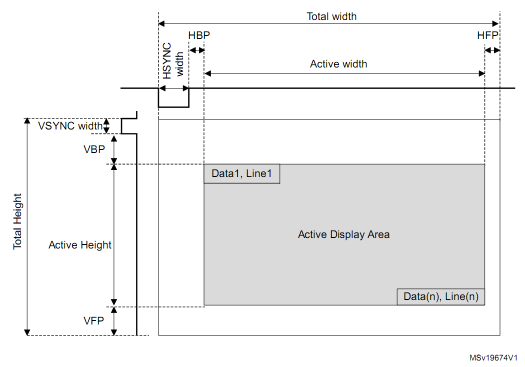

## DLPC343x Display Controller Video Timing Parameter Definitions

Active Lines Per Frame (ALPF)

Defines the number of lines in a frame containing displayable data: ALPF is a subset of the TLPF.

Active Pixels Per Line (APPL)Defines the number of pixel clocks in a line containing displayable data: APPL is a subset of the TPPL.

Horizontal Back Porch (HBP) BlankingNumber of blank pixel clocks after horizontal sync but before the first active pixel.  
Note: HBP times are reference to the leading (active) edge of the respective sync signal.Horizontal Front Porch (HFP) BlankingNumber of blank pixel clocks after the last active pixel but before Horizontal Sync.

Horizontal Sync (HS)Timing reference point that defines the start of each horizontal interval (line).  
The absolute reference point is defined by the active edge of the HS signal.  
The active edge (either rising or falling edge as defined by the source) is the reference from which all horizontal blanking parameters are measured.

Total Lines Per Frame (TLPF)Defines the vertical period (or frame time) in lines: TLPF = Total number of lines per frame (active and inactive).

Total Pixel Per Line (TPPL)Defines the horizontal line period in pixel clocks: TPPL = Total number of pixel clocks per line (active and inactive).

Vertical Sync (VS)Timing reference point that defines the start of the vertical interval (frame).  
The absolute reference point is defined by the active edge of the VS signal.  
The active edge (either rising or falling edge as defined by the source) is the reference from which all vertical blanking parameters are measured.

Vertical Back Porch (VBP) BlankingNumber of blank lines after vertical sync but before the first active line.

Vertical Front Porch (VFP) BlankingNumber of blank lines after the last active line but before vertical sync.

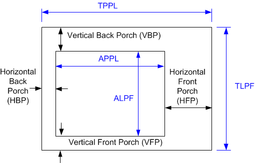