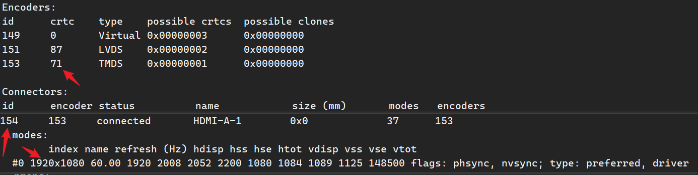

# 显示屏调试
## dump 当前的显示状态
```shell
cat /sys/kernel/debug/dri/0/summary
```
> [!info] 内核依赖
> 注意的是该命令依赖内核的 debugfs 功能，如果内核没有开启 debugfs 功能或者系统没有挂载 debugfs 节点，需要确保内核打开 CONFIG_DEBUG_FS 选项，并通过如下命令手动挂载
> ```shell
> mount -t debugfs none /sys/kernel/debug
> ```

##  VOP2 dump 显示信息

- [vop2_dump.sh 脚本 dump 显示信息 gitee](https://gitee.com/andyshrk/drm/blob/master/res/vop2_dump.sh#)
- 调试工具 7yuv：[Datahammer 7yuv YUV Viewer, Raw Graphics Editor and Hex Editor](http://datahammer.de/)

#### 强行开关显示设备
~~~shell
# 关 LVDS
echo off > /sys/class/drm/card0-LVDS-1/status
# 开 LVDS
cho on > /sys/class/drm/card0-LVDS-1/status
~~~

#### HDMI 显示彩色条纹

~~~shell
modetest -M rockchip -s 154@71:1920x1080
~~~
- modetest 是集成在 libdrm 中用来测试 drm 系统的命令行工具
- $154$ 是 HDMI-A-1 的 id
- $71$ 是 VP 的 id
> [!info] CRTC
> CRTC 对应 VOP 2.0 中的 Video Port 或者 VOP 1.0 中的 vop

> [!tip] 查询 id 的另一种方法
> ```shell
> cat /sys/kernel/debug/dri/0/state
> ```

#### 查看 HDMI 状态
~~~shell
cat /sys/kernel/debug/dw-hdmi/status
~~~

