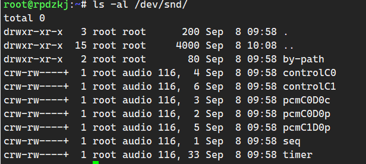

# ALSA
## ALSA utilities
```shell
# apt-cache search alsamixer
sudo apt install alsa-utils
```

- 查看 ALSA 驱动版本：`cat /proc/asound/version`
- systemd 开机 ALSA 服务：`alsa-restore.service` `lsa-state.service`

## ALSA 设备文件结构


- **controlC0**：用于声卡的控制，例如通道选择，混音，麦克风的控制等
- **midiC0D0**：用于播放 midi 音频
- **pcmC0D0c**：用于录音的 pcm 设备
- **pcmC0D0p**：用于播放的 pcm 设备
- **seq**：音序器
- **timer**：定时器

- @ C0D0代表的是声卡0中的设备0，pcmC0D0c 最后一个 c 代表 capture，pcmC0D0p 最后一个 p 代表 playback
- @ capture     把 mic 拾取到得模拟信号，经过采样、量化，转换为 PCM 信号送回给用户空间的应用程序
- @ C0D0代表的是声卡0中的设备0，pcmC0D0c 最后一个 c 代表 capture，pcmC0D0p 最后一个 p 代表 playback

---
- **参考**：[Advanced Linux Sound Architecture (简体中文) - ArchWiki](https://wiki.archlinux.org/title/Advanced_Linux_Sound_Architecture_(%E7%AE%80%E4%BD%93%E4%B8%AD%E6%96%87))

- `alsa-restore.service` 服务在开机时读取 `/var/lib/alsa/asound.state`，关机时写入更新

---
- [Matrix:Main - AlsaProject](https://www.alsa-project.org/wiki/SoundCard-Matrix)