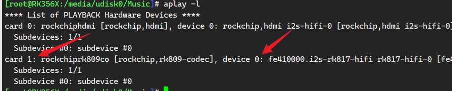
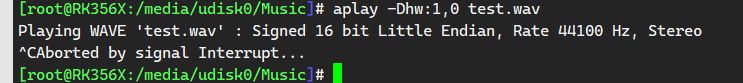

#  Linux aplay 音频播放
## 指定声卡
### 查看音频设备
```shell
[root@RK356X:/media/udisk0/Music]# aplay -l
**** List of PLAYBACK Hardware Devices ****
card 0: rockchiphdmi [rockchip,hdmi], device 0: rockchip,hdmi i2s-hifi-0 [rockchip,hdmi i2s-hifi-0]
  Subdevices: 1/1
  Subdevice #0: subdevice #0
card 1: rockchiprk809co [rockchip,rk809-codec], device 0: fe410000.i2s-rk817-hifi rk817-hifi-0 [fe410000.i2s-rk817-hifi rk817-hifi-0]
  Subdevices: 1/1
  Subdevice #0: subdevice #0
```



### 指定音频设备播放
```shell
aplay -Dhw:1,0 test.wav
```

