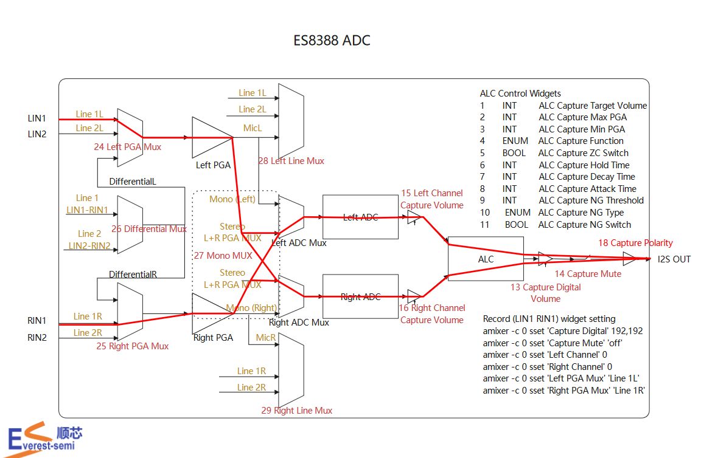
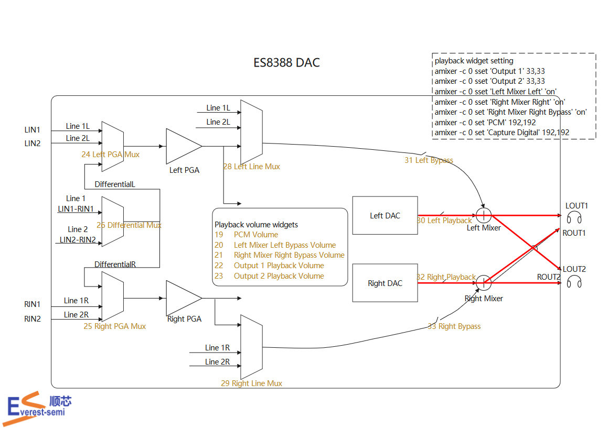

---
tags:
  - Audio
---

## 录音配置


```shell
# Record (LIN1 RIN1) widget setting
amixer -c 0 sset 'Capture Digital' 192,192
amixer -c 0 sset 'Capture Mute' 'off'
amixer -c 0 sset 'Left Channel' 0
amixer -c 0 sset 'Right Channel' 0
amixer -c 0 sset 'Left PGA Mux' 'Line 1L'
amixer -c 0 sset 'Right PGA Mux' 'Line 1R'
```

## 播放声音配置


## Link 
