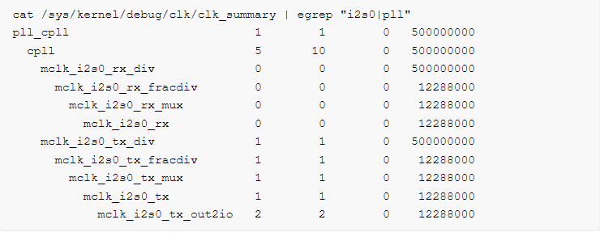
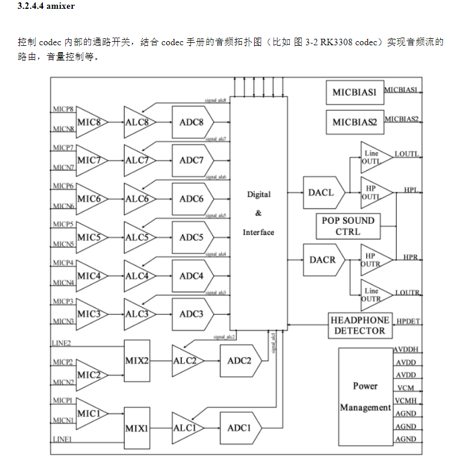

# tinyplay
* `tingplay` 只能播放**wav**原始格式的音乐

* `tinycminfo`
	* `tinycminfo -D /proc/asound/cards` 
	* -D 后面一般声卡文件

*  `tinymix` 得到音频通路相关的各项配置参数
*  `tinycap` 录音软件 

> [!info] PCM
> PCM - Pulse Code Modulation
> 一种从音频模拟信号转换成数字信号的技术，区别于 PCM 音频通信协议

### 设备文件结构
```
/dev/snd
  ├── controlC0
  ├── pcmC0D0p
  ├── pcmC0D0c
  └── timer
```
* **controlC0** 用于声卡的控制，例如通道选择，混音，麦克风的控制等
* **pcmC0D0c** 用于录音的pcm设备
* **pcmC0D0p** 用于播放pcm设备
* **timer** 定时器

> [!info] 组合说明
> * C0D0 表示的是声卡 0 中的设备 0
> * pcmC0D0c 最后一个 c 代表 *capture*
> * pcmC0D0p 最后一个 p 代表*playback*

# 调试命令
## procfs
* 通过 procfs 确认声卡是否注册成功
~~~shell
cat /proc/asound/cards

ls /dev/snd/
~~~

## clk summary

> [!info] 查询音频时钟
> 查询 i2s mclk 频率，以及其所在的 pll
> 结果： mclk 为 12288000Hz，pll 源为 cpll
> 

## 寄存器
### IO 命令
通过 io 命令查看修改寄存器（适合 SOC 寄存器查询）
~~~sehll
cat /proc/iomem |grep i2s

io -4 -i 0x40 0xff800000
~~~

## regmap
通过 regmap 节点查看寄存器（只读）
~~~shell
ls /sys/kernel/debug/regmap/

cat /sys/kernel/debug/regmap/0-0020-rk817-codec/registers
~~~

#### 关闭 regmap cache，查询寄存器的值
~~~shell
cd /sys/kernel/debug/regmap/ff800000. i2s/
cat registers # dump register by regmap

io -4 0xff800000 0x0 # set 0xff800000 to 0
io -4 -l 0x40 0xff800000 # dump to check value of 0xff800000, now it's 0 

cat registers # dump register by regmap
00: 7200000f # it's still old value 

echo N > cache_only
echo Y > cache_only

cat registers # dump again, now it's correct
00: 00000000
~~~

> [!NOTE] 
> regmap 基于 cache 机制，如果通过 io 命令直接修改寄存器后， regmap 节点不会体现更新后的寄存器，除非驱动将寄存器类型设置为 volatile 或者将 regmap cache 关闭

## i2c-tools
通过 i2c tool 查看修改 codec 寄存器（适合 i2c 类型的 codec 设备）

* 查询 i2c0 总线上的设备
~~~shell
i2cdetect -y 0
~~~

* dump 设备的所有寄存器: `i2cdump`

> [!example] 查询 i2c0 总线下 rk817（设备地址：0x20）的寄存器，其中 0x12 ~ 0x4f 为 codec 寄存器
> ~~~shell
> i2cdump -f -y 0 0x20 b
> ~~~

* 修改 rk817 的 0x12 寄存器，将值改为 0
~~~shell
i2cset -f -y -r 0 0x20 0x12 0x0 b
~~~

* 查询 rk817 的 0x12 寄存器
~~~shell
i2cget -f -y 0 0x20 0x12 b
~~~

# alsa-utils

> [!info] alsa-utils
> RK Linux SDK 标配 alsa-utils 工具

* `aplay | arecord` 通过管道可以方便的实现 loopback 功能，方便驱动调试和指标测试

示例：声卡 0 录制 -> 声卡 1 播放
~~~shell
arecord -D hw:0,0 --period-size=1024 --buffer-size=4096 -r 48000 -c 2 -f s16_le -t raw | aplay -D hw:1,0 --period-size=1024 --buffer-size=4096 -r 48000 -c 2 -f s16_le -t raw
~~~

### amixer


### alsaloop
* 支持任意声卡间的路由
* 支持自适应时钟同步
* 自持自适应重采样
* 支持 mixer controls 重定向


> [!example] 声卡 0 录制的音频通过声卡 1 播放，同步模式采用策略 1（增加或减少采样点）
> ~~~shell
alsaloop -C hw:0,0 -P hw:1,0 -t 10000  -A 3 -S 1 -b -v
>~~~


> [!attention] 累计误差
> 如果声卡 0 和 1 的时钟源相同（比如，同一个 OSC），那么不存在异步累积误差问题。如果声卡 0 为  UAC（时钟来源于 PC），声卡 1 为系统声卡（时钟来源于设备），因为时钟源不同，随着时间的累积，必然出现累计误差，导致断音。此时需要软件补偿（如：增加或减少采样点）或者硬件补偿

# tiny-alsa

> [!info] tiny-alsa
> RK Android SDK 标配 tiny-alsa 工具
* `tinypcminfo`
查询声卡支持的采样率，格式，声道数等

* `tinymix`
控制 codec 内部的通路开关，音量控制等。效果等同于 `amixer`

# xrun profiling
当音频播放 buffer empty 的时候，触发 underrun；当音频录制 buffer full 的时候，触发 overrun；两者统称为 xrun。音频流路径上，所有 buffer 的节点都可能触发 xrun

## 内核 xrun
### xrun kmsg
~~~config
CONFIG_SND_DEBUG
CONFIG_SND_PCM_XRUN_DEBUG
CONFIG_SND_VERBOSE_PROCFS
~~~

xrun 调试开关如下表，如果需要支持所有开关，取和即可

| Bit Value | Description                                       |
| --------- | ------------------------------------------------- |
| $1$       | Basic debugging - show xruns in ksyslog interface |
| $2$       | Dump stack - dump stack for basic debugging       |
| $4$          |Jiffies check - compare the position with jiffies (a sort of in-kernel monotonic clock), show what's changed when basic debugging is enabled|

1. 使能声卡 0 播放设备的所有 xrun 调试开关
~~~shell
echo 7 > /proc/asound/card0/pcm0p/xrun_debug
~~~

