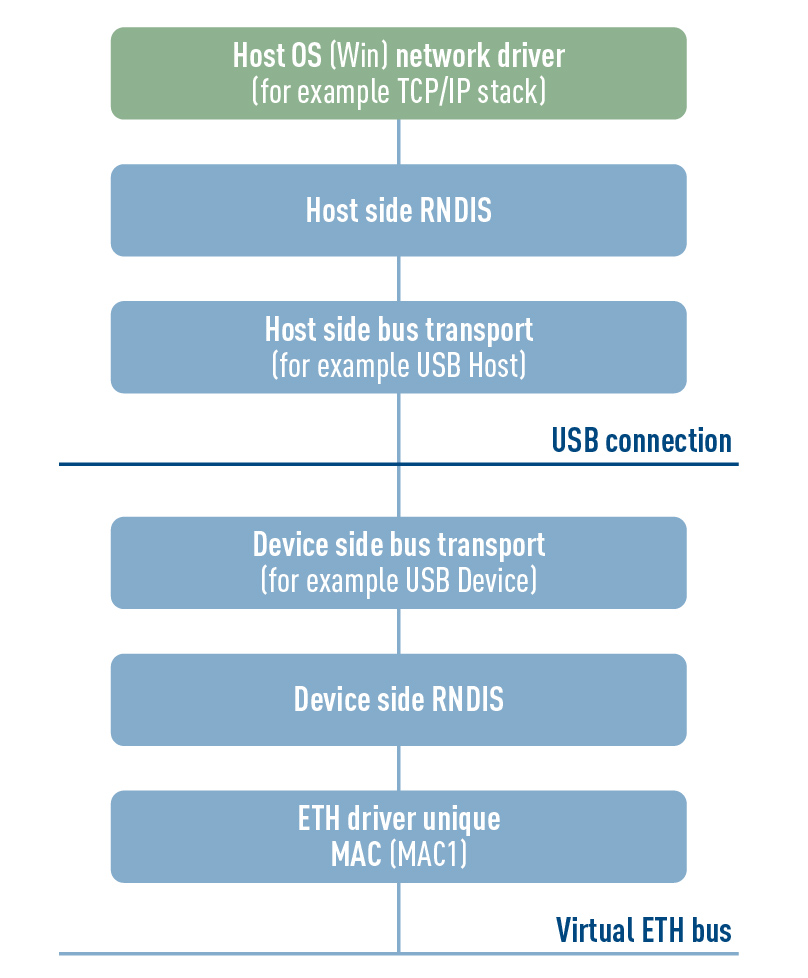
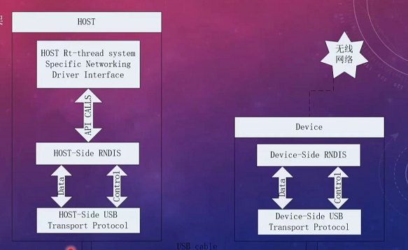
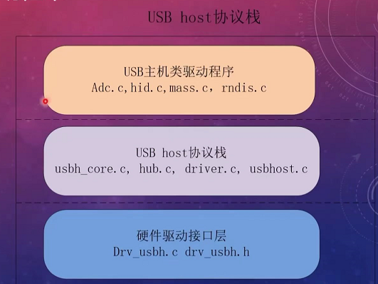

# RNDIS

> [!info] RNDIS
> Remote Network Driver Interface Standard
> TNDIS 协议一般运行在 USB 总线上面，实现 USB 接口的虚拟网卡功能
>RNDIS (RemoteNDIS) 设备：Remote Network Driver Interface Specification（远程网络驱动程序接口规范）

* 架构

