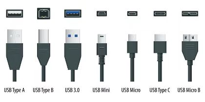
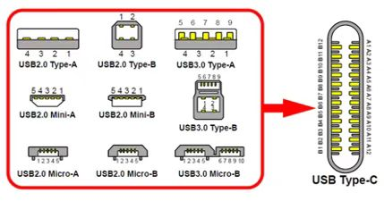

# USB4 的名字

从前的USB接口，不同的版本都带有不同的数字，比如 USB 2.0、USB 3.0、USB 3.1 等。但每一次，在USB和版本号之间都有一个空格。而这次正式的写法里，“USB”和“4”之间没有了空格，而是连着写成“USB4”，而且也没有4.0这么一说，就是4。

USB推广联盟的CEO特地解释了：USB4是一个品牌名称，不是技术版本号，所以今后也不会有什么USB4.1，USB4.2之类的叫法。

# 之前 USB 接口的标准

USB 3.0 是在2008年11月出现的，5年后出现了 USB 3.1。按说，从前的 USB 3.0 这个名字不用变——但不知道为什么，从前的USB 3.0 变成了 USB 3.1 Gen1（带宽5Gbps）；而新出现的USB 3.1 变成了 USB 3.1 Gen2（带宽10Gbps）。这两者的区别只是在带宽上，后一代的带宽是前一代的2倍。

* USB 3.1 Gen1 → USB 3.2 Gen1（带宽 5Gbps）
* USB 3.1 Gen2 → USB 3.2 Gen2（带宽 10Gbps）
* USB 3.2 → USB 3.2 Gen 2×2（带宽 20Gbps）

# USB4 接口采用 Type-C 的设计
## Type-C 型 USB4 接口的好处
因为全部统一为了Type-C的口，那么只要厂商愿意，一切传输数据的接口都可以使用USB4。不止是U盘，移动硬盘、手机数据接口、音频数据也可以，甚至显示器的输入接口也可以采用USB4，显卡的输出接口也可以采用USB4，甚至网络接口也可以转化为USB4。

* USB4 这次的带宽是 40Gbps，其中最少给显示功能留出 18Gbps 的带宽，最多给文件传输留出 22Gbps 的带宽，所以仅仅从文件传输速度的上限来看，并没有比上一代提升很大，但最大的差异就是它给显示功能预留的资源很多，
* 最多可以接两台刷新率 60Hz 的 4K 分辨率的显示器。
* USB4 还支持 100 瓦的快充功能

## USB4 兼容性

* 左边的红框里是历史上其他 USB 接口的针脚定义；
* 右边是 USB4 的 Type-C 型针脚，它预留了很多功能。这样它就能和历史上的 USB 接口兼容，和雷电接口、各种显示接口，比如 HDMI 或 VGA，还有网络接口、火线接口和供电接口兼容

### USB 3.2 时代技术上的限制。
当那根 USB 数据线上既有显示器的数据信号，又有外置硬盘传输的数据时，线上的带宽就会强制被一分为二，从原来是 10Gbps 降低为各 5Gbps。而我还有网线的数据在这个口上传输，所以还会继续对半分。但在实际情况里，速度还会飘忽不定的乱跳。