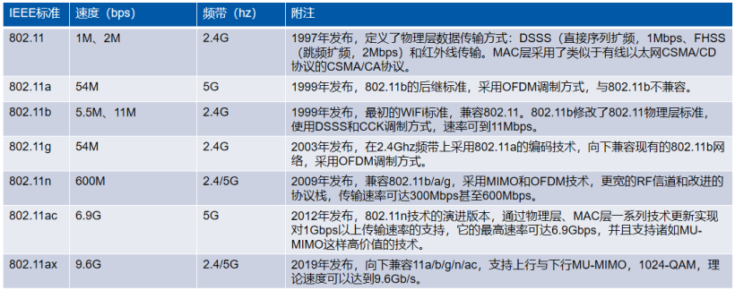

# WiFi
### WiFi 标准

## WiFi 网络结构
- **工作站**
工作站是指配备无线网络接口的终端设备（计算机、手机等），构建网络的目的就是为了在工作站间传送数据
- **接入点（Access Point）**
802.11 网络所使用的帧必须经过转换，方能被传递至其他不同类型的网络。具备无线至有线（wireless-to-wired）的桥接功能的设备称为接入点，简称 AP
- **无线媒介（Wireless medium）**
802.11 标准以无线媒介在工作站之间传递帧
- **分布式系统（Distribution system）**
几个接入点串联起来可以覆盖一块比较大的区域，接入点之间相互通信可以掌握移动式工作站的行踪，这就组成了一个分布式系统。分布式系统属于 802.11 的逻辑组件，负责将帧（frame）传送至目的地，分布式系统是接入点间转发帧的骨干网络，因此通常称为骨干网络（backbone network），基本都是以太网（Ethernet）
