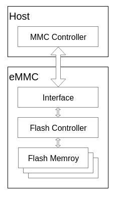

---
tags:
  - eMMC
---
# eMMC的构成
eMMC 是一种嵌入式、非易失的存储系统，它主要由闪存、闪存控制器和 eMMC 协议接口等组成，以 BGA 的形式封装在一起。

## 闪存
闪存是一种非易失性存储器，通常用来存放数据，应用和系统程序等。

eMMC 内部的闪存一般都属于 Nand Flash

- SLC：Single-Level Cell
- MLC：Multi-Level Cell
- TLC：Triple-Level Cell
- QLC：Quad-Level Cell
## 闪存控制器
闪存控制器主要用来对内部的 Nand Flash 进行操作和管理

由于 Nand Flash 自身的物理特性，需要实现坏块管理、磨损均衡、ECC 等诸多功能，这些功能就是由 FTL（Flash Translation Layer）来实现。eMMC 内部集成的闪存控制器则实现了 FTL 等功能，减少了由于不同型号 Nand Flash 的各种特性差异，造成的软件开发复杂度；同时闪存控制器也提供了 Cache、Memory array、interleave 等多种功能，大大提高了 Nand Flash 读写操作性能

## eMMC接口
eMMC 接口主要实现将 eMMC 接入到 Host 的 MMC 总线上，与 Host 进行通信，实现 eMMC 的协议逻辑

- **CLK**: 时钟信号，用于Host与Device间的同步。
- **Data Strobe**：数据锁存信号，Device端的输出信号，用于HS400模式下，频率与CLK相同，主要用于同步从Device端输出的数据
- **CMD**: 用于传输从Host端发出的command和Device端发出的response
- **DATA0 ~ DATA7**: 用于在Host和Device间传输数据
- **Reset** ：复位信号线，主要用于Host对Device进行复位操作
## eMMC的工作模式
eMMC 共有 5 种不同的工作模式

## eMMC的内部寄存器
eMMC内部有6个不同的寄存器，主要用来存放eMMC的相关配置和状态或设定eMMC的工作时的配置参数，方便Host查询和操作eMMC

## Link
- [eMMC简介](https://mp.weixin.qq.com/s/2ttZSRfQf_r0xifYNKWHSA)