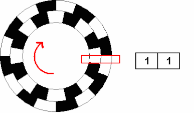

---
tags:
  - PWM/RK3576
---
## 增量编码器
增量编码器是一种线性或旋转机电设备，具有两个输出信号 **A** 和 **B**，当设备移动时会发出脉冲。A 和 B 信号共同表示运动的发生和方向。

许多增量编码器带有额外的输出信号，通常指定为索引或 **Z**，表示编码器位于特定参考位置


- 首先检查引脚 A 是否为低电平，然后再检查引脚 B。
- 如果引脚 A 变为低电平，而此时引脚 B 已经为低电平，则意味着引脚 B 一定在引脚 A 之前变为低电平，这将是CCK 动作。
- 我们将减少这里的计数器。
- 如果引脚变为低电平，而此时引脚 B 为高电平，则表示引脚 A 在引脚 B 之前变为低电平，这将是一个CK 动作。
- 我们增加这里的计数器

## RK3576 的 pwm 应用
PWM 捕获功能通过测量：
- 周期（Period）
- 高电平时间（High Time）
- 占空比（Duty Cycle）
实现
- ABZ：提供高分辨率位置
- PWM：提供稳定的速度测量

### 内核修改
- 内核配置使能
```
CONFIG_PWM_ROCKCHIP=y
CONFIG_PWM_ROCKCHIP_TEST=y
```

- dts 配置
```c
pwm_rockchip_test: pwm-rockchip-test {
	compatible = "pwm-rockchip-test";
	pwms = <&pwm1_6ch_0 0 25000 0>;
	pwm-names = "pwm1_0";
};

&pwm2_8ch_2 {
	pinctrl-0 = <&pwm2m1_ch2 &pwm2m1_ch6>;
	status = "okay";
};

// 用于测试，输出给 pwm2m1_ch2
&pwm2_8ch_5 {
	pinctrl-names = "active";
	pinctrl-0 = <&pwm2m1_ch5>;
	status = "okay";
};

// pwm 与 UART6 为引脚复用
&uart6 {
	status = "disabled";
	/delete-property/ dmas;
	pinctrl-names = "default";
	pinctrl-0 = <&uart6m3_xfer>;
};
```

### 测试
1. 查看 pwm 对应关系
```bash
ls -al /sys/class/pwm/

lrwxrwxrwx  1 root root 0  1月  1 08:00 pwmchip0 -> ../../devices/platform/27330000.pwm/pwm/pwmchip0
lrwxrwxrwx  1 root root 0  1月  1 08:00 pwmchip1 -> ../../devices/platform/2ade2000.pwm/pwm/pwmchip1
lrwxrwxrwx  1 root root 0  1月  1 08:00 pwmchip2 -> ../../devices/platform/2ade6000.pwm/pwm/pwmchip2
```
- 通过编译中间 `dts` 文件，查看对应关系
```c
pwm2_8ch_6: pwm@2ade6000...
pwm2_8ch_2: pwm@2ade2000...
```
2. 使能 `pwm2_8ch_5` 输出 pwm 波形，使用 `pwm2_8ch_2` 进行采集
```shell
# pwm2_8ch_5 对应 pwmchip2 -> ../../devices/platform/2ade5000.pwm/pwm/pwmchip2
cd /sys/class/pwm/pwmchip2/
echo 0 > export
echo 10000 > pwm0/period
echo 5000 > pwm0/duty_cycle
echo normal > pwm0/polarity
echo 1 > pwm0/enable
```

3. 使用 `PWM_ROCKCHIP_TEST` 驱动进行测试
```shell
# 查看帮助
dmesg -n8 
echo help > dev/pwm_rockchip_misc_test

# 模式说明，可以查看 TRM
echo biphasic 2 2 mode0 1000 > /dev/pwm_rockchip_misc_test

# 显示计数结果，需要执行 dmesg -n8
[ 1631.033193] set biphasic mode for pwm2_2: timeout_ms = 1000, result = 100000
```
## Link
- [STM32 Encoder Mode: Read Incremental Encoder & Servo \|](https://controllerstech.com/incremental-encoder-with-stm32/)
- [Incremental encoder wikipedia](https://en.wikipedia.org/wiki/Incremental_encoder)