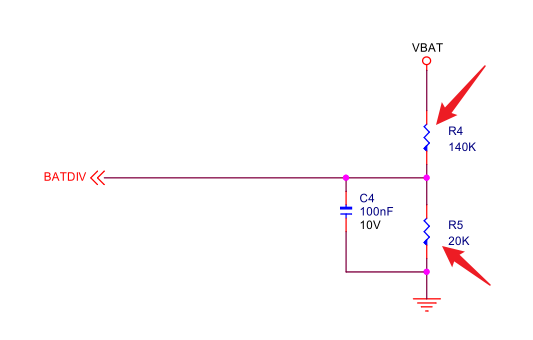
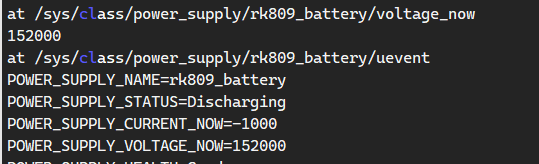

## 测试要点
### 电量计测试
1. 电量计测试充电电流
	1. 充电为正（充电判定 $\geq0$）
	2. ~~充满为 $0$~~(耗时操作不判定)
	3. 放电为负（$\leq0$）
	4. 不接电池为负
2. 电量计电压读取
3. 充电时电池电量不能减小（$AC=1$;  $times\geq20s$;  $last\_capacity - capacity \geq 0$）
4. 关闭主板供电，需要在电池供电情况下，主板运行 $6s$  ($AC=0$; $current \leq 0$; $times \geq 10s$)

### ADC 测试
1. 读取 ADC 电压值与电量计电压值做比较（$V_{809} -200 \leq V_{ADC} \leq V_{809}+200$）

### 测试节点
- DC 直流源供电节点：`/sys/class/power_supply/ac/online`
- 电量计测量电流节点：`/sys/class/power_supply/rk809_battery/current_now`
- RK 809 驱动电压：`/sys/class/power_supply/rk809_battery/voltage_now`
- ADC 测试电压：`/sys/class/power_supply/battery/voltage_now`

## 809 异常记录
 1. 充电时大约 $20s$ 电量减少 $1\%$ ；断开供电大约 $20s$ 减少 $1\%$ ，电量降到 $1\%$，不会马上关机
	 - ! 原因：虚焊，具体不详
 2. 带直流供电开机，电量显示 $1\%$，断开直流供电，Android 马上关机，PCBA 不会
	 - !  原因：电量计**SNSP**，**SNSN** 完全没焊接上
3. 模拟 RK 809 电压测量虚焊，去除测量电阻（R4、R5）
	1. 单接电池，Android 启动后马上关机，**电量为零**
	2. 同时接 DC 电源、电池（开机过程电量上报为 $1$）
		1. 拔掉 DC 电源、过一会关机
		2. 不拔电源，电量可能从 $0\%$   上涨
	
	3. 单接电源，不接电池
	
4. 电池过放：RK 809 充电电流显示为 1，电量为零 
5. ADC 电压测量电阻、RK 809 电压、电流测量电阻全部去除，PCBA 测试程序不会导致关机

## PCBA 测试流程

## ADC 与 RK 809 电量计驱动兼容
1. [x] PCBA 电量计驱动与 ADC 驱动共存（需要修改节点目录名 battery）
2. [x] ADC 电池驱动，电量上报使用 RK 809 的电量 
