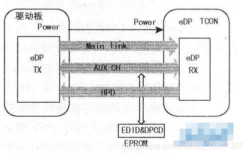

eDP接口信号主要由Main Link、AUXCH与HPD三部分组成，如下图所示。
![[edp 接口线路]]

## AUX CH 辅助通道
* 用于传输低带宽需求的数据，以及链路管理和设备控制信号
* 是一条双向半双工传输通道，其信号采用交流耦合差分传输方式，信号采用Manchesterll编码
* 该通道与EDID及DPCD存储器相连，并通过总线方式进行读写。EDID为扩展显示标识数据，用来存储显示器参数；DPCD为eDP接口配置数据，与链路管理层相连，用于链路的配置
## HPD  热插拔检测通道
* 是一条单向通道，用于检测E层设备和下层设备是否连接，进而实现线路的连接和中断
# Main Link: 主通道
* 用来传输各类型视频数据和音频数据
*  1～4对数据线组成，每对数据线都是一对差分线。对于一款液晶屏而言，Main Link具体需几对数据线，这取决于屏幕的分辨率和彩色位数。
在该通道中传送的信号有视频像素信号、视频定时信号、视频格式信号、比特／像素及颜色空间信号和视频信号的误差补正信号，并采用ANXI8B/10B编码方式，以提高数据传输正确性。数据传输采用交流耦合技术，发送端和接收端有不同的共模电压，因此可以把接口做得更小。
> [!info] ANXI8B/10B
> ANSI8B/10B编码是先将一组连续的8位数据分成两组数据，一组3位，一组5位，然后经过编码，得到一组4位、一组6位的二进制数据。
> 
