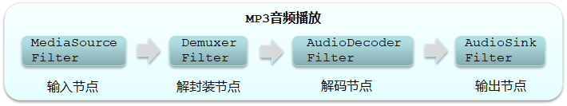

# MP3 格式
MP3 文件由 ID3 Metadata 容器头和若干 MP3 Frame（MP3 数据帧）构成。每个 MP3 Frame 又由 MP3 Header（MP3 头信息）和 MP3 Data 构成。这一系列的 MP3 Frame 称为 ES Data（ Element Stream Data）。
● ID3 Metadata：容器头，主要包括标题、艺术家、专辑、音轨数量等。
● MP3 Header：包含 MP3 Sync word（标识 MP3 数据帧起始位置）和 MPEG 版本信息等。
● MP3 Data：包含压缩的音频信息。

播放 MP3 文件，首先需要把 MP3 文件数据读进来，然后去掉 ID3 Metadata 容器头（即解封装），再把一系列 MP3 Frame 解压缩成 PCM（Pulse-Code Modulation）数据，最后驱动喇叭发声

1. 输入节点（MediaSourceFilter）: 读取 MP3 原始数据，传给下一个节点。
2. 解封装节点（DemuxerFilter）: 解析 ID3 Metadata 容器头信息，作为后续节点的参数输入，并且把一帧帧 MP3 Frame（即 ES Data）传给后续的解码节点。
3. 解码节点（AudioDecoderFilter）: 把 ES Data 解码成 PCM 数据，传给输出节点。
4. 输出节点（AudioSinkFilter）: 输出 PCM 数据，驱动喇叭发声。

由以上示例可知，HiStreamer 通过 Pipeline 框架把音视频处理的每个过程抽象成一个个节点。这些节点是解耦的，可以灵活拼装，从而可以根据业务需要拼装出不同的 Pipeline