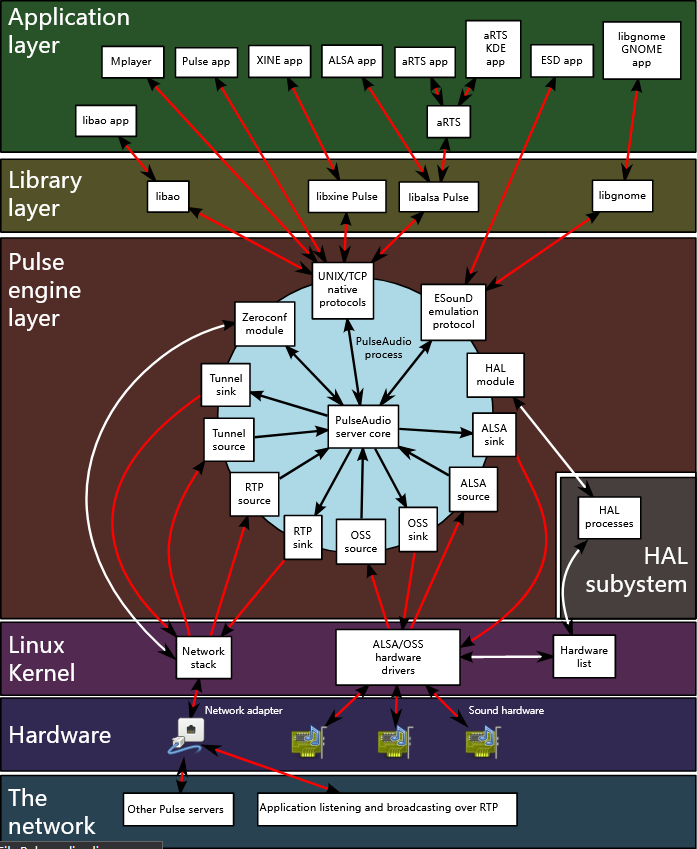

# PulseAudio

- ALSA 提供声音设备的驱动支持以及低级调用
- PulseAudio 允许你分应用程序调整输入输出（音量、输出设备、平衡等），支持蓝牙音频设备，可以调整声音效果（噪声消除、合并输出等）
- 大部分软件应当可以自动通过 PulseAudio 输入/输出音频
- PulseAudio还有更高级的用法，比如远程（网络）输出，多用户共享一个PulseAudio daemon之类