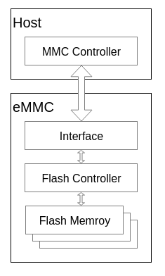

---
tags:
  - eMMC
---
## eMMC
eMMC是embedded MultiMediaCard的简称，即嵌入式多媒体卡, 是一种闪存卡的标准，它定义了基于嵌入式多媒体卡的存储系统的物理架构和访问接口及协议

eMMC是一种嵌入式、非易失的存储系统，它主要由闪存、闪存控制器和eMMC协议接口等组成，以BGA的形式封装在一起

###  闪存
eMMC内部的闪存一般都属于Nand Flash

### 闪存控制器
闪存控制器主要用来对内部的Nand Flash进行操作和管理。

由于Nand Flash自身的物理特性，需要实现坏块管理、磨损均衡、ECC等诸多功能，这些功能就是由FTL（Flash Translation Layer）来实现。eMMC内部集成的闪存控制器则实现了FTL等功能，减少了由于不同型号Nand Flash的各种特性差异，造成的软件开发复杂度；同时闪存控制器也提供了Cache、Memory array、interleave等多种功能，大大提高了Nand Flash读写操作性能
## Link
- [eMMC简介 - 内核工匠 - 博客园](https://www.cnblogs.com/Linux-tech/p/12961289.html)