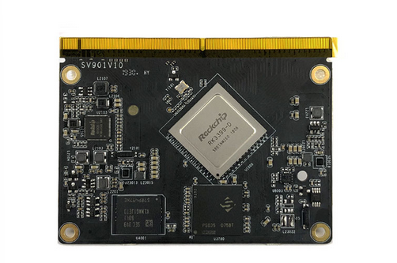
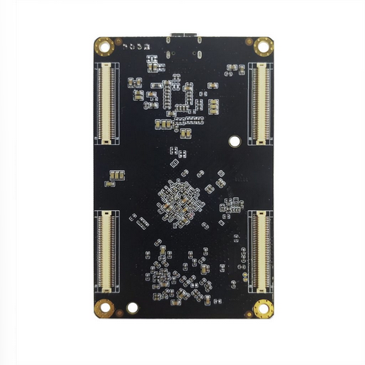
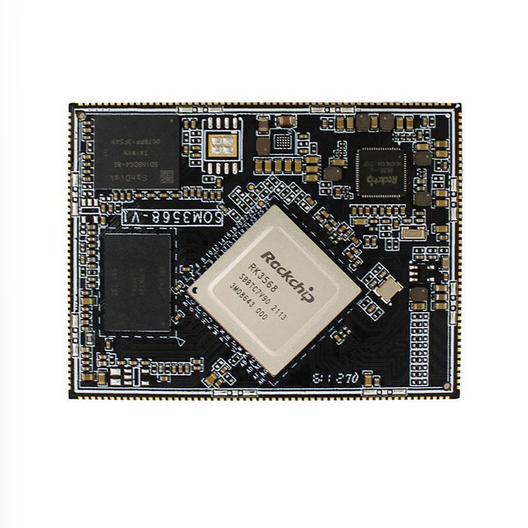
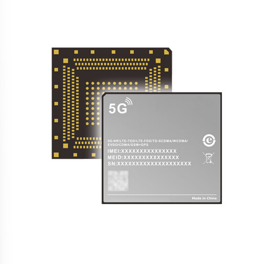
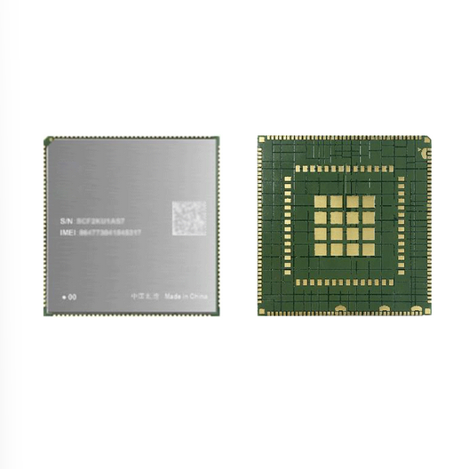

# SOM
- SOM (System-on-Module) 在随时可投入生产的单块印刷电路板 (PCB) 上提供嵌入式处理系统的各种核心组件，包括处理器内核、通信接口和内存模块等
- SOM 不同于片上系统 SoC
> [!info] SoC
> SoC 是一系列布置在单个芯片上的重要计算机组件

- SOM 可能包含一个 SOC，但它们是基于电路板的，因此有空间容纳额外的组件

## 产品形态
### 金手指 （connecting finger）

### 板对板连接器（B2B，Board-to-board Connectors）

### LCC 封装（Leadless Chip Carriers, 邮票孔）

### LGA （Land Grid Array，栅格阵列）

### LCC+LGA
