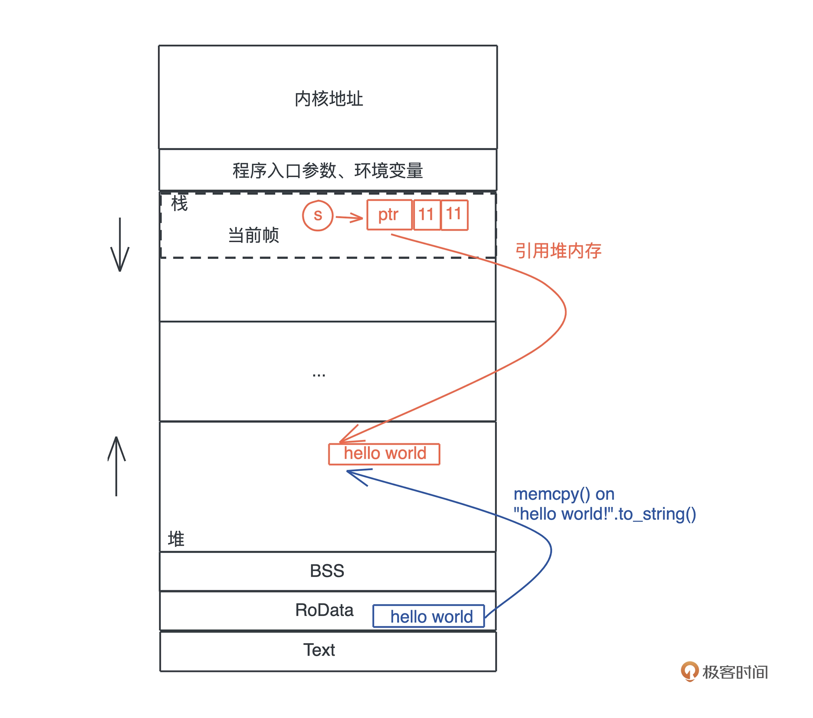

# 数据存放
~~~rust
let s = "hello world".to_string();
~~~
* hello world” 作为一个字符串常量（string literal）
* 在编译时被存入可执行文件的 .RODATA 段（GCC）或者 .RDATA 段（VC++）
* 在程序加载时，获得一个固定的内存地址
* “`hello world”.to_string()` 时，在堆上，一块新的内存被分配出来，并把 “hello world” 逐个字节拷贝过去

## 栈
* 栈是程序运行的基础。每当一个函数被调用时，一块连续的内存就会在栈顶被分配出来，这块内存被称为帧（frame）
* 在编译并优化代码的时候，一个函数就是一个最小的编译单元
* 在编译时，一切无法确定大小或者大小可以改变的数据，都无法安全地放在栈上，最好放在堆上
* **STW**：GC 释放内存的时机是不确定的，释放时引发的 STW（Stop The World）

## 指针和引用
* **指针**：一个值被存储到内存中的某个位置，这个位置对应一个内存地址。而指针是一个持有内存地址的值
* **引用**：引用的解引用访问是受限的，它只能解引用到它引用数据的类型，不能用作它用