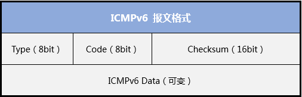

---
tags:
  - IPv6
---
## NDP协议概述
NDP（Neighbor Discovery Protocol，邻居发现协议）是IPv6协议体系中一个重要的基础协议。通过使用ICMPv6报文实现以下丰富的功能

1. 无状态自动配置（简化版的DHCP）：路由器发现、前缀发现、参数发现 --- 路由请求
2. 重复地址检测（DAD），相当于IPv4的免费ARP --- 路由通告
3. 地址解析，相当于IPv4的ARP --- 邻居请求）
4. 邻居不可达检测（NUD）--- 邻居通告
5. 路由器重定向 --- 重定向

### ICMPv6报文格式

- **Type**：表明消息的类型，0至127表示差错报文类型，128至255表示消息报文类型
- **Code**：表示此消息类型细分的类型
- **Checksum**：表示ICMPv6报文的校验和，校验的部分包括了ICMPv6数据和IPv6的报头部分（IPv6报头不含校验）
- **Data**：ICMPv6数据

## Link
- [IPv6系列基础篇（下）—邻居发现协议NDP - 锐捷网络](https://www.ruijie.com.cn/jszl/83220/)