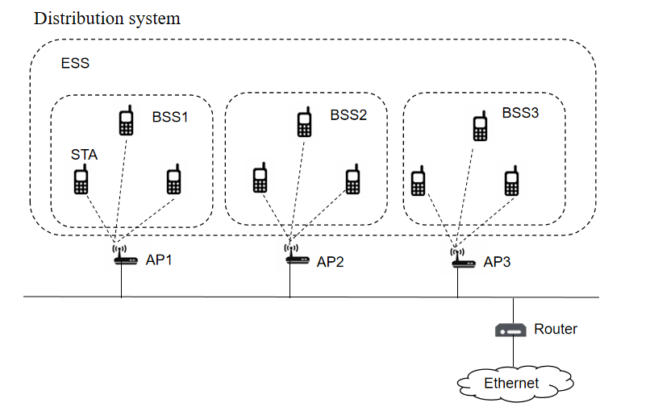

# WiFi 基础
### WiFi 网络结构
#### 工作站（Station）
工作站是指配备无线网络接口的终端设备（计算机、手机等），构建网络的目的就是为了在工作站间传送数据。

#### 接入点（Access Point）
802.11 网络所使用的帧必须经过转换，方能被传递至其他不同类型的网络。具备无线至有线（wireless-to-wired）的桥接功能的设备称为接入点，简称 AP。

#### 无线媒介（Wireless medium）
802.11 标准以无线媒介在工作站之间传递帧。

#### 分布式系统（Distribution system）
几个接入点串联起来可以覆盖一块比较大的区域，接入点之间相互通信可以掌握移动式工作站的行踪，这就组成了一个分布式系统。分布式系统属于 802.11 的逻辑组件，负责将帧（frame）传送至目的地，分布式系统是接入点间转发帧的骨干网络，因此通常称为骨干网络（backbone network），基本都是以太网（Ethernet）

### 在分布式网络拓扑结构中的几个基本概念：
#### 基本服务集（BSS）
由一组彼此通信的工作站组成，一个热点覆盖的范围称为一个 BSS。

#### 扩展服务集（ESS）
多个 BSS 可以构成一个扩展网络，称为扩展服务集（ESS）网络，一个 ESS 网络内部的 STA 可以互相通信，是采用相同的 SSID 的多个 BSS 形成的更大规模的虚拟 BSS。
连接 BSS 的组件称为分布式系统（Distribution System，DS）。

#### SSID
- Service Set ID，服务集标识。
- SSID 是让网管人员为服务集合（SS）指定的识别码，组成 ESS 的所有 BSS 都会使用相同的 SSID。

#### BSSID
- Basic Service Set ID，基本服务集标识。
- 在基础网络里，BSSID 就是接入点（AP）使用的 MAC 地址。

#### ESSID
- Extended Service Set ID，扩展服务集标识。
- 因为 ESS 中所有 BSS 使用同一标识，所以 ESSID 就是 SSID。

## WiFi 网络安全技术
1. **WPA**（WiFi Protected Access，WiFi 保护访问），WiFi 联盟在 IEEE802.11i 草案基础上制定的一项无线网络安全技术，目的在于替代传统 WEP 安全技术，分为 WPA Personal（pre-shared key 身份验证）和 WPA Enterprise。WPA 使用临时密钥完整性协议（Temporal Key Integrity Protocol，TKIP），提高了无线网络的安全性。
2. **WPA2** 是 WPA 的加强版，支持高级加密协议（Advanced Encryption Standard，AES），使用计数器模式密码块链消息完整码协议（CCMP），安全性比 WPA 有进一步提升。
3.  **WPA3** 是 Wi-Fi 联盟组织于 2018 年 1 月 8 日发布的 Wifi 新加密协议，是 WPA2 技术的后续版本。WPA3 支持 SAE（对等同步认证）以及具有 192 位加密功能的 WPA3-Enterprise，比 WPA2 更安全。

## WiFi 工作模式
1. **STATION 模式**：无线局域网中的一个客户端，这是 Wifi 最基本的工作模式，通过连接其他接入点访问网络。
2. **AP 模式也就是接入点模式**：即设备作为接入点，为无线局域网中的客户端提供网络接入功能，大多数终端设备称其为 hotspot（热点）或者 softap，通过 wifi 的 AP 模式，可以将设备的运营商数据网络共享给接入的客户端，实现随时随地的网络资源共享。
3. **P2P 模式**： P2P模式是 WFA（WiFi 联盟）推出的一项与蓝牙类似的技术，允许设备间一对一直连，无需通过 AP 即可相互连接。P2P 模式中的设备，称为 P2P Device，P2P 设备组成的网络叫 P2P Group。在 P2P 网络中，P2P Device 有两个角色，一个是 GO（Group Owner），其作用类似于 AP；另一个角色是 GC（Group Client），类似于工作站（Station）。P2P 设备完成协商组建为一个 P2P 网络的时候，有且只能有一个设备作为 GO，其他设备做为 GC。Wifi P2P 模式传输速度和传输距离比蓝牙有大幅提升，但功耗也要比蓝牙高