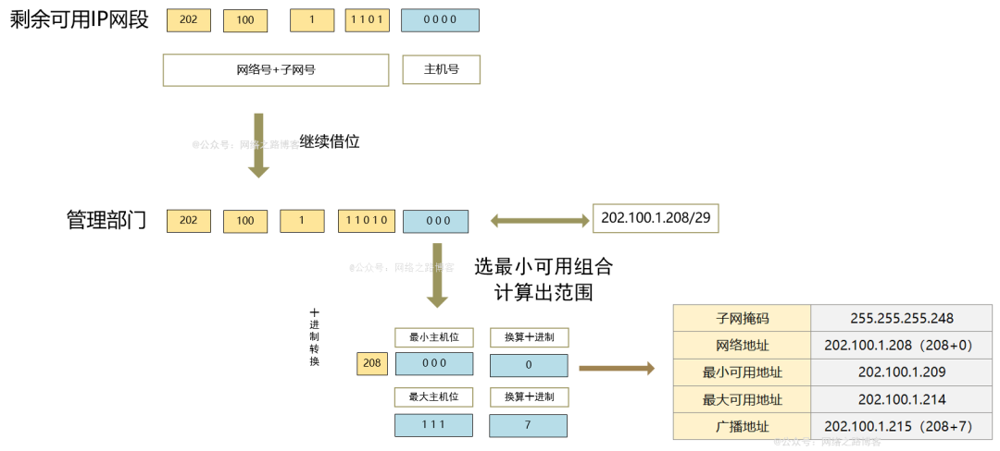
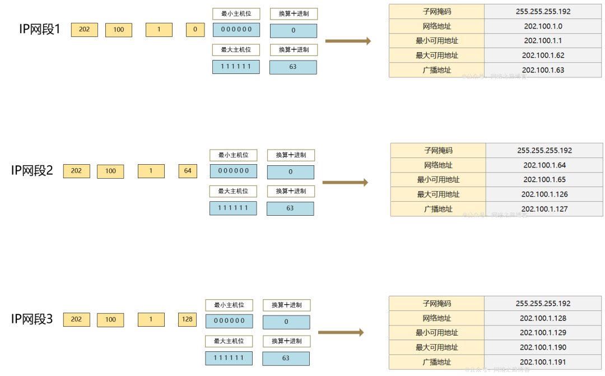
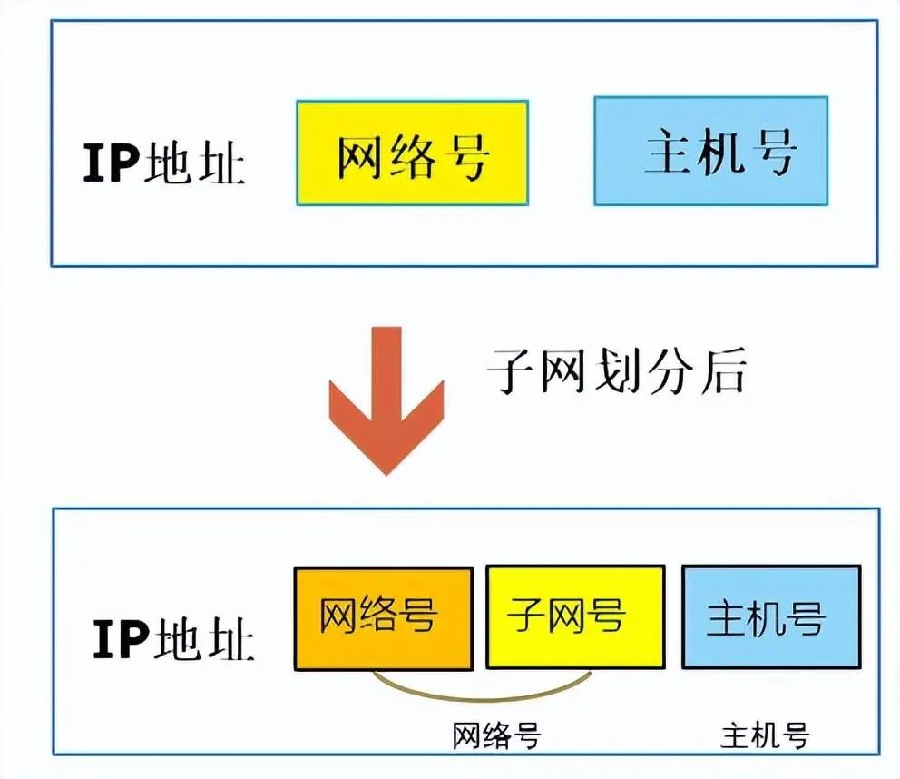
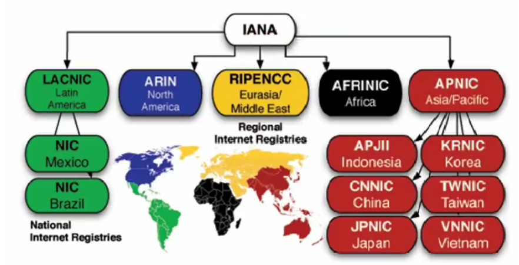
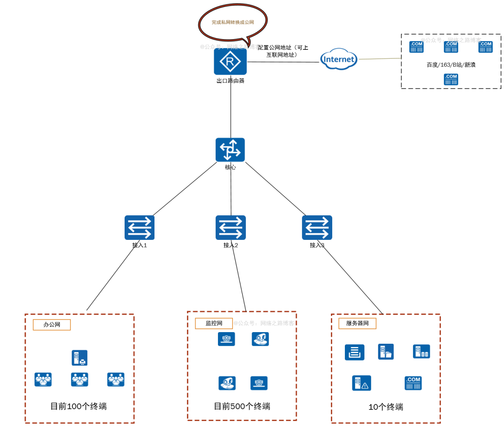

# IP 地址划分、子网掩码的作用、实际中 IP 地址规划

（1）子网掩码

之所以出现大量地址浪费，在于早期的地址分类采用的是固定的网络位与主机位的长度，不能灵活的规划，所以在后面打破了这个规则，32比特的IP还是分为网络号与主机号，但是不在采用固定的长度形式，可以根据环境需求来变化长度，那就带来了一个问题，之前的主机与网络设备都是通过固定分类来识别的，而现在网络号的长度不确定，那怎么来识别呢？这个识别的功能就是子网掩码。（打破这个规则的是CIDR与VLSM，子网掩码为了打破固定为后，标识出实际的网络号是多少）

子网掩码也是采用32位的二进制表示，IP地址网络号部分，子网掩码设置为1，IP地址的主机部分，设置为0，简单理解IP的网络号有多少位，子网掩码就有多少位取1，其余的主机号为0，然后为了方便记录，跟IP地址形式一样，每8位一组，以点分十进制方式表示。

举例：202.100.1.33的子网掩码为255.255.255.0，算出它的网络号。

这样就得前24位为网络号，网络号为202.100.1，主机号为最后一位，可用地址为1~254（其中0是网段地址，255是广播地址排除）

你会发现，不管是Windows系统、安卓、苹果或者Linux等系统上，只要是运行了TCP/IP协议体系的，都要求填写子网掩码，否则会提示错误。因为之前我们上面介绍过，网络号与主机号的作用，网络号用于两台计算机通讯来判断是否处于同一个网段依据，既网络号相同，说明处于同一个网段，直接把数据包发送给目标主机，如网络号不同，则不在一个网段，这个时候就需要交给主机填写的默认网关处理（如果默认网关没有，则通信失败。），所以有了子网掩码，就能确认网络号的范围，就能判断数据包目的是否在同一个网段了，这是主机终端系统判断的依据。

在三层设备路由寻址中，也是通过路由表存在的掩码信息来找到数据包目的IP对应的网络号路由条目，然后把数据包发往对应的网络中去。

IP与子网掩码在实际中的结合表示方法通常有两种，一种是，十进制表示为：255.255.255.0，或者斜线表示：/24，比如192.168.1.0/24或者192.168.1.0/255.255.255.0这个都是表示192.168.1.0网段（网络号为192.168.1，主机地址范围1~254）

（2）VLSM（可变长子网掩码）

上面提到的子网掩码只是表示当前的地址的网络号多少，用于判断的，像之前提到的安全问题（A与B公司在一个网段），以及运营商如何把一个标准的C类网段给划分成客户需要的数量，这个就是VLSM实现的功能，它可以将之前的A、B、C类地址进行划分，划分成各种网络场景需求的大小，这个过程也叫做子网划分。

子网划分是把IP地址最左边开始的主机位，根据需求移动对应的主机位划入网络位，也可以叫做借位，比如一个标准的C类，是24位网络号，8位的主机号，从最左边开始借两位，这样网络号就变成了26位，主机号就成了6位了，这样就把一个大的网段变成多个小的网段分给多个公司或者区域，主机位变成网络位的部分叫做子网号，这个划分没有什么诀窍，只能依靠多练习，下面举例几个来了解下划分的技巧跟公式，然后在说说如今企业网中以及规划中注意的地方。

举例一：公司有三个部门，每个部门终端数在50~60之间，使用网段202.100.1.0/24，为三个部门各自分配一个网段。

（1）现在已经知道的是每个部门的终端数在50~60之间，取最大值60，这个时候有一个公式计算 2n-2≥m，m=需要的终端数量，也就是2n-2≥60，只有n=6的时候，才满足这个条件。（最基本的数学公式，实在忘记了可以用计算器。）

（2）得到对应的网络位：32（子网掩码255.255.255.255）-主机位（N=6）=26（255.255.255.192）

（3）开始进行划分，把网段202.100.1.0/24的主机号，借两位变成子网号，可以划分出4个等同大小的子网，怎么快速得到的是4个呢？22=4，当然也可以按下面的办法把能组合的列出来，就自然知道了。

4、通过计算出来的子网号，从小到大的顺序，分配给三个部分，这里分配202.100.1.0/26，202.100.1.64/26，202.100.1.128/26，剩下的怎么计算出有多少个主机地址其实就很简单的。

还记得上面的公式2n-2，减2的原因是有一个网络地址，一个广播地址，这两个是不可用的，所以需要减去，每个划分的子网都是一样，可能你也发现了一个特点，如果划分的子网越多，每个子网都需要减去2个地址，这部分的地址也是被浪费掉的，但是这也是一个无奈的选择，相比浪费更多地址来说，这种情况还是可以接受的。另外计算出最小可用地址与最大可用地址，对于新手来说，可以跟上面一样把二进制列出来，最小位无非是全0（网络地址），最大位全1（广播地址），去掉这2个地址，剩下的就是可用范围了。

举例二：某个公司有180个人，销售部 110人，技术部 55人，管理部门 10人 ，财务部 5人，还是采用202.100.1.0/24的网段划分，这个跟第一个不一样，第一个每个部门的数量一样的，而这个则不一样，每个部门的人数不一样，这个时候划分，从最大需求的人数开始。

1、按照需求数量，从地址需求大到小开始进行划分，先计算销售部，公式还是之前的2n-2≥m，m=需要的终端数量，也就是2n-2≥110，N=7，同样的方法代入，计算出 技术部 N=6，管理部门 N=4，财务部门 N=3

2、各个部门的网络位，销售部 32-7=25位 （255.255.255.128），技术部32-6=26位（255.255.255.192），管理部门 32-4=28位（255.255.255.240），财务部门32-3=29位（255.255.255.248）

3、开始进行划分，分配从最大的开始，7个主机位，借取一位做子网位

4、第一个子网占用了1~127的地址，虽然需求里面只需要110个，但是VLSM是没法做到正好的，只能做到离110需求最近的，那么在划分第二个子网的时候，需要跟第一个子网不重复。

第一个已经使用了202.100.1.0/25，还剩下202.100.1.128/25没有划分，第二个子网就从这个里面继续开始划分。（主机数已经在第一个步骤与第二个步骤计算出来了，技术部主机号需要6位）

同样的方法，第二个子网网段使用了202.100.1.128/26，还剩下202.100.1.192/26，管理部门接着划分。

在用同样的方法，，第三个子网网段用了202.100.1.192/28，还三个可以继续使用，使用最小的，202.100.1.208/28，计算出财务部门。

至此，VLSM就到在这里结束了，对于新手来说，只要掌握了这个划分的方法就行了，知道怎么去划分，计算，这个要熟练的话就得多去练习，但是这里博主说下，这种划分方式在我们工作中在运营商运维以及金融、政企这些网络中对于地址的范围以及规划有严格的划分要求，经常会用到VLSM，而常见的大部分面向中小型企业网的环境，对于地址而言就没这么严格的要求了，可能更多的这种需求在面试或者是题目中会经常看到，这个在待会了解完私网地址，博主会以实际环境来介绍。

（3）CIDR（无分类域间路由或者无分类编址）

从上面两个举例可以看出来，VLSM是将一个大的网段划分成多个小的子网，让地址需求少的用户获取相近数量的地址，避免浪费，它的核心理念就是从主机号进行借位，变成子网号。那CIDR正好相反，来看一个例子。

例子：某个公司办公网200人，用了一个192.168.100.0/24的网段，有一个监控网络，包含仓库、办公以及各个区域有500个摄像头点位，为了方便管理，希望这500个摄像头都在同一个网段内，这个时候该怎么处理呢？

从之前学到的内容来说，VLSM并不具备这个功能，只能将一个原有的网段划分成多个小的子网网段，而一个标准C类/24的地址最多也就254个，如果用2个C类地址，确实可以达到500个的需求，但是不属于同一个网段了，如果能把这2个C类地址合并到一起，变成一个网段，这样地址够了，又满足了在同一个网段的需求，CIDR就是解决这样的场景的，假设分配的网段是192.168.0.0/24，想主机位可容纳500个地址。

先回顾下，一个网段的判断是网络号相同，主机号可变，如果要满足500个地址，那是不是主机号2n-2≥500即可，N=9，然后用32-9=23位（255.255.254.0），相当于像网络位借一位作为主机位使用，跟VLSM正好相反。

CIDR后，相当于最终的网段则是192.168.0.0/255.255.254.0（23），可用地址为192.168.0.1到192.168.1.254，那么这里看一个比较有趣的事情，像192.168.0.255、192.168.1.0，如果按C类标准24位掩码，它明显是一个网络地址以及广播地址，这也是很多面试或者题目里面经常会问到的，它就给你这么一个地址，问你是是不是广播地址或者网络地址，很多朋友就会忽略后面的子网掩码，就直接选择是，但是，实际上一定要看子网掩码是多少，如果它是24位的掩码，那确实是，但是如果是23或者22等掩码，就不是了，通过上面就可以计算出，最小的主机位是192.168.0 0 0 0 0 0 0 0\. 0 0 0 0 0 0 0 0（192.168.0.0），最大的主机为是192.168.0 0 0 0 0 0 0 1，1 1 1 1 1 1 1 1（192.168.1.255），192.168.0.255以及192.168.1.0在子网掩码255.255.254.0中，既不是网络地址也不是广播地址，而是可用的地址。

CIDR有一个特别需要注意的地方，就是网络号要保持相同，这个也好很理解，就像上面一个要求500个地址在同一个网段，同一个网段的判断不就是网络号相同吗？所以在规划的时候要注意，不能将192.168.0.0/24与192.168.2.0/24，合并成一个网段，用500个地址，因为它得到的网络号是不一样的，如果要将0.0与2.0在一个网段，那则必须在借位。

只有网络号保持一样了，才能继续进行下一步，但是你会发现，这样的话地址就不只500个了，包含四个组合0网段（0 0=0）1网段（0 1 =1），2网段（1 0=2），3网段（1 1=3），地址就变成了2^10-2=1022个主机地址。

CIDR还有聚合的作用，把相网络号的网段进行合并，变成一个超网（大的网段），可以大大的减少路由器的压力，对于数据包的转发效率更高，这一块在学习路由知识点的时候会涉及到，这里就提一下。

小经验分享：

CIDR在实际中用的非常多，比如在一个商场的网络部署中，每个人负责的不一样，可能A负责网络设备的规划跟打通，B负责监控这块，这时候B跑过来跟A说，监控这块我需要500个地址或者1000个地址，规划地址的时候单独帮我划分出来一个这样的网段给监控用，告诉我范围就行，这个就是上面介绍的给予一个192.168.0.0/23或者192.168.0.0/22的网段了。在无线环境也很多这样的需求，特别流动性大的公共场所，为了地址够用，有时候也会划分一个大的网段，避免地址不够的情况出现。

CIDR用多了你就会越来越有经验了，比如一个/24的C类标准地址，子网掩码借一位（往左移一位），能够将两个网段合并成一个大的，如果借2位（往左移动两位），能够将4个网段合并，借三位能够合并八个网段，依次这样类推，那么在实际中完全可以根据不同的场景需求，来进行规划网段容纳多少地址，来满足客户的需求。

（4）公网与私网地址

随着IP地址的早期规划带来的问题，早期已经有大量的A类地址被分配出去，A类地址就占用了整个IP地址中的二分之一，又无法收回，导致只有B与C类可以分配，虽然有了VLSM以及CIDR技术的方案，但是也只能缓解IP地址枯竭的速度，于是提出了一个概念，私网地址。

之前提到过IP地址在互联网中是有唯一标识的，这个指的是公网地址，私网地址的作用是什么呢？可以想象下，如今的一个办公楼、一个有点规模的企业，少则几十人，多则几百人，而且每个人手里不单单只有办公电脑，可能手机、平板都要接入到网络中来，那对于地址这块的消耗是非常大的，私网地址的作用就是在之前的A、B、C类里面拿出来一小部分作为私网地址的范围，这个范围的地址任何公司的局域网都可以使用，只要同一个局域网内网段没有重复、冲突即可，私网地址的出现，又帮助了IP地址缓解了枯竭的速度。

那么可能就有朋友会觉得奇怪了，A公司使用的是192.168.1.0/24，B公司使用的也是192.168.1.0/24，那么它们去互联网上不就冲突了吗？，没错，相同的地址如果都出现在互联网上，势必就冲突了，所以私网地址明确规定只能在局域网内使用，不允许出现在互联网上，通常运营商会做访问策略，在接入用户的设备上面拒绝掉私网地址的进入。冲突的问题解决了，那使用私网地址的局域网无法访问互联网了吗？答案肯定是可以的，不知道大家有没有

没有留意过，家里使用的一体猫、或者路由器，分配的地址都是192.168.0.0/24或者192.168.1.0/24开头的，从上面列表里面就可以看到不管是192.168.0.0还是192.168.1.0都是属于C类的私网地址范围，但是确实是可以上网的，电脑或者手机上面并没有使用公网地址，这就是我们后续要讲解的一个技术，叫做NAT，它的功能简单介绍就是把私网网段转换成一个公网地址（可上互联网的地址）来完成对internet的访问（这个技术后续会详细讲解，这里简单提一下）

（5）公网地址管理机构

私网IP地址都是由对应场景的IT人员进行规划分配，而公网地址需要保证唯一性，就有一个专门的管理组织，叫做ICANN（互联网名称与数字地址分配机构），它下面有一个机构叫做IANA，主要负责互联网IP地址的分配。

分配的方式是按州的方式层层分配，APNIC主要负责的是亚太地区（中国、日本、韩国等国家），每个国家又有自己专门的机构进行管理分配给运营商，中国则是CNNIC的机构进行管理分配。

（6）IPV6

上面介绍到的技术都只能缓解IP地址的枯竭，早在2011年的时候IP地址就已经被分配完毕，运营商与对应的管理机构，也在回收一些倒闭的公司跟空闲的IP地址，但也治标不治本，迟早有一天是会用尽的，所以在提出缓解技术的同时，也在想着规划出一套全新的地址体系，那就是IPV6。

IPV6在本次课程不会涉及，后续会根据情况来开专题课，这里就简单了解下IPV6的功能跟好处。

1、巨大的地址空间

IPV4的地址位数是32位，IPV6充分的考虑到了以后的发展，采用了128位，IPV6出现的时候就流传着这样一个说法：地球上的每粒沙子都可以被分配到一个地址。

2、报文的改进

IPV6采用了新的协议头部，简化了格式，这样在数据包处理起来效率更高，并且引入了安全机制。

3、引入邻居发现协议

替代了IPV4中依赖的ARP协议、DHCP协议。（这2个协议马上就会接触到了）

以实际环境来讲解解析一些困惑的地方

上面拓扑是一个常见的企业网的架构，中间的设备现在还没学习路由交换的技术，可能看不懂，这个没关系，简单理解就是，这个企业网有三个内网，一个办公网，一个监控网，一个服务器网，办公网需要100个终端，监控网500个终端，服务器网10个终端，客户希望每个网独立一个网段，那我们在实际中去规划这个网段的时候应该怎么去规划呢？

（1）第一种规划方法，需要多少划分多少

监控网500个终端，按照CIDR的方法，向网络位借位，2n-2≥500，N=9，32位-9位=23位，子网掩码为255.255.254.0（/23），选用192.168.0.0/23，可用地址192.168.0.1~192.168.1.254

办公网终端100个，按照VLSM方法，向主机位借位，2n-2≥100，N=7，32位-7位=25位，子网掩码为255.255.255.128（/25），选用192.168.2.0/25，可用地址：192.168.2.1~192.168.2.126

服务器网终端10个，按照VLSM方法，向主机位借位，2n-2≥10，N=4，32位-4位=28位，子网掩码为255.255.255.240（/28），选用192.168.2.128/28，可用地址：192.168.2.129~142

（2）第二种规划方法，预留空间

监控网500个终端，可以给予1022个地址，使用10.0.0.0/22，范围10.0.0.1~10.0.3.254

办公网终端100个，给予一个C类地址/24位，使用10.0.4.0/24，范围10.0.4.1~10.0.4.254

服务器网终端10个，给予一个C类地址/24为，使用10.0.5.0/24，范围10.0.5.1~10.0.5.254

这种对于初学者来说可能都会用第一种 ，因为上面介绍的方法或者在看书的知识点的时候都是这样介绍的，但是在实际中要多方面考虑

在局域网使用的是私网地址范围，由IT管理者来自用规划，作为IT人员，自然要考虑长远点，相对于常见的企业网来说，私网地址相当于免费使用，同一个局域网中不要使用同一个相同的网段即可，所以通常的做法是只需要100个地址的给予一个标准C类，需要400~500的给予一个23位或者22位网段，而10台服务器的网段，也可以给予一个标准的C。

给予充裕的地址空间是为了扩展性，比如办公网目前100个终端，分配的是25位，只有126个可用地址，假设后续增加了50台，那是不是这个网段的地址就不够用了，基于这样的情况，通常就会给予一个可扩展的空间预留。

对于企业这种多网段的环境，如果网段之间互访那必须依赖网关，因为不在同一个网络号里面，所以每个网段里面都拿出一个给予三层设备作为网关地址使用，通常会以网段的第一个地址或者最后一个地址作为网关，比如192.168.0.0/25，可以用192.168.0.1也可以用192.168.0.126。

在规划的时候尽量避免使用192.168.0.0、1.0、2.0、31.0这些网段，因为很多网络设备的初始化网段就在这些里面，为了避免冲突，建议使用10、172.16.~172.31或者192.168其他网段进行规划选择，大家住熟悉的光猫与家用路由器就使用的192.168.0.0或者1.0、2.0这三个网段。

在工作交流中，会经常听到C类地址或者B类地址，虽然分类地址已经不再使用了，但是这个叫法一直存在，当别人提到C类地址的时候指的就是/24的掩码，B类地址指的是/16的掩码，实际上的使用就很灵活，10.0.0.0/24，172.16.0.0/24，又或者192.168.0.0/16都是可以的。

地址规划的时候采用连续的，对于后续在三层设备上面可以做聚合。

这个只是一个常见的规划方法，在后续中，会继续讲解各种组网的结构，要学会灵活运用即可。

（3）另外一些经验之谈

子网规划跟划分对于初学者来说，懂的VLSM以及CIDR的用途跟如何划分即可，因为在实际中往往会碰到一个尴尬的问题，都会采用第二种规划方法，直接采用24或者23位这样的，久而久之对应的子网划分使用的少了，就会忘掉，或者是更依赖与计算工具，就像我们从小学到大的数学，但是平时生活中算数，是不是大部分都依赖计算器的多，所以对于初学者来说，知道了它的用途以及如何划分的方法就行了，那这里分享一些有用的经验，在实际规划中能帮到大家。

1、速记表格

对于IP地址规划记住了VLSM与CIDR的用途以及划分方式后，在配合这个表格，能达到很好的效果，那这个表格有什么有用的信息呢

子网掩码，表格从/8开始到/32都列出来了，不需要都记住，项目中经常遇到的/22~/26以及/30与/32，记住这几个常用的即可，其余的遇到了，查下或者换算下就可以得到了。

地址可用数量，可以看最后一列，它列出来了常见的地址数量），比如需要500个地址，找到最相近的512，用掩码/23即可。

多个子网划分，如果相同主机数量要求的，可以参考子网数量，需要几个网段，对应的掩码设置多少即可，如果主机需求不一样，这个只能就依靠VLSM算法了，但是这种环境通常很少遇到。

2、计算工具

跟我们平时生活中用计算器一样，子网掩码也有计算工具，手机推荐使用网络万用表（应用商店或者浏览器都可以找到），电脑版本可以网页在线搜索子网掩码计算工具或者离线版本，这个我都会共享在公众号里面，可以自己获取就行。

3、表达格式

你可能在后续的工程实施以及客户给需求文档中，会看到这样的格式，比如办公网：192.168.10.0/24，监控网：192.168.11.0/24，这个表示是办公网规划成192.168.10.0的网段（主机范围1~254），监控网规划成192.168.11.0（主机范围1~254），还有在与客户或者是同行交流中，如果对方只说了IP地址，没说子网掩码，这种是无法确定它网段的大小的，只有明确的表明了子网掩码是多少，才能确定它的网段大小。

4、其他特殊地址

可能在后续中还会见到很多特殊的地址，比如0.0.0.0、255.255.255.255，以及169.254.0.0/16、127.0.0.0/8等，这个我们在后续中慢慢都会接触到，这里就暂时不详细说，否则东西太多，容易混乱。

“承上启下”

IP地址已经知道是什么了，也知道如何划分了，已经通信的规则，也知道MAC地址的作用，那么下一篇我们就来了解下通信的时候终端是如何知道对方的MAC地址的，网关又起一个什么样的作用，会从抓包、图解等多方面来掌握，下两篇的内容很重要，需要反复看。

